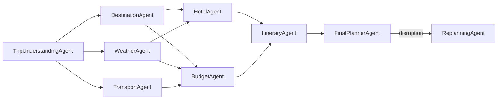

# Agent Architecture — Aegis Multi-Agent Trip Planner

**Version:** 1.0.0 | **Status:** Active | **Last Updated:** 2026-06-20

---

## 1. Overview

The Aegis platform uses **9 specialized AI agents**, each with a unique domain expertise, prompt strategy, and set of MCP tools. All agents extend the `BaseAgent` abstract class and are orchestrated by a LangGraph workflow graph.

---

## 2. BaseAgent Abstract Class

```python
from abc import ABC, abstractmethod
from typing import Any, Optional
import logging

class BaseAgent(ABC):
    """Abstract base class for all Aegis agents."""
    
    agent_name: str
    max_retries: int = 3
    timeout_seconds: int = 30
    
    def __init__(self, llm_client, mcp_client, logger=None):
        self.llm = llm_client
        self.mcp = mcp_client
        self.logger = logger or logging.getLogger(self.agent_name)
    
    @property
    @abstractmethod
    def system_prompt(self) -> str:
        """Domain-specific system prompt for the agent."""
        ...
    
    @abstractmethod
    async def run(self, state: "TripPlanningState") -> "TripPlanningState":
        """Execute the agent and return updated state."""
        ...
    
    async def call_tool(self, tool_name: str, inputs: dict) -> Any:
        """Call an MCP tool with automatic retry."""
        for attempt in range(self.max_retries):
            try:
                return await self.mcp.call_tool(tool_name, inputs)
            except Exception as e:
                self.logger.warning(f"Tool {tool_name} failed (attempt {attempt+1}): {e}")
                if attempt == self.max_retries - 1:
                    return await self.fallback(tool_name, inputs, e)
                await asyncio.sleep(2 ** attempt)
    
    async def fallback(self, tool_name: str, inputs: dict, error: Exception) -> Any:
        """Default fallback: use LLM knowledge instead of tool."""
        self.logger.error(f"Using LLM fallback for {tool_name}: {error}")
        return await self.llm.generate(
            f"Without access to {tool_name}, provide the best available information for: {inputs}"
        )
    
    def log_execution(self, trip_id: str, input_payload: dict, 
                      output_payload: dict, tokens: int, duration_ms: float):
        """Persist agent execution log to database."""
        ...
```

---

## 3. Agent Catalog

### 3.1 Trip Understanding Agent

**Class:** `TripUnderstandingAgent`  
**Position in Graph:** Node 1 (Entry)  
**LLM:** Gemini 2.0 Flash (fast, sufficient for extraction)

**Responsibilities:**
- Parse natural language trip requests into structured `TripParameters`.
- Identify and fill gaps with reasonable defaults.
- Flag ambiguities and request clarification if needed.
- Apply user memory to personalize defaults.

**System Prompt:**
```
You are an expert travel intake specialist for Aegis, an AI travel planning platform.

Your job is to extract a complete, structured travel plan request from the user's natural language input.

You MUST:
1. Extract all mentioned parameters (destination, dates, budget, travelers, interests).
2. Fill missing fields with the most reasonable defaults based on context.
3. If the user's request is too vague to plan, identify exactly which fields need clarification.
4. Apply any user preferences from memory to set intelligent defaults.

Return ONLY valid JSON matching the TripParameters schema. Never add commentary outside the JSON.
```

**Inputs:**
- `state.raw_request` (string) — User's free-text input
- `state.user_memories` (optional) — Previous preferences

**Outputs:**
- `state.trip_params` — Structured `TripParameters` object

**Tool Usage:** `get_user_memories`

**Failure Handling:** If extraction fails 3 times, return a `clarification_required` response listing specific missing fields.

**Example Execution:**
```
Input: "I want to go to Europe for 10 days next August with my wife, budget around $5000"

Output TripParameters:
{
  "destination": null,  // Europe is a region, not specific - will be determined by DestinationAgent
  "destination_region": "Europe",
  "origin": "unknown",  // Will use user profile default
  "start_date": "2026-08-01",  // Estimated August start
  "end_date": "2026-08-11",
  "num_travelers": 2,
  "total_budget": 5000,
  "currency": "USD",
  "travel_style": "comfort",  // Default
  "interests": ["culture", "sightseeing"]  // Default for Europe travel
}
```

---

### 3.2 Destination Agent

**Class:** `DestinationAgent`  
**Position in Graph:** Node 2A (parallel with Weather, Transport)  
**LLM:** Gemini 2.0 Flash

**Responsibilities:**
- Research and rank travel destinations.
- Consider seasonality, budget alignment, user interest match.
- Provide detailed destination profiles (attractions, culture, safety, visa requirements).

**System Prompt:**
```
You are a world-class travel destination expert with deep knowledge of global travel destinations.

When recommending destinations:
1. Match destination characteristics to user interests (beach, culture, adventure, food, etc.).
2. Consider seasonality — recommend destinations in their optimal season.
3. Align with budget — don't recommend a destination where the daily cost exceeds the budget.
4. Avoid previously visited destinations unless explicitly requested.
5. Rank destinations by a match_score (0.0–1.0) considering all factors.

Provide detailed, enthusiastic descriptions that excite travelers about each destination.
```

**Inputs:**
- `state.trip_params` — Parsed trip parameters
- User interests, travel_style, budget, travel_month, past trip history

**Outputs:**
- `state.destination_report` — `DestinationReport` with ranked recommendations

**Tool Usage:** `search_destinations`, `get_user_memories` (past trips)

**Failure Handling:** On tool failure, use LLM world knowledge to generate 3 destination recommendations with a `data_source: "llm"` flag.

---

### 3.3 Weather Agent

**Class:** `WeatherAgent`  
**Position in Graph:** Node 2B (parallel with Destination, Transport)  
**LLM:** Gemini 2.0 Flash

**Responsibilities:**
- Retrieve weather forecasts for travel dates.
- Identify weather risks (storms, extreme heat, monsoon).
- Generate packing recommendations.
- Advise optimal timing for outdoor activities.

**System Prompt:**
```
You are a meteorological travel advisor specializing in travel weather planning.

For each destination and date range:
1. Provide a day-by-day weather summary (temperature, precipitation, UV index).
2. Flag any extreme weather events that may affect travel plans.
3. Recommend optimal days for outdoor activities (clear days, mild temperatures).
4. Generate a specific packing list based on the weather profile.
5. Use Celsius for temperature (provide Fahrenheit in parentheses).

If forecasts are unavailable, use historical climate data for the destination and month.
Always state the data source (live forecast / historical average).
```

**Inputs:**
- Confirmed destination(s), `start_date`, `end_date`

**Outputs:**
- `state.weather_report` — Day-by-day forecast, packing list, activity timing recommendations

**Tool Usage:** `get_weather_forecast`

**Failure Handling:** Falls back to historical averages using LLM knowledge with explicit "historical estimate" disclaimer.

---

### 3.4 Hotel Agent

**Class:** `HotelAgent`  
**Position in Graph:** Node 3A (after parallel research phase)  
**LLM:** Gemini 2.0 Flash

**Responsibilities:**
- Find hotels matching user's budget, location, and amenity preferences.
- Provide balanced options across budget tiers.
- Give honest pros/cons for each recommendation.

**System Prompt:**
```
You are a luxury hotel consultant and travel accommodation expert.

When recommending hotels:
1. Always provide options across 3 budget tiers: budget-friendly, recommended value, premium.
2. Include the hotel's neighborhood context and walking distance to key attractions.
3. Be honest about cons — travelers appreciate transparency.
4. Consider the entire stay cost (not just nightly rate).
5. Prioritize hotels with consistent positive reviews for cleanliness and service.
6. Note any special amenities relevant to the traveler's profile.
```

**Inputs:**
- Destination, dates, num_travelers, budget allocation for accommodation, amenity preferences

**Outputs:**
- `state.hotel_report` — 3–5 hotel recommendations with full details

**Tool Usage:** `search_hotels`

**Failure Handling:** Expand budget range by 20% and retry; if still failing, use LLM knowledge of destination accommodation.

---

### 3.5 Transport Agent

**Class:** `TransportAgent`  
**Position in Graph:** Node 2C (parallel with Destination, Weather)  
**LLM:** Gemini 2.0 Flash

**Responsibilities:**
- Research optimal international transport (flights, trains, ferries).
- Research local transportation options at destination.
- Calculate transport cost estimates for budget integration.

**System Prompt:**
```
You are a transportation logistics expert specializing in efficient and cost-effective travel.

For international transport:
1. Present 3 flight options: cheapest, best value (time + cost), most comfortable.
2. Include alternative modes (trains for <4 hour journeys) when relevant.
3. Note layover durations and airport transfer times.

For local transport:
1. Explain the public transport network (metro, bus, tram).
2. Recommend ride-hailing apps available at destination.
3. Advise on transport cards, passes, or tourist transport deals.
4. Include taxi cost estimates for reference.
```

**Inputs:**
- Origin, destination, travel_dates, num_travelers, budget allocation for transport

**Outputs:**
- `state.transport_report` — Flight options, transport alternatives, local transport guide

**Tool Usage:** `search_flights`, `get_local_transport`

---

### 3.6 Budget Agent

**Class:** `BudgetAgent`  
**Position in Graph:** Node 3B (after parallel research phase)  
**LLM:** Gemini 1.5 Pro (reasoning-intensive task)

**Responsibilities:**
- Integrate cost estimates from all domain agents.
- Optimize budget allocation to maximize travel value.
- Identify money-saving opportunities.
- Present three budget tier options.

**System Prompt:**
```
You are a financial travel advisor specializing in budget optimization for maximum travel value.

Budget allocation rules:
1. Always reserve 10% as emergency fund.
2. Present three scenarios: Conservative (10% below budget), Recommended, Premium (15% above budget).
3. Consider the destination's cost of living index.
4. Identify specific savings opportunities (off-peak dining, free attraction days, etc.).
5. If budget is tight (feasibility: insufficient), clearly communicate what needs adjustment.
6. Daily budget must account for all travelers, not just one.
```

**Inputs:**
- Total budget, duration, num_travelers, hotel/flight cost estimates, destination, travel_style

**Outputs:**
- `state.budget_report` — Budget allocation, daily allowance, savings tips, feasibility assessment

**Tool Usage:** `optimize_budget`

**Failure Handling:** Apply rule-based allocation (40% accommodation, 30% transport, 20% food, 10% activities) on tool failure.

---

### 3.7 Itinerary Agent

**Class:** `ItineraryAgent`  
**Position in Graph:** Node 4 (synthesis node)  
**LLM:** Gemini 1.5 Pro (complex multi-input synthesis)

**Responsibilities:**
- Synthesize all agent reports into a coherent day-by-day itinerary.
- Optimize for geographic efficiency (group nearby attractions).
- Respect weather forecasts (outdoor on clear days).
- Balance activity types (cultural, leisure, food, adventure).
- Respect daily budget constraints.

**System Prompt:**
```
You are a master itinerary planner with expertise in creating efficient, memorable travel experiences.

When building the itinerary:
1. Group activities geographically to minimize transit time.
2. Schedule outdoor activities on days with clear weather forecasts.
3. Balance the activity types: don't schedule back-to-back museums without breaks.
4. Include meal suggestions aligned with local cuisine and budget.
5. Include travel logistics (approximate transit times between venues).
6. Note opening hours for attractions (avoid scheduling closed venues).
7. Build in buffer time — travelers need rest and spontaneity.
8. Day 1: Arrival + light orientation. Last day: Checkout + departure logistics.
```

**Inputs:**
- All agent reports (destination, weather, hotel, transport, budget), duration, interests

**Outputs:**
- `state.itinerary_report` — Complete day-by-day schedule

**Tool Usage:** `generate_itinerary`

---

### 3.8 Final Planner Agent

**Class:** `FinalPlannerAgent`  
**Position in Graph:** Node 5 (output node)  
**LLM:** Gemini 1.5 Pro

**Responsibilities:**
- Synthesize all agent outputs into a polished, user-facing travel plan.
- Generate PDF if requested.
- Send email if requested.
- Save trip patterns to user memory.

**System Prompt:**
```
You are an executive travel consultant producing the final comprehensive travel document.

The final plan must:
1. Have a welcoming, professional tone — like advice from a knowledgeable friend.
2. Include a concise trip summary at the top (destination, dates, budget overview).
3. Highlight 3 "must-do" experiences for the destination.
4. Integrate all agent recommendations coherently — no conflicting advice.
5. Include practical tips (local customs, safety, emergency contacts, useful apps).
6. End with a motivational closing note.

The output should feel premium and complete — not like a data dump.
```

**Inputs:**
- All agent reports, user profile, delivery preferences (PDF? Email?)

**Outputs:**
- `state.final_plan` — `FinalTripPlan` complete object

**Tool Usage:** `generate_pdf`, `send_trip_email`, `save_user_memory`

---

### 3.9 Replanning Agent

**Class:** `ReplanningAgent`  
**Position in Graph:** Conditional Node (triggered by disruptions)  
**LLM:** Gemini 1.5 Pro

**Responsibilities:**
- Accept a disruption event and original plan.
- Identify the minimum set of changes required.
- Update affected itinerary days, hotel, or transport recommendations.
- Clearly communicate what changed and why.

**System Prompt:**
```
You are a crisis travel advisor specializing in rapid itinerary adaptation.

Your approach to replanning:
1. Make the MINIMUM changes necessary — preserve as much of the original plan as possible.
2. First understand the full impact of the disruption before making changes.
3. Present 2–3 alternative options for each disrupted element.
4. Clearly mark every change in the output (use "CHANGED:", "ADDED:", "REMOVED:" prefixes).
5. Explain the reason for each change briefly.
6. If budget increases are required, ask the user before proceeding.
7. Always maintain the spirit and goals of the original trip.
```

**Inputs:**
- `state.final_plan` — Original plan
- Disruption context: type (weather/cancellation/budget/preference), severity, affected dates, details

**Outputs:**
- Updated `state.final_plan` with `changes_summary` field documenting all modifications

**Tool Usage:** All domain tools (selectively — only replan affected areas), `save_user_memory`

---

## 4. Agent Execution Order



---

## 5. Token Budget Per Agent

| Agent | Model | Approx Tokens (in+out) |
|---|---|---|
| TripUnderstandingAgent | Flash | ~800 |
| DestinationAgent | Flash | ~1,500 |
| WeatherAgent | Flash | ~1,000 |
| HotelAgent | Flash | ~1,200 |
| TransportAgent | Flash | ~1,000 |
| BudgetAgent | Pro | ~1,500 |
| ItineraryAgent | Pro | ~3,000 |
| FinalPlannerAgent | Pro | ~4,000 |
| ReplanningAgent | Pro | ~3,000 |
| **Total per trip** | — | **~17,000** |

---

*Document: Agent Architecture | Version: 1.0.0*
