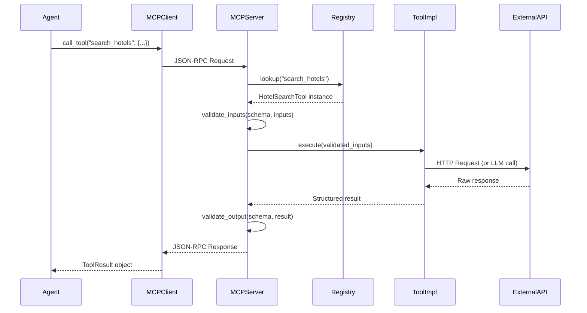
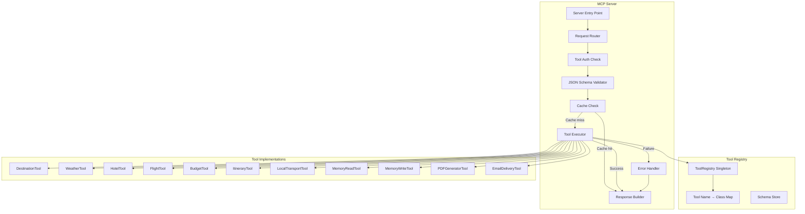
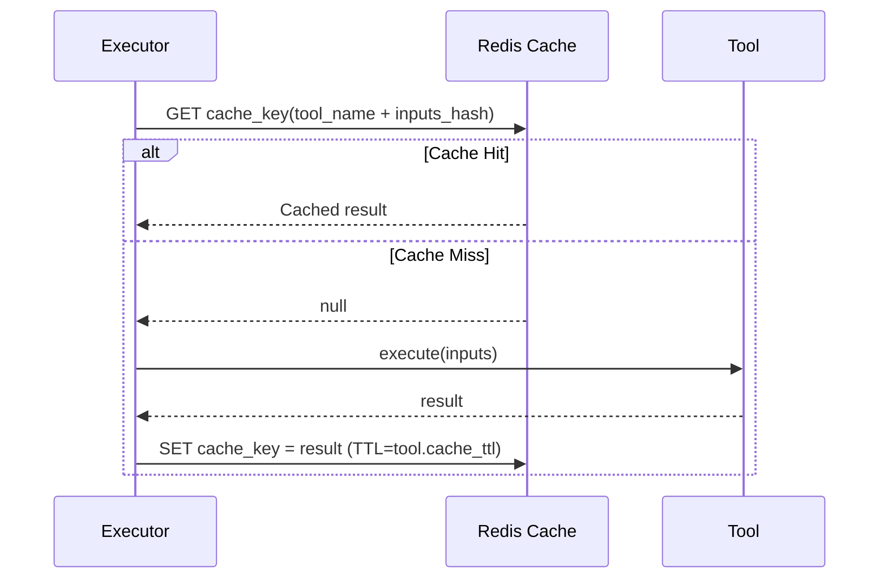

# MCP Architecture — Aegis Multi-Agent Trip Planner

**Version:** 1.0.0 | **Status:** Active | **Last Updated:** 2026-06-20

---

## 1. Overview

The **Model Context Protocol (MCP)** serves as the standardized communication layer between AI agents and their domain tools. Rather than hard-coding tool calls inside individual agents, all tool interactions flow through a centralized MCP Server that manages discovery, validation, execution, and response formatting.

This design enables:
- **Tool reusability** across multiple agents.
- **Centralized validation** of tool inputs.
- **Unified error handling** for all tool failures.
- **Runtime tool discovery** — agents query the registry without hardcoded assumptions.

---

## 2. MCP Protocol Flow



---

## 3. MCP Server Architecture



---

## 4. Tool Registry Implementation

```python
from typing import Dict, Type
from dataclasses import dataclass

@dataclass
class ToolDefinition:
    name: str
    description: str
    input_schema: dict
    output_schema: dict
    cacheable: bool
    cache_ttl_seconds: int

class ToolRegistry:
    """Singleton registry for all MCP tools."""
    
    _instance = None
    _tools: Dict[str, "BaseMCPTool"] = {}
    _definitions: Dict[str, ToolDefinition] = {}
    
    @classmethod
    def get_instance(cls) -> "ToolRegistry":
        if cls._instance is None:
            cls._instance = cls()
        return cls._instance
    
    def register(self, tool: "BaseMCPTool") -> None:
        self._tools[tool.name] = tool
        self._definitions[tool.name] = tool.definition
    
    def get_tool(self, name: str) -> "BaseMCPTool":
        if name not in self._tools:
            raise ToolNotFoundError(f"Tool '{name}' not registered")
        return self._tools[name]
    
    def list_tools(self) -> list[ToolDefinition]:
        return list(self._definitions.values())
    
    async def execute(self, name: str, inputs: dict) -> "ToolResult":
        tool = self.get_tool(name)
        validated = tool.validate_inputs(inputs)
        return await tool.execute(validated)
```

---

## 5. Tool Base Class

```python
from abc import ABC, abstractmethod
from pydantic import BaseModel

class BaseMCPTool(ABC):
    """Abstract base class for all MCP tools."""
    
    name: str
    description: str
    
    @property
    @abstractmethod
    def definition(self) -> ToolDefinition: ...
    
    @abstractmethod
    def validate_inputs(self, inputs: dict) -> BaseModel: ...
    
    @abstractmethod
    async def execute(self, inputs: BaseModel) -> "ToolResult": ...
    
    async def _with_retry(self, coro, max_attempts=3):
        for attempt in range(max_attempts):
            try:
                return await coro
            except Exception as e:
                if attempt == max_attempts - 1:
                    raise
                await asyncio.sleep(2 ** attempt)
```

---

## 6. Tool Catalog

### 6.1 `search_destinations`

**Domain:** Destination Research  
**Agent(s):** DestinationAgent  
**Cacheable:** Yes (6 hours)

**Input Schema:**
```json
{
  "type": "object",
  "properties": {
    "interests": { "type": "array", "items": { "type": "string" } },
    "budget_range": { "type": "string", "enum": ["budget", "mid-range", "luxury"] },
    "duration_days": { "type": "integer", "minimum": 1, "maximum": 30 },
    "departure_city": { "type": "string" },
    "travel_month": { "type": "string" },
    "exclude_destinations": { "type": "array", "items": { "type": "string" } }
  },
  "required": ["interests", "duration_days", "travel_month"]
}
```

**Output Schema:**
```json
{
  "type": "object",
  "properties": {
    "destinations": {
      "type": "array",
      "items": {
        "type": "object",
        "properties": {
          "name": { "type": "string" },
          "country": { "type": "string" },
          "description": { "type": "string" },
          "top_attractions": { "type": "array", "items": { "type": "string" } },
          "cost_per_day_usd": { "type": "number" },
          "best_months": { "type": "array", "items": { "type": "string" } },
          "match_score": { "type": "number", "minimum": 0, "maximum": 1 }
        }
      }
    }
  }
}
```

**Error Handling:**
- No results → expand search criteria and retry.
- External API failure → use LLM world knowledge with `data_source: "llm_fallback"` flag.

---

### 6.2 `get_weather_forecast`

**Domain:** Weather Intelligence  
**Agent(s):** WeatherAgent  
**Cacheable:** Yes (1 hour)

**Input Schema:**
```json
{
  "type": "object",
  "properties": {
    "destination": { "type": "string" },
    "start_date": { "type": "string", "format": "date" },
    "end_date": { "type": "string", "format": "date" }
  },
  "required": ["destination", "start_date", "end_date"]
}
```

**Output Schema:**
```json
{
  "type": "object",
  "properties": {
    "destination": { "type": "string" },
    "forecast": {
      "type": "array",
      "items": {
        "properties": {
          "date": { "type": "string" },
          "high_temp_c": { "type": "number" },
          "low_temp_c": { "type": "number" },
          "precipitation_pct": { "type": "number" },
          "condition": { "type": "string" },
          "uv_index": { "type": "integer" },
          "wind_speed_kmh": { "type": "number" }
        }
      }
    },
    "summary": { "type": "string" },
    "packing_recommendations": { "type": "array", "items": { "type": "string" } },
    "data_source": { "type": "string", "enum": ["live", "historical_average", "llm_fallback"] }
  }
}
```

**Error Handling:**
- Live forecast unavailable → serve historical monthly averages with `data_source: "historical_average"`.

---

### 6.3 `search_hotels`

**Domain:** Accommodation  
**Agent(s):** HotelAgent  
**Cacheable:** Yes (30 minutes)

**Input Schema:**
```json
{
  "type": "object",
  "properties": {
    "destination": { "type": "string" },
    "checkin_date": { "type": "string", "format": "date" },
    "checkout_date": { "type": "string", "format": "date" },
    "guests": { "type": "integer", "minimum": 1 },
    "max_price_per_night_usd": { "type": "number" },
    "preferences": {
      "type": "array",
      "items": { "type": "string" },
      "description": "e.g. pool, gym, wifi, pet-friendly"
    },
    "location_preference": {
      "type": "string",
      "enum": ["city_center", "near_airport", "beachfront", "near_attractions"]
    }
  },
  "required": ["destination", "checkin_date", "checkout_date", "guests"]
}
```

**Output Schema:**
```json
{
  "type": "object",
  "properties": {
    "hotels": {
      "type": "array",
      "items": {
        "properties": {
          "name": { "type": "string" },
          "star_rating": { "type": "integer" },
          "price_per_night_usd": { "type": "number" },
          "total_price_usd": { "type": "number" },
          "amenities": { "type": "array", "items": { "type": "string" } },
          "neighborhood": { "type": "string" },
          "pros": { "type": "array", "items": { "type": "string" } },
          "cons": { "type": "array", "items": { "type": "string" } },
          "tier": { "type": "string", "enum": ["budget", "mid-range", "luxury"] }
        }
      }
    }
  }
}
```

---

### 6.4 `search_flights`

**Domain:** Transportation  
**Agent(s):** TransportAgent  
**Cacheable:** Yes (15 minutes)

**Input Schema:**
```json
{
  "type": "object",
  "properties": {
    "origin_iata": { "type": "string" },
    "destination_iata": { "type": "string" },
    "departure_date": { "type": "string", "format": "date" },
    "return_date": { "type": "string", "format": "date" },
    "passengers": { "type": "integer" },
    "cabin_class": { "type": "string", "enum": ["economy", "premium_economy", "business", "first"] },
    "max_price_usd": { "type": "number" }
  },
  "required": ["origin_iata", "destination_iata", "departure_date", "passengers"]
}
```

---

### 6.5 `optimize_budget`

**Domain:** Budget Intelligence  
**Agent(s):** BudgetAgent  
**Cacheable:** No (depends on live hotel/flight prices)

**Input Schema:**
```json
{
  "type": "object",
  "properties": {
    "total_budget_usd": { "type": "number" },
    "duration_days": { "type": "integer" },
    "num_travelers": { "type": "integer" },
    "destination": { "type": "string" },
    "travel_style": { "type": "string", "enum": ["budget", "comfort", "luxury"] },
    "hotel_cost_estimate": { "type": "number" },
    "flight_cost_estimate": { "type": "number" }
  },
  "required": ["total_budget_usd", "duration_days", "num_travelers"]
}
```

**Output Schema:**
```json
{
  "type": "object",
  "properties": {
    "allocation": {
      "properties": {
        "accommodation_usd": { "type": "number" },
        "transport_usd": { "type": "number" },
        "food_usd": { "type": "number" },
        "activities_usd": { "type": "number" },
        "emergency_reserve_usd": { "type": "number" }
      }
    },
    "daily_budget_per_person_usd": { "type": "number" },
    "budget_tier": { "type": "string" },
    "savings_tips": { "type": "array", "items": { "type": "string" } },
    "feasibility": { "type": "string", "enum": ["comfortable", "tight", "insufficient"] }
  }
}
```

---

### 6.6 `generate_itinerary`

**Domain:** Itinerary Planning  
**Agent(s):** ItineraryAgent  
**Cacheable:** No

**Input Schema:**
```json
{
  "type": "object",
  "properties": {
    "destination": { "type": "string" },
    "duration_days": { "type": "integer" },
    "hotel_neighborhood": { "type": "string" },
    "interests": { "type": "array", "items": { "type": "string" } },
    "daily_budget_usd": { "type": "number" },
    "weather_forecast": { "type": "array" },
    "num_travelers": { "type": "integer" }
  },
  "required": ["destination", "duration_days", "daily_budget_usd"]
}
```

**Output Schema:**
```json
{
  "type": "object",
  "properties": {
    "itinerary": {
      "type": "array",
      "items": {
        "properties": {
          "day": { "type": "integer" },
          "date": { "type": "string" },
          "theme": { "type": "string" },
          "morning": { "type": "object" },
          "afternoon": { "type": "object" },
          "evening": { "type": "object" },
          "meals": { "type": "object" },
          "estimated_cost_usd": { "type": "number" },
          "logistics_notes": { "type": "string" }
        }
      }
    }
  }
}
```

---

### 6.7 `get_local_transport`

**Domain:** Local Transportation  
**Agent(s):** TransportAgent  
**Cacheable:** Yes (24 hours)

---

### 6.8 `get_user_memories`

**Domain:** Memory System  
**Agent(s):** All agents (personalization)  
**Cacheable:** No

---

### 6.9 `save_user_memory`

**Domain:** Memory System  
**Agent(s):** FinalPlannerAgent, ReplanningAgent  
**Cacheable:** No

---

### 6.10 `generate_pdf`

**Domain:** Document Generation  
**Agent(s):** FinalPlannerAgent  
**Cacheable:** No

---

### 6.11 `send_trip_email`

**Domain:** Delivery  
**Agent(s):** FinalPlannerAgent  
**Cacheable:** No

---

## 7. MCP Error Response Format

All tool errors return a standardized error response:

```json
{
  "error": {
    "code": "TOOL_EXECUTION_FAILED",
    "tool_name": "search_hotels",
    "message": "External hotel API returned 503",
    "retry_after_seconds": 30,
    "fallback_available": true,
    "fallback_data_source": "llm_knowledge"
  },
  "result": null
}
```

### Error Codes

| Code | Description |
|---|---|
| `TOOL_NOT_FOUND` | Tool name not in registry |
| `INVALID_INPUT` | Input schema validation failed |
| `TOOL_EXECUTION_FAILED` | Tool raised an exception |
| `EXTERNAL_API_UNAVAILABLE` | Third-party API returned 5xx |
| `RATE_LIMIT_EXCEEDED` | External API rate limit hit |
| `CACHE_ERROR` | Redis unavailable (non-fatal) |
| `OUTPUT_VALIDATION_FAILED` | Tool output failed schema validation |

---

## 8. Caching Architecture



**Cache Key Format:** `mcp:{tool_name}:{sha256(sorted_inputs_json)}`

---

*Document: MCP Architecture | Version: 1.0.0*
