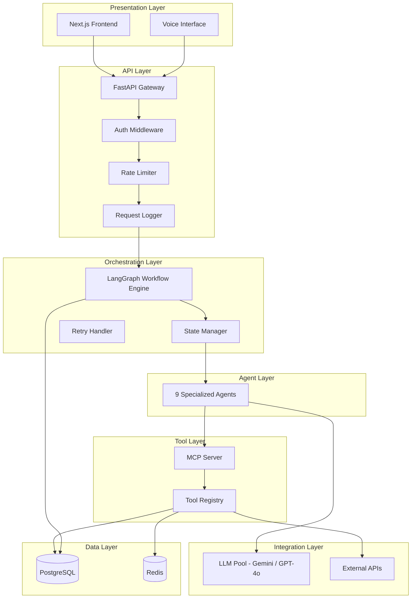
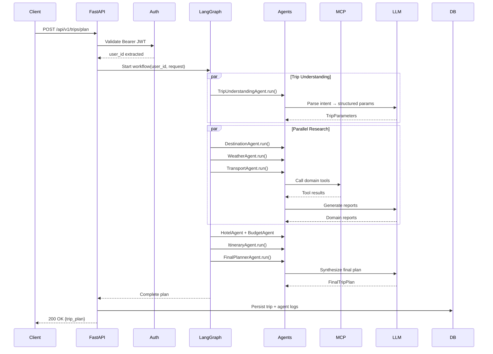
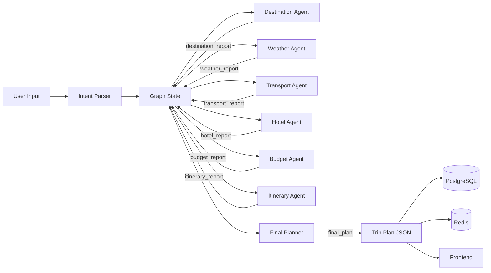
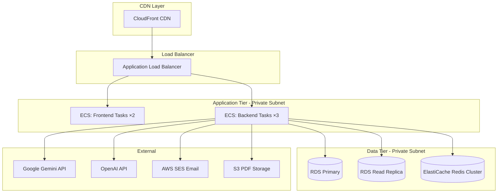
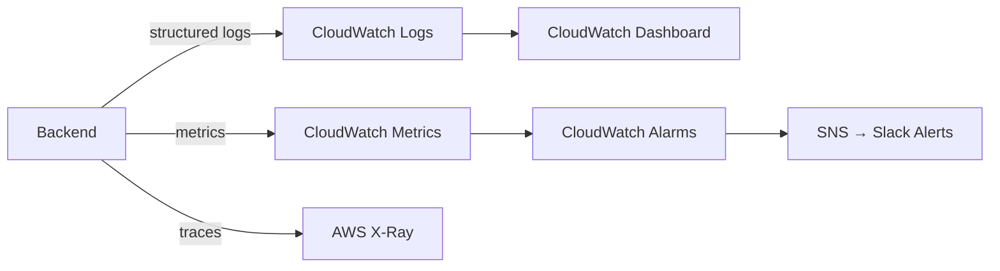

# System Architecture — Aegis Multi-Agent Trip Planner

**Version:** 1.0.0 | **Status:** Active | **Last Updated:** 2026-06-20

---

## 1. Overview

Aegis is built on a **layered, domain-separated architecture** where each layer has a single, well-defined responsibility. The system orchestrates a network of specialized AI agents using LangGraph and the Model Context Protocol (MCP), backed by a FastAPI REST API and a Next.js frontend.

---

## 2. Architectural Principles

| Principle | Description |
|---|---|
| **Separation of Concerns** | Each layer and module has exactly one responsibility |
| **Agent Autonomy** | Each AI agent is independently prompt-engineered and tested |
| **Tool Composability** | MCP tools are reusable across multiple agents |
| **Stateless API** | JWT-authenticated stateless REST API — no server sessions |
| **Fail-Safe Defaults** | Every agent has defined fallback behavior on failure |
| **Observable by Design** | Structured logging and metrics emitted at every layer |

---

## 3. Layer Architecture

---

## 4. Component Responsibilities

### 4.1 Presentation Layer

| Component | Technology | Responsibility |
|---|---|---|
| Next.js Frontend | Next.js 15 + TypeScript | User interface, routing, state display |
| Voice Interface | Web Speech API | STT/TTS for hands-free planning |

### 4.2 API Layer

| Component | Technology | Responsibility |
|---|---|---|
| FastAPI Gateway | FastAPI 0.110+ | Route requests, validate inputs, return responses |
| Auth Middleware | PyJWT + bcrypt | Verify JWT tokens on protected routes |
| Rate Limiter | SlowAPI / Redis | Prevent abuse (100 req/min per IP) |
| Request Logger | Python logging | Structured JSON request/response logs |

### 4.3 Orchestration Layer

| Component | Technology | Responsibility |
|---|---|---|
| LangGraph Workflow | LangGraph 0.2+ | Define and execute the multi-agent graph |
| State Manager | TypedDict State | Shared state across all graph nodes |
| Retry Handler | Custom decorator | Exponential backoff retry logic |

### 4.4 Agent Layer

Nine specialized agents, each extending `BaseAgent`. See `Agent_Architecture.md` for full details.

### 4.5 Tool Layer (MCP)

| Component | Responsibility |
|---|---|
| MCP Server | Expose tools via MCP protocol |
| Tool Registry | Discover and dispatch tool calls |
| Domain Tools | 12 tools across 7 domains |

### 4.6 Data Layer

| Component | Purpose |
|---|---|
| PostgreSQL 16 | Primary persistent storage (users, trips, logs) |
| Redis 7 | Session cache, rate limiting, agent result cache |

---

## 5. Request Lifecycle

---

## 6. Data Flow Architecture

---

## 7. Deployment Topology (Production)

---

## 8. Scalability Design

### Horizontal Scaling

- **Backend**: Stateless FastAPI pods behind ALB. Scale by adding ECS tasks.
- **Frontend**: Static-optimized Next.js behind CloudFront. CDN handles scale.
- **Database**: Read replica for read-heavy workloads (trip history queries).

### Caching Strategy

| Cache Target | TTL | Store |
|---|---|---|
| Weather tool results | 1 hour | Redis |
| Destination search results | 6 hours | Redis |
| Hotel search results | 30 minutes | Redis |
| User profile | 5 minutes | Redis |
| JWT refresh token state | 7 days | Redis |

### Agent Concurrency

- Parallel agent execution via `asyncio.gather()` in LangGraph.
- Each agent runs in its own async context — no shared mutable state.
- LLM calls use `AsyncOpenAI` / `AsyncGemini` clients.

---

## 9. Observability Stack

### Key Metrics

| Metric | Alert Threshold |
|---|---|
| API Error Rate | > 1% |
| P95 Trip Planning Latency | > 60 seconds |
| LLM Token Usage (daily) | > 80% of quota |
| DB Connection Pool Exhaustion | Any occurrence |
| Failed Agent Executions | > 5% of requests |

---

*Document: System Architecture | Version: 1.0.0*
