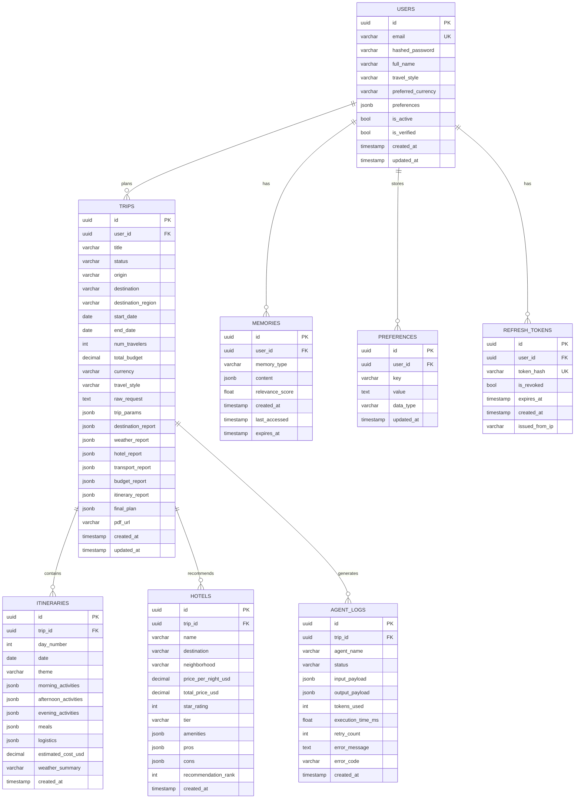

# Database ERD & Schema — Aegis Multi-Agent Trip Planner

**Version:** 1.0.0 | **Database:** PostgreSQL 16 | **ORM:** SQLAlchemy 2.x | **Last Updated:** 2026-06-20

---

## 1. Entity Relationship Diagram



---

## 2. Table Schemas (SQLAlchemy Models)

### 2.1 `users`

```sql
CREATE TABLE users (
    id              UUID PRIMARY KEY DEFAULT gen_random_uuid(),
    email           VARCHAR(255) UNIQUE NOT NULL,
    hashed_password VARCHAR(255) NOT NULL,
    full_name       VARCHAR(255),
    travel_style    VARCHAR(50) DEFAULT 'comfort',
    preferred_currency VARCHAR(3) DEFAULT 'USD',
    preferences     JSONB DEFAULT '{}',
    is_active       BOOLEAN DEFAULT TRUE,
    is_verified     BOOLEAN DEFAULT FALSE,
    created_at      TIMESTAMP WITH TIME ZONE DEFAULT NOW(),
    updated_at      TIMESTAMP WITH TIME ZONE DEFAULT NOW()
);

CREATE INDEX idx_users_email ON users(email);
```

### 2.2 `trips`

```sql
CREATE TABLE trips (
    id                  UUID PRIMARY KEY DEFAULT gen_random_uuid(),
    user_id             UUID NOT NULL REFERENCES users(id) ON DELETE CASCADE,
    title               VARCHAR(255),
    status              VARCHAR(50) NOT NULL DEFAULT 'planning',
                        -- values: planning, completed, failed, replanning
    origin              VARCHAR(255),
    destination         VARCHAR(255),
    destination_region  VARCHAR(255),
    start_date          DATE,
    end_date            DATE,
    num_travelers       INTEGER DEFAULT 1,
    total_budget        DECIMAL(12,2),
    currency            VARCHAR(3) DEFAULT 'USD',
    travel_style        VARCHAR(50),
    raw_request         TEXT,
    trip_params         JSONB,
    destination_report  JSONB,
    weather_report      JSONB,
    hotel_report        JSONB,
    transport_report    JSONB,
    budget_report       JSONB,
    itinerary_report    JSONB,
    final_plan          JSONB,
    pdf_url             TEXT,
    created_at          TIMESTAMP WITH TIME ZONE DEFAULT NOW(),
    updated_at          TIMESTAMP WITH TIME ZONE DEFAULT NOW()
);

CREATE INDEX idx_trips_user_id ON trips(user_id);
CREATE INDEX idx_trips_status ON trips(status);
CREATE INDEX idx_trips_created_at ON trips(created_at DESC);
CREATE INDEX idx_trips_destination ON trips(destination);
```

### 2.3 `itineraries`

```sql
CREATE TABLE itineraries (
    id                  UUID PRIMARY KEY DEFAULT gen_random_uuid(),
    trip_id             UUID NOT NULL REFERENCES trips(id) ON DELETE CASCADE,
    day_number          INTEGER NOT NULL,
    date                DATE,
    theme               VARCHAR(255),
    morning_activities  JSONB DEFAULT '[]',
    afternoon_activities JSONB DEFAULT '[]',
    evening_activities  JSONB DEFAULT '[]',
    meals               JSONB DEFAULT '{}',
    logistics           JSONB DEFAULT '{}',
    estimated_cost_usd  DECIMAL(10,2),
    weather_summary     VARCHAR(255),
    created_at          TIMESTAMP WITH TIME ZONE DEFAULT NOW(),
    UNIQUE(trip_id, day_number)
);

CREATE INDEX idx_itineraries_trip_id ON itineraries(trip_id);
```

### 2.4 `hotels`

```sql
CREATE TABLE hotels (
    id                      UUID PRIMARY KEY DEFAULT gen_random_uuid(),
    trip_id                 UUID NOT NULL REFERENCES trips(id) ON DELETE CASCADE,
    name                    VARCHAR(255) NOT NULL,
    destination             VARCHAR(255),
    neighborhood            VARCHAR(255),
    price_per_night_usd     DECIMAL(10,2),
    total_price_usd         DECIMAL(12,2),
    star_rating             INTEGER CHECK (star_rating BETWEEN 1 AND 5),
    tier                    VARCHAR(50),  -- budget, mid-range, luxury
    amenities               JSONB DEFAULT '[]',
    pros                    JSONB DEFAULT '[]',
    cons                    JSONB DEFAULT '[]',
    recommendation_rank     INTEGER DEFAULT 1,
    created_at              TIMESTAMP WITH TIME ZONE DEFAULT NOW()
);

CREATE INDEX idx_hotels_trip_id ON hotels(trip_id);
```

### 2.5 `memories`

```sql
CREATE TABLE memories (
    id              UUID PRIMARY KEY DEFAULT gen_random_uuid(),
    user_id         UUID NOT NULL REFERENCES users(id) ON DELETE CASCADE,
    memory_type     VARCHAR(50) NOT NULL,
                    -- values: preference, past_trip, feedback, blacklist
    content         JSONB NOT NULL,
    relevance_score FLOAT DEFAULT 1.0,
    created_at      TIMESTAMP WITH TIME ZONE DEFAULT NOW(),
    last_accessed   TIMESTAMP WITH TIME ZONE DEFAULT NOW(),
    expires_at      TIMESTAMP WITH TIME ZONE
);

CREATE INDEX idx_memories_user_id ON memories(user_id);
CREATE INDEX idx_memories_user_type ON memories(user_id, memory_type);
CREATE INDEX idx_memories_expires ON memories(expires_at) WHERE expires_at IS NOT NULL;
```

### 2.6 `preferences`

```sql
CREATE TABLE preferences (
    id          UUID PRIMARY KEY DEFAULT gen_random_uuid(),
    user_id     UUID NOT NULL REFERENCES users(id) ON DELETE CASCADE,
    key         VARCHAR(100) NOT NULL,
    value       TEXT NOT NULL,
    data_type   VARCHAR(20) DEFAULT 'string',  -- string, integer, boolean, json
    updated_at  TIMESTAMP WITH TIME ZONE DEFAULT NOW(),
    UNIQUE(user_id, key)
);

CREATE INDEX idx_preferences_user_key ON preferences(user_id, key);
```

### 2.7 `agent_logs`

```sql
CREATE TABLE agent_logs (
    id                  UUID PRIMARY KEY DEFAULT gen_random_uuid(),
    trip_id             UUID NOT NULL REFERENCES trips(id) ON DELETE CASCADE,
    agent_name          VARCHAR(100) NOT NULL,
    status              VARCHAR(50) NOT NULL,  -- running, success, failed, fallback
    input_payload       JSONB,
    output_payload      JSONB,
    tokens_used         INTEGER DEFAULT 0,
    execution_time_ms   FLOAT,
    retry_count         INTEGER DEFAULT 0,
    error_message       TEXT,
    error_code          VARCHAR(100),
    created_at          TIMESTAMP WITH TIME ZONE DEFAULT NOW()
);

CREATE INDEX idx_agent_logs_trip_id ON agent_logs(trip_id);
CREATE INDEX idx_agent_logs_trip_agent ON agent_logs(trip_id, agent_name);
CREATE INDEX idx_agent_logs_status ON agent_logs(status);
```

### 2.8 `refresh_tokens`

```sql
CREATE TABLE refresh_tokens (
    id              UUID PRIMARY KEY DEFAULT gen_random_uuid(),
    user_id         UUID NOT NULL REFERENCES users(id) ON DELETE CASCADE,
    token_hash      VARCHAR(255) UNIQUE NOT NULL,
    is_revoked      BOOLEAN DEFAULT FALSE,
    expires_at      TIMESTAMP WITH TIME ZONE NOT NULL,
    created_at      TIMESTAMP WITH TIME ZONE DEFAULT NOW(),
    issued_from_ip  VARCHAR(45)
);

CREATE INDEX idx_refresh_tokens_user_id ON refresh_tokens(user_id);
CREATE INDEX idx_refresh_tokens_hash ON refresh_tokens(token_hash);
-- Partial index for active tokens
CREATE INDEX idx_refresh_tokens_active ON refresh_tokens(user_id) 
    WHERE is_revoked = FALSE;
```

---

## 3. JSONB Schema Definitions

### 3.1 `trip_params` JSONB Structure
```json
{
  "destination": "Japan",
  "destination_region": "East Asia",
  "origin": "New York, USA",
  "start_date": "2026-04-01",
  "end_date": "2026-04-08",
  "num_travelers": 2,
  "total_budget": 4000,
  "currency": "USD",
  "travel_style": "comfort",
  "interests": ["culture", "food", "temples"],
  "special_requirements": []
}
```

### 3.2 `final_plan` JSONB Structure
```json
{
  "title": "7-Day Japan Adventure",
  "summary": "An immersive cultural journey...",
  "must_do_experiences": ["..."],
  "practical_tips": ["..."],
  "emergency_contacts": ["..."],
  "useful_apps": ["..."],
  "destination_overview": {},
  "hotel_recommendations": [],
  "transport_plan": {},
  "budget_breakdown": {},
  "day_by_day_itinerary": [],
  "weather_overview": {},
  "packing_list": [],
  "changes_summary": []
}
```

---

## 4. Migration Strategy

### Alembic Configuration

```ini
# alembic.ini
[alembic]
script_location = alembic
sqlalchemy.url = postgresql://%(POSTGRES_USER)s:%(POSTGRES_PASSWORD)s@%(POSTGRES_SERVER)s/%(POSTGRES_DB)s
```

### Migration Naming Convention

```
YYYYMMDD_HHMMSS_short_description.py
e.g.: 20260620_120000_create_users_table.py
```

### Rollback Strategy

Each migration includes an explicit `downgrade()` function. Rollbacks are tested in CI before merge.

---

## 5. Database Maintenance

### Scheduled Jobs

| Job | Frequency | Purpose |
|---|---|---|
| Clean expired refresh tokens | Daily | Remove revoked/expired tokens |
| Clean expired memories | Weekly | Remove memories past `expires_at` |
| Archive old agent logs | Monthly | Move logs >90 days to archive table |
| VACUUM ANALYZE | Weekly | Reclaim storage and update statistics |

---

*Document: Database ERD & Schema | Version: 1.0.0*
