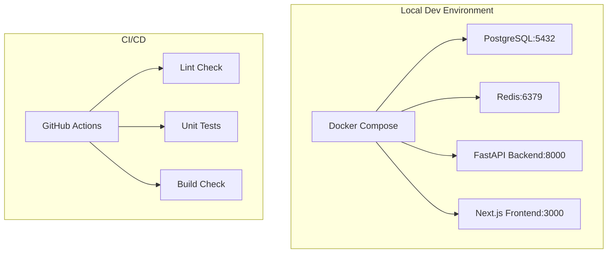

# M01 — Project Setup & Infrastructure

**Milestone:** 1 of 20 | **Duration:** 1 Week | **Status:** Foundation

---

## 1. Objective

Establish the complete monorepo structure, local development environment, CI/CD scaffold, and shared tooling. This milestone creates the foundation all subsequent milestones build upon.

---

## 2. Scope

- Initialize monorepo with `frontend/`, `backend/`, `mcp_server/`, `docs/` directories.
- Configure Docker Compose for local development (PostgreSQL, Redis, Backend, Frontend).
- Set up Python virtual environment and package management (`requirements.txt`).
- Initialize Next.js 15 frontend project with TypeScript, Tailwind, shadcn/ui.
- Configure ESLint, Prettier (frontend) and Ruff (backend) linting.
- Set up GitHub Actions CI pipeline (lint + test on every PR).
- Configure environment variable management (`.env` files + validation).
- Create Alembic migration infrastructure.

---

## 3. Architecture



---

## 4. Folder Structure

```
Trip_Planner/
├── frontend/
│   ├── src/
│   │   ├── app/
│   │   │   └── layout.tsx
│   │   └── components/
│   ├── package.json
│   ├── next.config.ts
│   ├── tailwind.config.ts
│   └── tsconfig.json
├── backend/
│   ├── app/
│   │   ├── main.py
│   │   ├── api/
│   │   ├── core/
│   │   │   ├── config.py
│   │   │   └── database.py
│   │   └── models/
│   ├── alembic/
│   │   ├── env.py
│   │   └── versions/
│   ├── requirements.txt
│   └── .env
├── mcp_server/
│   └── __init__.py
├── docs/
├── docker-compose.yml
├── .github/
│   └── workflows/
│       └── ci.yml
└── .gitignore
```

---

## 5. Database Changes

Create initial Alembic migration infrastructure. No application tables yet — only the migration tracking table.

```bash
alembic init alembic
alembic revision --autogenerate -m "initial_setup"
```

---

## 6. APIs

**Health check endpoint (no auth):**

```
GET /api/v1/health
→ 200 { "status": "healthy", "version": "1.0.0" }
```

---

## 7. Key Files & Classes

### `backend/app/core/config.py`
```python
from pydantic_settings import BaseSettings

class Settings(BaseSettings):
    PROJECT_NAME: str = "Aegis Trip Planner API"
    API_V1_STR: str = "/api/v1"
    POSTGRES_SERVER: str
    POSTGRES_USER: str
    POSTGRES_PASSWORD: str
    POSTGRES_DB: str
    POSTGRES_PORT: str = "5432"
    DATABASE_URL: str | None = None
    REDIS_URL: str = "redis://localhost:6379"
    SECRET_KEY: str
    REFRESH_SECRET_KEY: str
    GEMINI_API_KEY: str | None = None
    OPENAI_API_KEY: str | None = None

    model_config = SettingsConfigDict(env_file=".env")

settings = Settings()
```

### `backend/app/core/database.py`
```python
from sqlalchemy.ext.asyncio import AsyncSession, create_async_engine
from sqlalchemy.orm import DeclarativeBase, sessionmaker

engine = create_async_engine(settings.DATABASE_URL, echo=False)
AsyncSessionLocal = sessionmaker(engine, class_=AsyncSession, expire_on_commit=False)

class Base(DeclarativeBase):
    pass
```

### `docker-compose.yml`
```yaml
version: '3.8'
services:
  db:
    image: postgres:16-alpine
    environment:
      POSTGRES_USER: postgres
      POSTGRES_PASSWORD: password123
      POSTGRES_DB: trip_planner
    ports: ["5432:5432"]
    volumes: [postgres_data:/var/lib/postgresql/data]
    healthcheck:
      test: ["CMD-SHELL", "pg_isready -U postgres"]
      interval: 5s
      timeout: 5s
      retries: 5

  redis:
    image: redis:7-alpine
    ports: ["6379:6379"]
    command: redis-server --maxmemory 256mb --maxmemory-policy allkeys-lru

  backend:
    build: ./backend
    ports: ["8000:8000"]
    env_file: ./backend/.env
    depends_on:
      db:
        condition: service_healthy
    volumes: [./backend:/workspace]

  frontend:
    build: ./frontend
    ports: ["3000:3000"]
    env_file: ./frontend/.env
    depends_on: [backend]
    volumes: [./frontend:/app, /app/node_modules]

volumes:
  postgres_data:
```

---

## 8. CI/CD Pipeline

```yaml
# .github/workflows/ci.yml
name: CI
on:
  push:
    branches: [develop, main]
  pull_request:
    branches: [develop, main]

jobs:
  backend-checks:
    runs-on: ubuntu-latest
    steps:
      - uses: actions/checkout@v4
      - uses: actions/setup-python@v5
        with: { python-version: '3.12' }
      - run: pip install ruff pytest
      - run: ruff check backend/
      - run: pytest backend/ -x --tb=short

  frontend-checks:
    runs-on: ubuntu-latest
    steps:
      - uses: actions/checkout@v4
      - uses: actions/setup-node@v4
        with: { node-version: '20' }
      - run: npm ci
        working-directory: frontend
      - run: npm run lint
        working-directory: frontend
      - run: npm run build
        working-directory: frontend
```

---

## 9. Edge Cases

- `.env` file missing → `config.py` raises `ValidationError` at startup with a clear message listing missing variables.
- PostgreSQL connection failure → Backend startup fails with a clear connection error (not a silent hang).
- Redis unavailable → Application starts but logs a warning; Redis-dependent features degrade gracefully.

---

## 10. Error Handling

- Global FastAPI exception handler catches unhandled exceptions and returns `500` with a structured error body.
- `422 Unprocessable Entity` returned for Pydantic validation failures with field-level error details.

---

## 11. Security Considerations

- `.env` files added to `.gitignore`.
- No secrets hardcoded in any source file.
- Docker volumes use named volumes (not bind mounts for database data).
- Backend container runs as non-root user.

---

## 12. Testing Plan

| Test | Type | Tool | Criteria |
|---|---|---|---|
| Health endpoint returns 200 | Integration | pytest+httpx | Response `status: healthy` |
| Config loads from .env | Unit | pytest | `settings.POSTGRES_SERVER` resolves correctly |
| Docker Compose starts all services | Manual | docker compose up | All 4 services healthy |
| CI pipeline runs on PR | Automated | GitHub Actions | All checks green |

---

## 13. Acceptance Criteria

- [ ] `docker compose up --build` starts all 4 services without errors.
- [ ] `GET /api/v1/health` returns `{"status": "healthy"}`.
- [ ] Next.js dev server runs at `http://localhost:3000`.
- [ ] Alembic `current` command shows migration state.
- [ ] GitHub Actions CI pipeline runs successfully on a test PR.
- [ ] Ruff linting passes on all Python files.
- [ ] ESLint passes on all TypeScript files.
- [ ] `.env` validation raises clear errors for missing required variables.

---

## 14. Implementation Tasks

- [ ] Initialize monorepo directory structure.
- [ ] Create `docker-compose.yml` with all services.
- [ ] Initialize Next.js 15 with TypeScript + Tailwind + shadcn/ui.
- [ ] Set up FastAPI `main.py` with global error handler and CORS.
- [ ] Implement `core/config.py` with Settings and validation.
- [ ] Implement `core/database.py` with async SQLAlchemy engine.
- [ ] Initialize Alembic with `env.py` connected to async engine.
- [ ] Create `GET /api/v1/health` endpoint.
- [ ] Configure `.gitignore` for all service directories.
- [ ] Create `backend/.env.example` and `frontend/.env.example`.
- [ ] Set up GitHub Actions CI workflow.
- [ ] Configure Ruff for backend linting.
- [ ] Configure ESLint + Prettier for frontend.

---

## 15. Definition of Done

- All acceptance criteria above are checked.
- CI pipeline runs green on `develop` branch.
- `docker compose up` works from a fresh clone with no additional steps.
- Documentation updated: `docs/Deployment/Local_Setup.md`.

---

*M01 — Project Setup & Infrastructure | Duration: 1 Week*
