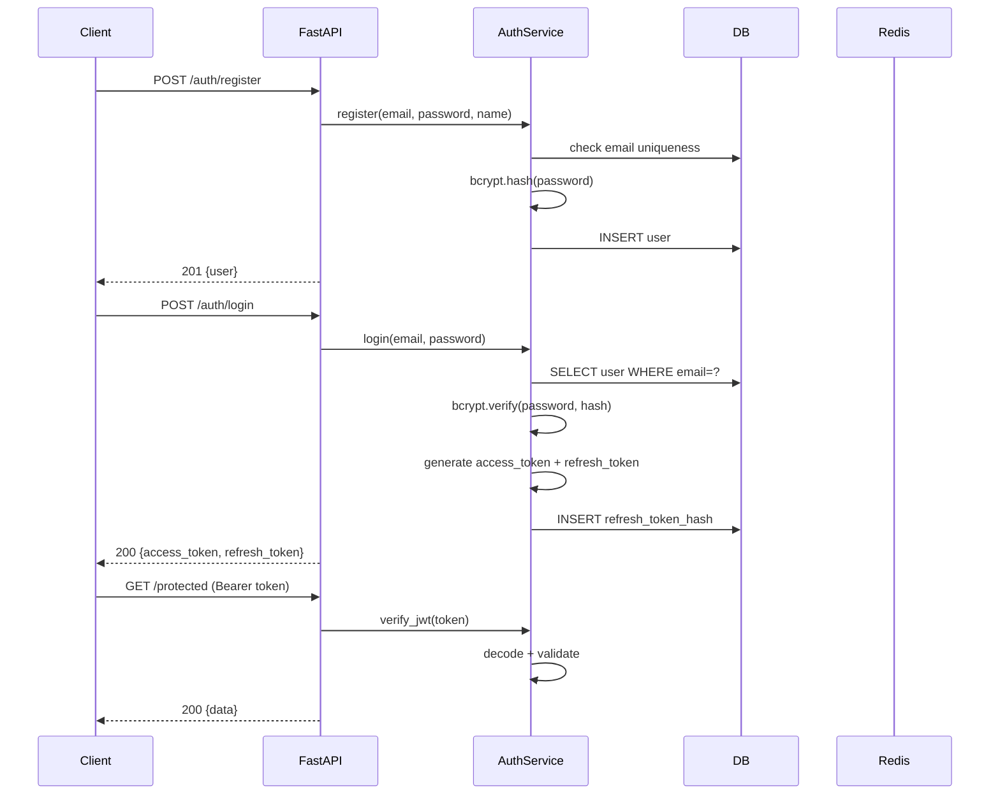
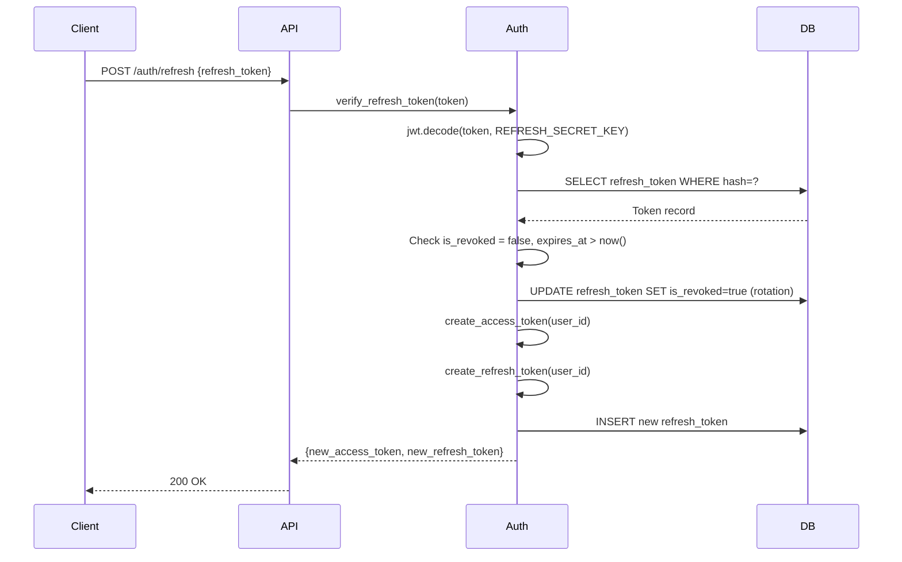

# M02 — Authentication System

**Milestone:** 2 of 20 | **Duration:** 1 Week | **Depends On:** M01

---

## 1. Objective

Implement a complete, production-grade authentication system with user registration, login, JWT-based stateless auth, token rotation, and secure logout.

---

## 2. Scope

- User registration with email, password, and full name.
- Login with JWT access token (15 min) + refresh token (7 days).
- Token refresh with rotation (old token invalidated).
- Logout with token revocation.
- Password hashing with bcrypt (work factor 12).
- Auth middleware for protecting routes.
- Rate limiting on auth endpoints.

---

## 3. Architecture



---

## 4. Database Changes

**New table:** `users` (full schema in ERD.md)  
**New table:** `refresh_tokens`

```bash
alembic revision --autogenerate -m "create_users_and_refresh_tokens"
alembic upgrade head
```

---

## 5. APIs

| Method | Endpoint | Auth | Description |
|---|---|---|---|
| POST | `/api/v1/auth/register` | None | Register new user |
| POST | `/api/v1/auth/login` | None | Login and get tokens |
| POST | `/api/v1/auth/refresh` | Refresh Token | Get new access token |
| POST | `/api/v1/auth/logout` | Bearer Token | Revoke refresh token |
| GET | `/api/v1/users/me` | Bearer Token | Get current user |

---

## 6. Classes & Components

### `backend/app/core/security.py`
```python
from datetime import datetime, timedelta
from typing import Any
import jwt, bcrypt

def hash_password(password: str) -> str:
    return bcrypt.hashpw(password.encode(), bcrypt.gensalt(12)).decode()

def verify_password(plain: str, hashed: str) -> bool:
    return bcrypt.checkpw(plain.encode(), hashed.encode())

def create_access_token(subject: Any, expires_delta: timedelta = None) -> str:
    expire = datetime.utcnow() + (expires_delta or timedelta(minutes=15))
    payload = {"sub": str(subject), "exp": expire, "type": "access"}
    return jwt.encode(payload, settings.SECRET_KEY, algorithm="HS256")

def create_refresh_token(subject: Any) -> str:
    expire = datetime.utcnow() + timedelta(days=7)
    payload = {"sub": str(subject), "exp": expire, "type": "refresh"}
    return jwt.encode(payload, settings.REFRESH_SECRET_KEY, algorithm="HS256")

def decode_token(token: str, secret: str) -> dict:
    return jwt.decode(token, secret, algorithms=["HS256"])
```

### `backend/app/models/user.py`
```python
from sqlalchemy import Column, String, Boolean, DateTime
from sqlalchemy.dialects.postgresql import UUID, JSONB
from app.core.database import Base

class User(Base):
    __tablename__ = "users"
    id = Column(UUID(as_uuid=True), primary_key=True, default=uuid4)
    email = Column(String(255), unique=True, nullable=False, index=True)
    hashed_password = Column(String(255), nullable=False)
    full_name = Column(String(255))
    travel_style = Column(String(50), default="comfort")
    preferred_currency = Column(String(3), default="USD")
    preferences = Column(JSONB, default={})
    is_active = Column(Boolean, default=True)
    created_at = Column(DateTime(timezone=True), default=datetime.utcnow)
    updated_at = Column(DateTime(timezone=True), default=datetime.utcnow, onupdate=datetime.utcnow)
```

### `backend/app/middleware/auth.py`
```python
from fastapi import Depends, HTTPException, status
from fastapi.security import HTTPBearer, HTTPAuthorizationCredentials

bearer_scheme = HTTPBearer()

async def get_current_user(
    credentials: HTTPAuthorizationCredentials = Depends(bearer_scheme),
    db: AsyncSession = Depends(get_db)
) -> User:
    try:
        payload = decode_token(credentials.credentials, settings.SECRET_KEY)
        user_id = payload.get("sub")
        if not user_id or payload.get("type") != "access":
            raise HTTPException(status_code=401, detail="Invalid token")
    except jwt.ExpiredSignatureError:
        raise HTTPException(status_code=401, detail="Token expired")
    except jwt.InvalidTokenError:
        raise HTTPException(status_code=401, detail="Invalid token")
    
    user = await db.get(User, user_id)
    if not user or not user.is_active:
        raise HTTPException(status_code=401, detail="User not found or inactive")
    return user
```

---

## 7. Sequence Diagram — Token Refresh



---

## 8. Edge Cases

| Scenario | Expected Behavior |
|---|---|
| Duplicate email registration | `400 EMAIL_ALREADY_EXISTS` |
| Wrong password login | `401 INVALID_CREDENTIALS` (same message as wrong email — no enumeration) |
| Expired access token | `401 Token expired` |
| Reused refresh token | `401 TOKEN_REUSED` + revoke ALL user tokens (security incident) |
| Refresh token after logout | `401 INVALID_REFRESH_TOKEN` |
| 5+ failed logins | `429 RATE_LIMIT_EXCEEDED` for 10 minutes |

---

## 9. Security Considerations

- **Timing-safe comparison** for password verification (bcrypt handles this).
- **No user enumeration** — same error message for wrong email and wrong password.
- **Refresh token rotation** — using a refresh token invalidates it and issues a new one.
- **Suspicious reuse detection** — if an already-revoked refresh token is used, revoke ALL user sessions.
- **Token stored as hash** — never store raw refresh tokens in the database.
- **HTTPS only** — auth endpoints must reject plain HTTP in production.

---

## 10. Testing Plan

| Test | Type | Coverage |
|---|---|---|
| Register success | Integration | Happy path |
| Register duplicate email | Integration | Error case |
| Login success | Integration | Happy path |
| Login wrong password | Integration | Error case |
| Access protected route with valid token | Integration | Happy path |
| Access protected route with expired token | Integration | Error case |
| Refresh token rotation | Integration | Happy path |
| Reused refresh token detection | Integration | Security case |
| Logout invalidates token | Integration | Happy path |
| Password hash strength | Unit | bcrypt rounds=12 |

**Coverage Target:** 90%+ for auth service

---

## 11. Acceptance Criteria

- [ ] `POST /auth/register` creates user and returns profile (no password in response).
- [ ] `POST /auth/login` returns valid JWT access and refresh tokens.
- [ ] Access token expires in 15 minutes; verified by decoding.
- [ ] Refresh token rotation works — old token is revoked on refresh.
- [ ] Reused refresh token detection revokes all user sessions.
- [ ] `POST /auth/logout` invalidates the refresh token.
- [ ] Protected routes return `401` without valid Bearer token.
- [ ] Passwords are bcrypt-hashed (not stored plaintext).
- [ ] Rate limiting blocks 6th login attempt within 10 minutes.

---

## 12. Definition of Done

- All acceptance criteria checked.
- Auth integration tests passing in CI.
- No raw passwords or tokens in logs.
- `docs/API/API_Specification.md` updated with auth endpoint details.

---

*M02 — Authentication System | Duration: 1 Week*
