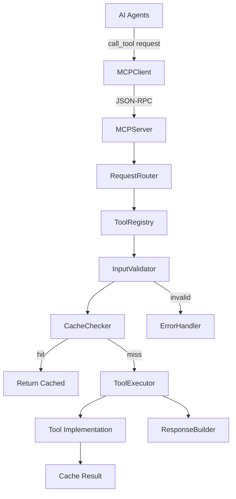
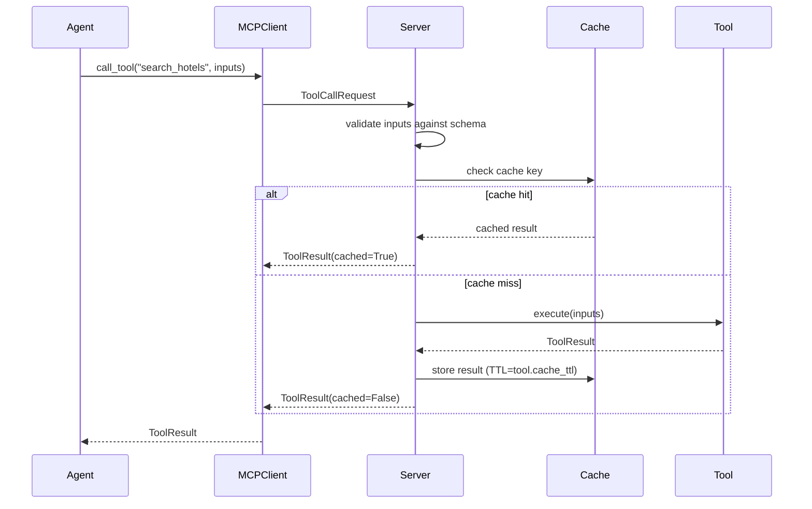

# M03 — MCP Server Foundation

**Milestone:** 3 of 20 | **Duration:** 1 Week | **Depends On:** M01

---

## 1. Objective

Build the MCP (Model Context Protocol) server foundation including the tool registry, base tool class, request routing, input/output validation, error handling, and caching infrastructure.

---

## 2. Scope

- MCP server entry point with JSON-RPC style request handling.
- `ToolRegistry` singleton for tool registration and discovery.
- `BaseMCPTool` abstract class all tools extend.
- Input/output schema validation using Pydantic.
- Redis-based result caching for cacheable tools.
- Standardized error response format.
- Tool introspection endpoint (`list_tools`).

---

## 3. Architecture



---

## 4. Folder Structure

```
mcp_server/
├── __init__.py
├── server.py          # Entry point
├── client.py          # MCPClient for agents to use
├── registry.py        # ToolRegistry singleton
├── base.py            # BaseMCPTool abstract class
├── cache.py           # Redis caching layer
├── validator.py       # JSON schema validation
├── errors.py          # Error types and codes
├── models.py          # ToolDefinition, ToolResult Pydantic models
└── tools/
    └── __init__.py    # Empty until M04
```

---

## 5. Key Classes

### `mcp_server/models.py`
```python
from pydantic import BaseModel
from typing import Any, Optional

class ToolDefinition(BaseModel):
    name: str
    description: str
    input_schema: dict
    output_schema: dict
    cacheable: bool = False
    cache_ttl_seconds: int = 3600

class ToolResult(BaseModel):
    tool_name: str
    success: bool
    data: Optional[Any] = None
    error: Optional[dict] = None
    cached: bool = False
    execution_time_ms: float = 0.0
    data_source: str = "live"

class ToolCallRequest(BaseModel):
    tool_name: str
    inputs: dict
    request_id: str
```

### `mcp_server/base.py`
```python
from abc import ABC, abstractmethod
from .models import ToolDefinition, ToolResult
import asyncio
import time

class BaseMCPTool(ABC):
    """All MCP tools must extend this class."""
    
    @property
    @abstractmethod
    def name(self) -> str: ...
    
    @property
    @abstractmethod
    def description(self) -> str: ...
    
    @property
    @abstractmethod
    def input_schema(self) -> dict: ...
    
    @property
    @abstractmethod
    def output_schema(self) -> dict: ...
    
    cacheable: bool = False
    cache_ttl_seconds: int = 3600
    
    @property
    def definition(self) -> ToolDefinition:
        return ToolDefinition(
            name=self.name,
            description=self.description,
            input_schema=self.input_schema,
            output_schema=self.output_schema,
            cacheable=self.cacheable,
            cache_ttl_seconds=self.cache_ttl_seconds
        )
    
    @abstractmethod
    async def _execute(self, inputs: dict) -> dict:
        """Tool-specific execution logic."""
        ...
    
    async def execute(self, inputs: dict) -> ToolResult:
        start = time.monotonic()
        try:
            data = await self._execute(inputs)
            return ToolResult(
                tool_name=self.name,
                success=True,
                data=data,
                execution_time_ms=(time.monotonic() - start) * 1000
            )
        except Exception as e:
            return ToolResult(
                tool_name=self.name,
                success=False,
                error={"code": "EXECUTION_FAILED", "message": str(e)},
                execution_time_ms=(time.monotonic() - start) * 1000
            )
```

### `mcp_server/registry.py`
```python
from typing import Dict
from .base import BaseMCPTool
from .models import ToolDefinition, ToolResult
from .errors import ToolNotFoundError

class ToolRegistry:
    """Singleton registry for all MCP tools."""
    
    _instance = None
    
    def __new__(cls):
        if cls._instance is None:
            cls._instance = super().__new__(cls)
            cls._instance._tools: Dict[str, BaseMCPTool] = {}
        return cls._instance
    
    def register(self, tool: BaseMCPTool) -> None:
        if tool.name in self._tools:
            raise ValueError(f"Tool '{tool.name}' already registered")
        self._tools[tool.name] = tool
    
    def get_tool(self, name: str) -> BaseMCPTool:
        if name not in self._tools:
            raise ToolNotFoundError(f"Tool '{name}' is not registered")
        return self._tools[name]
    
    def list_tools(self) -> list[ToolDefinition]:
        return [t.definition for t in self._tools.values()]
    
    async def execute(self, name: str, inputs: dict) -> ToolResult:
        tool = self.get_tool(name)
        return await tool.execute(inputs)
```

### `mcp_server/cache.py`
```python
import json, hashlib
import aioredis

class MCPCache:
    def __init__(self, redis_url: str):
        self.redis = aioredis.from_url(redis_url)
    
    def _make_key(self, tool_name: str, inputs: dict) -> str:
        inputs_hash = hashlib.sha256(
            json.dumps(inputs, sort_keys=True).encode()
        ).hexdigest()[:16]
        return f"mcp:{tool_name}:{inputs_hash}"
    
    async def get(self, tool_name: str, inputs: dict):
        key = self._make_key(tool_name, inputs)
        raw = await self.redis.get(key)
        return json.loads(raw) if raw else None
    
    async def set(self, tool_name: str, inputs: dict, result: dict, ttl: int):
        key = self._make_key(tool_name, inputs)
        await self.redis.setex(key, ttl, json.dumps(result))
```

---

## 6. Error Types

```python
# mcp_server/errors.py
class ToolNotFoundError(Exception):
    code = "TOOL_NOT_FOUND"

class InputValidationError(Exception):
    code = "INVALID_INPUT"

class ToolExecutionError(Exception):
    code = "TOOL_EXECUTION_FAILED"
```

---

## 7. Data Flow



---

## 8. Edge Cases

| Scenario | Behavior |
|---|---|
| Unknown tool name | `ToolNotFoundError` → 404-equivalent response |
| Invalid input schema | `InputValidationError` with field-level error details |
| Tool execution exception | Wrapped in `ToolResult(success=False)`, never propagated |
| Redis unavailable | Proceed without caching, log warning |
| Tool returns non-dict result | Wrap in `{"result": value}` |

---

## 9. Security Considerations

- Tool inputs validated before execution — no raw SQL or shell injection possible.
- Tool implementations must not receive raw database connections.
- Cache keys are SHA-256 hashed — no sensitive data in Redis keys.

---

## 10. Testing Plan

| Test | Type | Criteria |
|---|---|---|
| Register tool and retrieve it | Unit | Tool found in registry |
| Call unregistered tool | Unit | `ToolNotFoundError` raised |
| Invalid input schema | Unit | Validation error returned |
| Cache hit bypasses execution | Unit | Tool `_execute` not called |
| Cache miss stores result | Unit | Redis `set` called with correct TTL |
| Tool execution failure wrapped | Unit | `ToolResult(success=False)` returned |
| List tools returns all registered | Unit | Count matches registered tools |

---

## 11. Acceptance Criteria

- [ ] `ToolRegistry` registers and retrieves tools correctly.
- [ ] Calling an unknown tool raises `ToolNotFoundError`.
- [ ] Input validation errors return structured error (not 500).
- [ ] Caching stores results in Redis with correct TTL.
- [ ] Cache hit bypasses tool execution.
- [ ] All tool execution errors are wrapped — never unhandled.
- [ ] `list_tools()` returns definitions for all registered tools.

---

## 12. Definition of Done

- All acceptance criteria checked.
- Unit test coverage ≥ 85% for MCP server core.
- MCP server can be imported and used by agents (M06+).

---

*M03 — MCP Server Foundation | Duration: 1 Week*
