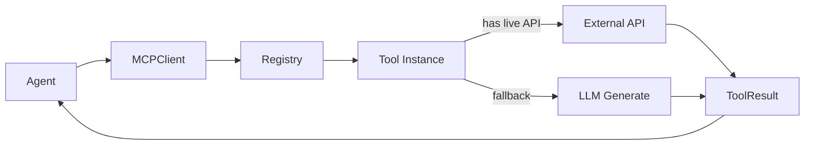

# M04 — Tool Registry & Core Tools

**Milestone:** 4 of 20 | **Duration:** 1 Week | **Depends On:** M03

---

## 1. Objective

Implement all 11 MCP domain tools in `mcp_server/tools/`. Each tool has complete input/output schema validation, execution logic, error handling, and caching configuration.

---

## 2. Scope

Implement all tools:
1. `search_destinations` — Destination research
2. `get_weather_forecast` — Weather data
3. `search_hotels` — Hotel recommendations
4. `search_flights` — Flight options
5. `optimize_budget` — Budget allocation
6. `generate_itinerary` — Itinerary creation
7. `get_local_transport` — Local transport guide
8. `get_user_memories` — Retrieve user memories from DB
9. `save_user_memory` — Persist user memory to DB
10. `generate_pdf` — PDF document generation
11. `send_trip_email` — Email delivery

---

## 3. Folder Structure

```
mcp_server/tools/
├── __init__.py          # Register all tools on import
├── destination.py
├── weather.py
├── hotel.py
├── flight.py
├── budget.py
├── itinerary.py
├── local_transport.py
├── memory_read.py
├── memory_write.py
├── pdf_generator.py
└── email_delivery.py
```

---

## 4. Tool Implementations

### `tools/destination.py`
```python
class SearchDestinationsTool(BaseMCPTool):
    name = "search_destinations"
    description = "Search and rank travel destinations based on user interests and constraints"
    cacheable = True
    cache_ttl_seconds = 21600  # 6 hours
    
    input_schema = {
        "type": "object",
        "properties": {
            "interests": {"type": "array", "items": {"type": "string"}},
            "budget_range": {"type": "string", "enum": ["budget", "mid-range", "luxury"]},
            "duration_days": {"type": "integer", "minimum": 1, "maximum": 30},
            "departure_city": {"type": "string"},
            "travel_month": {"type": "string"},
            "exclude_destinations": {"type": "array", "items": {"type": "string"}}
        },
        "required": ["interests", "duration_days", "travel_month"]
    }
    
    async def _execute(self, inputs: dict) -> dict:
        # In Phase 1: Use LLM to generate destination recommendations
        # In Phase 2: Integrate with real travel API (Amadeus, etc.)
        prompt = self._build_destination_prompt(inputs)
        result = await self.llm.generate_structured(prompt, schema=DESTINATION_OUTPUT_SCHEMA)
        return result
```

### `tools/weather.py`
```python
class GetWeatherForecastTool(BaseMCPTool):
    name = "get_weather_forecast"
    description = "Retrieve weather forecast for destination and travel dates"
    cacheable = True
    cache_ttl_seconds = 3600  # 1 hour
    
    async def _execute(self, inputs: dict) -> dict:
        # Phase 1: LLM-generated historical averages
        # Phase 2: OpenWeatherMap / WeatherAPI integration
        destination = inputs["destination"]
        start_date = inputs["start_date"]
        end_date = inputs["end_date"]
        
        try:
            # Attempt live API call
            return await self._fetch_live_forecast(destination, start_date, end_date)
        except Exception:
            # Fallback to LLM historical knowledge
            return await self._generate_historical_estimate(inputs)
    
    async def _generate_historical_estimate(self, inputs: dict) -> dict:
        result = await self.llm.generate_structured(
            f"Generate typical weather for {inputs['destination']} in "
            f"{inputs['start_date'][:7]} based on historical climate data",
            schema=WEATHER_OUTPUT_SCHEMA
        )
        result["data_source"] = "historical_average"
        return result
```

### `tools/budget.py`
```python
class OptimizeBudgetTool(BaseMCPTool):
    name = "optimize_budget"
    description = "Optimally allocate travel budget across categories"
    cacheable = False  # Depends on live price estimates
    
    # Default allocation ratios by travel style
    ALLOCATION_RULES = {
        "budget":  {"accommodation": 0.35, "transport": 0.30, "food": 0.25, "activities": 0.10},
        "comfort": {"accommodation": 0.40, "transport": 0.30, "food": 0.20, "activities": 0.10},
        "luxury":  {"accommodation": 0.45, "transport": 0.25, "food": 0.20, "activities": 0.10},
    }
    
    async def _execute(self, inputs: dict) -> dict:
        total = inputs["total_budget_usd"]
        emergency_reserve = total * 0.10
        available = total - emergency_reserve
        style = inputs.get("travel_style", "comfort")
        ratios = self.ALLOCATION_RULES[style]
        
        # Adjust if actual hotel/flight estimates are provided
        hotel_est = inputs.get("hotel_cost_estimate", 0)
        flight_est = inputs.get("flight_cost_estimate", 0)
        
        if hotel_est + flight_est > 0:
            fixed_costs = hotel_est + flight_est
            remaining = available - fixed_costs
            return self._compute_adjusted_allocation(total, fixed_costs, remaining, inputs)
        
        return {
            "allocation": {k: round(available * v, 2) for k, v in ratios.items()},
            "emergency_reserve_usd": emergency_reserve,
            "daily_budget_per_person_usd": round(
                available / inputs["duration_days"] / inputs["num_travelers"], 2
            ),
            "feasibility": self._assess_feasibility(total, inputs),
            "savings_tips": await self._generate_savings_tips(inputs)
        }
```

### `tools/memory_read.py`
```python
class GetUserMemoriesTool(BaseMCPTool):
    name = "get_user_memories"
    description = "Retrieve relevant user memories and preferences"
    cacheable = False  # Always fresh from DB
    
    async def _execute(self, inputs: dict) -> dict:
        user_id = inputs["user_id"]
        limit = inputs.get("limit", 10)
        memory_type = inputs.get("memory_type")
        
        async with self.db_session() as session:
            query = select(Memory).where(Memory.user_id == user_id)
            if memory_type:
                query = query.where(Memory.memory_type == memory_type)
            query = query.order_by(Memory.relevance_score.desc()).limit(limit)
            result = await session.execute(query)
            memories = result.scalars().all()
        
        return {
            "memories": [
                {"type": m.memory_type, "content": m.content, "relevance": m.relevance_score}
                for m in memories
            ]
        }
```

---

## 5. Tool Registration

```python
# mcp_server/tools/__init__.py
from ..registry import ToolRegistry
from .destination import SearchDestinationsTool
from .weather import GetWeatherForecastTool
from .hotel import SearchHotelsTool
from .flight import SearchFlightsTool
from .budget import OptimizeBudgetTool
from .itinerary import GenerateItineraryTool
from .local_transport import GetLocalTransportTool
from .memory_read import GetUserMemoriesTool
from .memory_write import SaveUserMemoryTool
from .pdf_generator import GeneratePDFTool
from .email_delivery import SendTripEmailTool

def register_all_tools(registry: ToolRegistry, **dependencies):
    registry.register(SearchDestinationsTool(**dependencies))
    registry.register(GetWeatherForecastTool(**dependencies))
    registry.register(SearchHotelsTool(**dependencies))
    registry.register(SearchFlightsTool(**dependencies))
    registry.register(OptimizeBudgetTool(**dependencies))
    registry.register(GenerateItineraryTool(**dependencies))
    registry.register(GetLocalTransportTool(**dependencies))
    registry.register(GetUserMemoriesTool(**dependencies))
    registry.register(SaveUserMemoryTool(**dependencies))
    registry.register(GeneratePDFTool(**dependencies))
    registry.register(SendTripEmailTool(**dependencies))
```

---

## 6. Data Flow



---

## 7. Edge Cases

| Tool | Scenario | Behavior |
|---|---|---|
| `search_destinations` | No matching destinations | Expand criteria, try again |
| `get_weather_forecast` | Forecast >14 days ahead | Use historical averages |
| `search_hotels` | Budget too low for destination | Return cheapest options + warning |
| `optimize_budget` | Total budget < flight + hotel | Return `feasibility: insufficient` |
| `send_trip_email` | Invalid email address | Skip invalid, send to valid ones |
| `generate_pdf` | PDF library error | Return error, frontend shows download-later option |

---

## 8. Testing Plan

| Test | Coverage |
|---|---|
| Each tool executes with valid input | 11 tools |
| Each tool handles invalid input | 11 tools |
| Budget tool: three style allocations | Math correctness |
| Memory tools: DB read/write | Integration |
| Weather fallback to historical | Fallback behavior |
| Destination: no results handling | Error case |
| All tools registered on import | Registration |

---

## 9. Acceptance Criteria

- [ ] All 11 tools registered and discoverable via `list_tools()`.
- [ ] Each tool validates inputs against its schema.
- [ ] Each tool returns a `ToolResult` (never raises uncaught exception).
- [ ] Cacheable tools store results in Redis with correct TTL.
- [ ] Memory tools correctly read/write to PostgreSQL.
- [ ] Budget allocation math validated: total allocations + emergency = total budget.
- [ ] Weather fallback returns `data_source: "historical_average"` when live fails.

---

## 10. Definition of Done

- All 11 tools implemented and tested.
- Tool registry unit test coverage ≥ 85%.
- Integration tests for memory tools pass (requires DB).
- `docs/Architecture/MCP_Architecture.md` updated with final tool catalog.

---

*M04 — Tool Registry & Core Tools | Duration: 1 Week*
