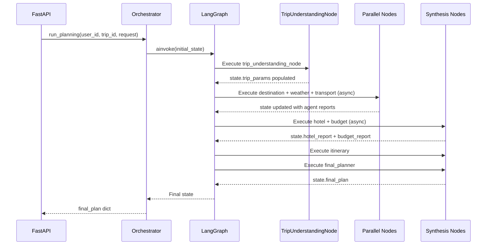
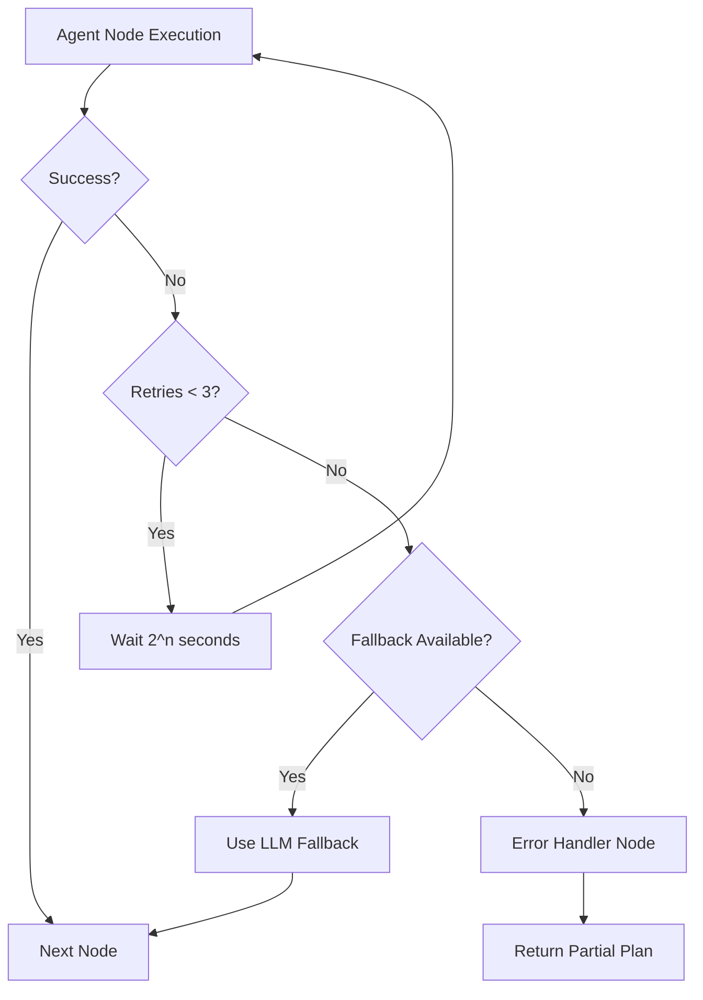

# M05 — LangGraph Foundation

**Milestone:** 5 of 20 | **Duration:** 1 Week | **Depends On:** M03, M04

---

## 1. Objective

Build the LangGraph workflow infrastructure including the shared state schema, graph definition, node functions, conditional routing, retry logic, and the orchestration service that drives the entire multi-agent pipeline.

---

## 2. Scope

- Define `TripPlanningState` TypedDict as the shared state for the entire workflow.
- Define the LangGraph `StateGraph` with all nodes and edges.
- Implement conditional routing (parallel execution, retry paths, replanning trigger).
- Implement the `PlanningOrchestrator` service class that starts and manages graph execution.
- Integrate graph execution with the FastAPI trip planning endpoint.
- Persist graph execution state to the `trips` table.

---

## 3. Folder Structure

```
backend/app/graph/
├── __init__.py
├── state.py        # TripPlanningState TypedDict
├── workflow.py     # LangGraph graph definition
├── nodes.py        # Node function implementations
└── orchestrator.py # PlanningOrchestrator service
```

---

## 4. State Definition

```python
# backend/app/graph/state.py
from typing import TypedDict, Optional, Any
from dataclasses import dataclass

@dataclass
class AgentError:
    agent_name: str
    error_message: str
    retry_count: int

class TripPlanningState(TypedDict):
    # Input
    user_id: str
    trip_id: str
    raw_request: str
    
    # Parsed Parameters (output of TripUnderstandingAgent)
    trip_params: Optional[dict]
    
    # Agent Reports
    destination_report: Optional[dict]
    weather_report: Optional[dict]
    hotel_report: Optional[dict]
    transport_report: Optional[dict]
    budget_report: Optional[dict]
    itinerary_report: Optional[dict]
    
    # Final Output
    final_plan: Optional[dict]
    
    # Control Flow
    errors: list
    retry_counts: dict  # {"agent_name": count}
    is_replanning: bool
    disruption_context: Optional[dict]
    
    # Delivery
    deliver_pdf: bool
    deliver_email: bool
    email_recipients: list[str]
    
    # Metadata
    planning_started_at: str
    current_phase: str
```

---

## 5. Graph Definition

```python
# backend/app/graph/workflow.py
from langgraph.graph import StateGraph, END
from .state import TripPlanningState
from .nodes import (
    trip_understanding_node, destination_node, weather_node,
    transport_node, hotel_node, budget_node, itinerary_node,
    final_planner_node, replanning_node, error_handler_node
)

def should_replan(state: TripPlanningState) -> str:
    if state.get("is_replanning"):
        return "replanning"
    return "final_planner"

def check_understanding(state: TripPlanningState) -> str:
    if state.get("trip_params") is None:
        retry = state["retry_counts"].get("trip_understanding", 0)
        if retry < 3:
            return "retry_understanding"
        return "error_handler"
    return "parallel_research"

def build_planning_graph() -> StateGraph:
    graph = StateGraph(TripPlanningState)
    
    # Add nodes
    graph.add_node("trip_understanding", trip_understanding_node)
    graph.add_node("destination", destination_node)
    graph.add_node("weather", weather_node)
    graph.add_node("transport", transport_node)
    graph.add_node("hotel", hotel_node)
    graph.add_node("budget", budget_node)
    graph.add_node("itinerary", itinerary_node)
    graph.add_node("final_planner", final_planner_node)
    graph.add_node("replanning", replanning_node)
    graph.add_node("error_handler", error_handler_node)
    
    # Set entry point
    graph.set_entry_point("trip_understanding")
    
    # Conditional routing after understanding
    graph.add_conditional_edges(
        "trip_understanding",
        check_understanding,
        {
            "parallel_research": "destination",
            "retry_understanding": "trip_understanding",
            "error_handler": "error_handler"
        }
    )
    
    # Parallel phase 1: destination, weather, transport run simultaneously
    graph.add_edge("destination", "hotel")
    graph.add_edge("weather", "hotel")
    graph.add_edge("transport", "budget")
    
    # Phase 2: hotel and budget
    graph.add_edge("hotel", "itinerary")
    graph.add_edge("budget", "itinerary")
    
    # Synthesis
    graph.add_edge("itinerary", "final_planner")
    
    # Conditional: replan or end
    graph.add_conditional_edges(
        "final_planner",
        should_replan,
        {"replanning": "replanning", "final_planner": END}
    )
    
    graph.add_edge("replanning", END)
    graph.add_edge("error_handler", END)
    
    return graph.compile()

planning_graph = build_planning_graph()
```

---

## 6. Node Implementation Pattern

```python
# backend/app/graph/nodes.py
from .state import TripPlanningState
from app.agents.trip_understanding import TripUnderstandingAgent

async def trip_understanding_node(state: TripPlanningState) -> TripPlanningState:
    """Node function: Wraps TripUnderstandingAgent execution."""
    agent = TripUnderstandingAgent(get_llm(), get_mcp_client())
    
    try:
        updated_state = await agent.run(state)
        updated_state["current_phase"] = "parallel_research"
        return updated_state
    except Exception as e:
        state["errors"].append({
            "agent": "trip_understanding",
            "error": str(e)
        })
        retry = state["retry_counts"].get("trip_understanding", 0)
        state["retry_counts"]["trip_understanding"] = retry + 1
        return state
```

---

## 7. Orchestrator Service

```python
# backend/app/graph/orchestrator.py
from .workflow import planning_graph
from .state import TripPlanningState
import asyncio

class PlanningOrchestrator:
    """Service that executes the LangGraph planning workflow."""
    
    async def run_planning(
        self,
        user_id: str,
        trip_id: str,
        raw_request: str,
        options: dict = None
    ) -> dict:
        """Execute the full planning workflow and return the final plan."""
        
        initial_state = TripPlanningState(
            user_id=user_id,
            trip_id=trip_id,
            raw_request=raw_request,
            trip_params=None,
            destination_report=None,
            weather_report=None,
            hotel_report=None,
            transport_report=None,
            budget_report=None,
            itinerary_report=None,
            final_plan=None,
            errors=[],
            retry_counts={},
            is_replanning=False,
            disruption_context=None,
            deliver_pdf=options.get("pdf", False) if options else False,
            deliver_email=options.get("email", False) if options else False,
            email_recipients=options.get("recipients", []) if options else [],
            planning_started_at=datetime.utcnow().isoformat(),
            current_phase="understanding"
        )
        
        final_state = await planning_graph.ainvoke(initial_state)
        return final_state
    
    async def run_replanning(
        self,
        existing_trip_id: str,
        disruption_context: dict
    ) -> dict:
        """Execute replanning for an existing trip."""
        # Load existing plan from DB
        existing_plan = await self._load_trip(existing_trip_id)
        
        state = TripPlanningState(
            **existing_plan,
            is_replanning=True,
            disruption_context=disruption_context
        )
        
        final_state = await planning_graph.ainvoke(state)
        return final_state
```

---

## 8. Sequence Diagram



---

## 9. Retry Strategy



---

## 10. Edge Cases

| Scenario | Behavior |
|---|---|
| LangGraph timeout (>120s) | Interrupt graph, return partial state with warning |
| All parallel agents fail | Route to error handler, return clarification request |
| State corruption (null required field) | Validate state at each node boundary |
| Replanning on non-existent trip | 404 before entering graph |
| LLM quota exceeded mid-graph | Pause 30s, retry once, then partial plan |

---

## 11. Testing Plan

| Test | Type | Criteria |
|---|---|---|
| Graph compiles without errors | Unit | `build_planning_graph()` succeeds |
| Initial state populates correctly | Unit | All required fields present |
| Graph routes to error on understanding failure | Unit | Mock TUA to fail 3x |
| Replanning sets `is_replanning=True` | Unit | State check |
| Full graph execution (mocked agents) | Integration | `final_plan` is not None |

---

## 12. Acceptance Criteria

- [ ] `planning_graph` compiles and all nodes are reachable.
- [ ] `PlanningOrchestrator.run_planning()` returns a `final_plan` for a valid request.
- [ ] Retry logic fires and increments `retry_counts` correctly.
- [ ] Error handler node returns a structured partial plan.
- [ ] Replanning workflow correctly loads existing state and triggers replanning agent.
- [ ] Graph state is persisted to `trips` table after execution.

---

## 13. Definition of Done

- All acceptance criteria checked.
- Graph can be executed end-to-end with mocked agents.
- CI integration test for orchestrator passes.

---

*M05 — LangGraph Foundation | Duration: 1 Week*
