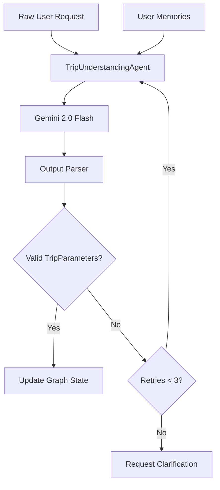
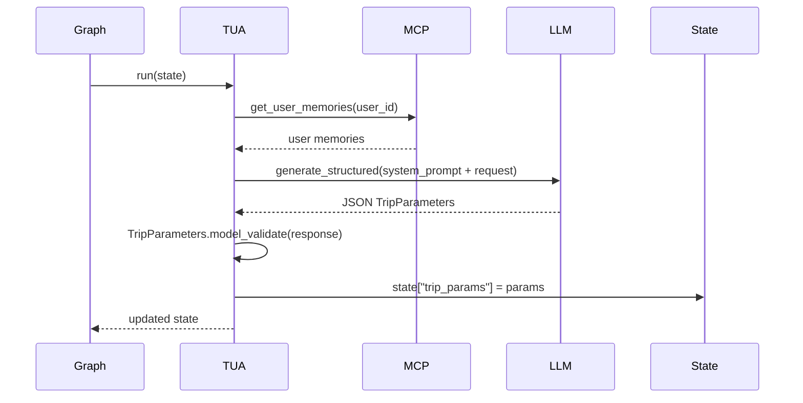

# M06 — Trip Understanding Agent

**Milestone:** 6 of 20 | **Duration:** 1 Week | **Depends On:** M05

---

## 1. Objective

Implement the `TripUnderstandingAgent` — the entry point of the planning pipeline that parses natural language trip requests into structured `TripParameters`, applies user memory for personalization, and handles ambiguous or incomplete inputs.

---

## 2. Scope

- `TripUnderstandingAgent` class extending `BaseAgent`.
- Pydantic schema for `TripParameters` with validation.
- System prompt with few-shot examples.
- Integration with `get_user_memories` MCP tool.
- Handling of ambiguous inputs (missing destination, date ranges, budget).
- Unit and integration tests with mocked LLM.

---

## 3. Architecture



---

## 4. TripParameters Schema

```python
# backend/app/schemas/trip.py
from pydantic import BaseModel, Field, model_validator
from typing import Optional, List
from datetime import date

class TripParameters(BaseModel):
    # Destination
    destination: Optional[str] = None
    destination_region: Optional[str] = None
    
    # Dates
    origin: Optional[str] = None
    start_date: Optional[date] = None
    end_date: Optional[date] = None
    duration_days: Optional[int] = None
    
    # Travelers
    num_travelers: int = Field(default=1, ge=1, le=20)
    
    # Budget
    total_budget: Optional[float] = Field(default=None, ge=0)
    currency: str = "USD"
    
    # Preferences
    travel_style: str = Field(default="comfort", pattern="^(budget|comfort|luxury)$")
    interests: List[str] = []
    special_requirements: List[str] = []
    dietary_restrictions: List[str] = []
    
    # Meta
    needs_clarification: bool = False
    clarification_fields: List[str] = []
    
    @model_validator(mode="after")
    def compute_duration(self) -> "TripParameters":
        if self.start_date and self.end_date and not self.duration_days:
            self.duration_days = (self.end_date - self.start_date).days
        return self
    
    @model_validator(mode="after")
    def validate_dates(self) -> "TripParameters":
        if self.start_date and self.end_date:
            if self.end_date <= self.start_date:
                raise ValueError("end_date must be after start_date")
        return self
```

---

## 5. Agent Implementation

```python
# backend/app/agents/trip_understanding.py
from .base import BaseAgent
from app.graph.state import TripPlanningState
from app.schemas.trip import TripParameters
import json

SYSTEM_PROMPT = """You are an expert travel intake specialist for Aegis, an AI-powered travel planning platform.

Your task is to extract a complete, structured trip request from the user's natural language input.

EXTRACTION RULES:
1. Extract ALL mentioned parameters: destination, dates, budget, number of travelers, interests.
2. For missing critical fields, use context clues or user memory to fill with reasonable defaults.
3. If "next month" is mentioned, calculate the actual month from today's date.
4. Budget mentioned without currency assumes USD unless user profile indicates otherwise.
5. "couple" = 2 travelers, "family" = check for mention of children.
6. Travel style defaults: backpacker → budget, couple/honeymoon → comfort, anniversary/luxury → luxury.
7. If too little information to plan (e.g., only "I want to travel"), set needs_clarification=true.

USER MEMORY CONTEXT: {memory_context}

Return ONLY valid JSON matching the TripParameters schema. No commentary.

FEW-SHOT EXAMPLES:
Input: "Family trip to Disney World for 4 people in July, budget $3000"
Output: {"destination": "Orlando, Florida, USA", "num_travelers": 4, "start_date": "2026-07-01", "end_date": "2026-07-08", "total_budget": 3000, "currency": "USD", "interests": ["theme_parks", "family"], "travel_style": "comfort"}

Input: "I want to travel somewhere warm"
Output: {"destination": null, "destination_region": "tropical", "needs_clarification": true, "clarification_fields": ["destination", "dates", "budget", "num_travelers"]}
"""

class TripUnderstandingAgent(BaseAgent):
    agent_name = "TripUnderstandingAgent"
    
    @property
    def system_prompt(self) -> str:
        return SYSTEM_PROMPT
    
    async def run(self, state: TripPlanningState) -> TripPlanningState:
        # Step 1: Get user memories for context
        memories = await self.call_tool("get_user_memories", {
            "user_id": state["user_id"],
            "limit": 5
        })
        memory_context = self._format_memories(memories.data) if memories.success else "No memories available"
        
        # Step 2: Call LLM to extract parameters
        prompt = self.system_prompt.format(memory_context=memory_context)
        response = await self.llm.generate_structured(
            system=prompt,
            user=state["raw_request"],
            output_schema=TripParameters.model_json_schema()
        )
        
        # Step 3: Validate and update state
        try:
            params = TripParameters.model_validate(response)
            state["trip_params"] = params.model_dump()
            self.logger.info(f"[TUA] Extracted params: {params.model_dump_json()}")
        except Exception as e:
            self.logger.error(f"[TUA] Parse failed: {e}")
            state["errors"].append({"agent": self.agent_name, "error": str(e)})
        
        return state
    
    def _format_memories(self, memories: list) -> str:
        if not memories:
            return "No prior preferences found"
        return "\n".join([
            f"- {m['type']}: {json.dumps(m['content'])}"
            for m in memories
        ])
```

---

## 6. Sequence Diagram



---

## 7. Edge Cases

| Input | Expected Behavior |
|---|---|
| "Plan me a trip" (too vague) | `needs_clarification=True`, 4 missing fields listed |
| "Tokyo next April for 2 people $5000" | Full extraction, date calculated from "next April" |
| "Honeymoon trip to Paris" | `num_travelers=2`, `travel_style="comfort"`, `interests=["romance"]` |
| "Budget backpacking Asia 3 months" | `travel_style="budget"`, `duration_days=90`, `destination_region="Southeast Asia"` |
| LLM returns malformed JSON | Retry up to 3 times with stricter prompt |
| Memory fetch fails | Proceed without memory context |

---

## 8. Testing Plan

```python
# tests/agents/test_trip_understanding.py

@pytest.mark.asyncio
async def test_basic_extraction():
    agent = TripUnderstandingAgent(mock_llm, mock_mcp)
    state = make_state(raw_request="7-day trip to Japan for 2, budget $4000")
    
    mock_llm.set_response({
        "destination": "Japan",
        "num_travelers": 2,
        "total_budget": 4000,
        ...
    })
    
    result = await agent.run(state)
    assert result["trip_params"]["destination"] == "Japan"
    assert result["trip_params"]["num_travelers"] == 2
    assert result["trip_params"]["total_budget"] == 4000

@pytest.mark.asyncio
async def test_vague_input_requests_clarification():
    agent = TripUnderstandingAgent(mock_llm, mock_mcp)
    state = make_state(raw_request="I want to travel")
    
    mock_llm.set_response({"needs_clarification": True, "clarification_fields": [...]})
    
    result = await agent.run(state)
    assert result["trip_params"]["needs_clarification"] == True

@pytest.mark.asyncio
async def test_memory_integration():
    agent = TripUnderstandingAgent(mock_llm, mock_mcp)
    mock_mcp.set_memory_response([{"type": "preference", "content": {"currency": "EUR"}}])
    
    # Verify memory context is passed to LLM
    ...
```

---

## 9. Acceptance Criteria

- [ ] Agent correctly extracts all parameters from well-formed requests.
- [ ] `needs_clarification=True` set for requests with <3 extractable parameters.
- [ ] Date resolution works for relative dates ("next month", "this summer").
- [ ] User memory context is included in LLM prompt when available.
- [ ] Failed LLM parse retries up to 3 times.
- [ ] State `trip_params` is populated after successful run.
- [ ] State `errors` has entry if agent fails completely.

---

## 10. Definition of Done

- Agent unit tests pass with mocked LLM (no real API calls in tests).
- Integration test with real Gemini API (in separate `test_integration.py` file).
- Agent logs persisted to `agent_logs` table.

---

*M06 — Trip Understanding Agent | Duration: 1 Week*
