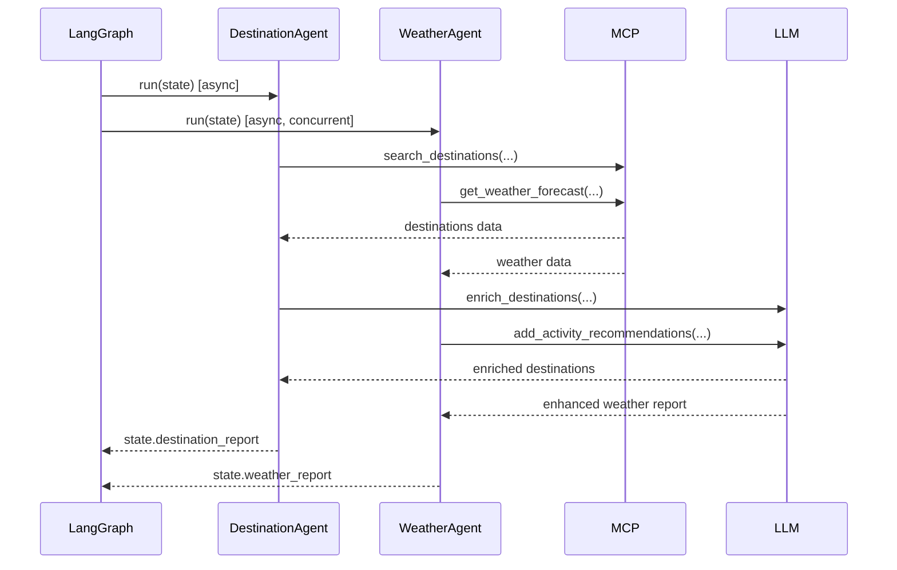

# M07 — Destination & Weather Agents

**Milestone:** 7 of 20 | **Duration:** 1 Week | **Depends On:** M06

---

## 1. Objective

Implement `DestinationAgent` and `WeatherAgent` — the first parallel research agents in the pipeline. Both run concurrently after the Trip Understanding phase.

---

## 2. Scope

- `DestinationAgent`: Research and rank destination recommendations with detailed profiles.
- `WeatherAgent`: Retrieve weather forecasts and generate packing/activity recommendations.
- Both agents use their respective MCP tools with fallback handling.
- Parallel execution validated in the LangGraph workflow.

---

## 3. Destination Agent

### System Prompt
```
You are a world-class travel destination expert with encyclopedic knowledge of global travel.

TASK: Recommend 3-5 travel destinations matching the user's criteria.

For each destination provide:
- name, country, description (2-3 sentences)
- top_attractions: list of 5 must-see places/experiences
- cost_per_day_usd: realistic daily budget estimate for all travelers
- best_months: months when this destination is optimal
- match_score: 0.0-1.0 (how well it matches the user's interests)
- why_recommended: one sentence specific to THIS user's interests
- visa_note: quick visa requirement note for most common nationalities
- safety_rating: safe / exercise_caution / high_risk

CONSTRAINTS:
- Seasonal alignment: never recommend a beach destination in monsoon season without warning.
- Budget alignment: cost_per_day * duration * travelers must fit within total_budget.
- Exclude destinations in {exclude_list}.
- Prefer destinations the user hasn't visited (from memory: {visited_list}).
```

### Agent Implementation
```python
# backend/app/agents/destination.py

class DestinationAgent(BaseAgent):
    agent_name = "DestinationAgent"
    
    async def run(self, state: TripPlanningState) -> TripPlanningState:
        params = state["trip_params"]
        
        # Get visited destinations from memory
        memories = await self.call_tool("get_user_memories", {
            "user_id": state["user_id"],
            "memory_type": "past_trip",
            "limit": 20
        })
        visited = self._extract_visited(memories.data) if memories.success else []
        
        # Call destination search tool
        tool_result = await self.call_tool("search_destinations", {
            "interests": params.get("interests", []),
            "budget_range": params.get("travel_style", "comfort"),
            "duration_days": params.get("duration_days", 7),
            "departure_city": params.get("origin"),
            "travel_month": str(params.get("start_date", ""))[:7],
            "exclude_destinations": visited
        })
        
        if tool_result.success:
            raw_destinations = tool_result.data
        else:
            # Fallback to LLM generation
            raw_destinations = await self._llm_fallback(params, visited)
        
        # Enrich with LLM analysis
        enriched = await self._enrich_destinations(raw_destinations, params)
        
        state["destination_report"] = enriched
        await self._log_execution(state["trip_id"], params, enriched)
        return state
    
    async def _enrich_destinations(self, raw: dict, params: dict) -> dict:
        """Use LLM to add narrative context and travel tips."""
        response = await self.llm.generate_structured(
            system=self.system_prompt.format(
                exclude_list="[]",
                visited_list=str(raw.get("visited", []))
            ),
            user=f"Trip parameters: {json.dumps(params)}\nRaw data: {json.dumps(raw)}",
            output_schema=DESTINATION_REPORT_SCHEMA
        )
        return response
```

### Output Schema
```json
{
  "recommended_destination": "Japan",
  "is_specific": true,
  "alternatives": [
    {
      "name": "Tokyo, Japan",
      "country": "Japan",
      "description": "...",
      "top_attractions": ["Shinjuku", "Asakusa", "Shibuya", "Mt. Fuji day trip", "teamLab"],
      "cost_per_day_usd": 150,
      "best_months": ["March", "April", "October", "November"],
      "match_score": 0.95,
      "why_recommended": "Perfect for culture and food lovers with your $4000 budget",
      "visa_note": "Most Western passport holders get 90-day visa-free entry",
      "safety_rating": "safe"
    }
  ]
}
```

---

## 4. Weather Agent

### System Prompt
```
You are a meteorological travel advisor with expertise in global weather patterns.

TASK: Provide travel weather intelligence for {destination} from {start_date} to {end_date}.

For each day provide:
- date, condition (sunny/cloudy/rainy/stormy/snow), high_temp_c, low_temp_c
- precipitation_pct (0-100), uv_index (1-11), wind_speed_kmh
- outdoor_activity_suitability: excellent/good/fair/poor

Also provide:
- weekly_summary: 2-3 sentence overview of weather patterns
- weather_alerts: any extreme events to watch for
- packing_recommendations: specific clothing/gear list based on weather
- best_outdoor_days: list of dates most suitable for outdoor activities
- data_source: "live_forecast" or "historical_average"
```

### Agent Implementation
```python
# backend/app/agents/weather.py

class WeatherAgent(BaseAgent):
    agent_name = "WeatherAgent"
    
    async def run(self, state: TripPlanningState) -> TripPlanningState:
        params = state["trip_params"]
        destination = (
            state.get("destination_report", {}).get("recommended_destination")
            or params.get("destination")
            or params.get("destination_region", "Unknown")
        )
        
        tool_result = await self.call_tool("get_weather_forecast", {
            "destination": destination,
            "start_date": str(params.get("start_date", "")),
            "end_date": str(params.get("end_date", ""))
        })
        
        if tool_result.success:
            weather_data = tool_result.data
        else:
            weather_data = await self._generate_climate_estimate(destination, params)
        
        # Enhance with LLM activity recommendations
        enhanced = await self._add_activity_recommendations(weather_data, params)
        
        state["weather_report"] = enhanced
        return state
    
    async def _generate_climate_estimate(self, destination: str, params: dict) -> dict:
        """Generate climate estimate using LLM historical knowledge."""
        month = str(params.get("start_date", ""))[:7]
        response = await self.llm.generate_structured(
            system=self.system_prompt.format(
                destination=destination,
                start_date=params.get("start_date"),
                end_date=params.get("end_date")
            ),
            user=f"Generate typical weather for {destination} in {month} based on historical climate data",
            output_schema=WEATHER_REPORT_SCHEMA
        )
        response["data_source"] = "historical_average"
        return response
```

---

## 5. Parallel Execution

Both agents run concurrently in the LangGraph workflow using separate graph nodes that LangGraph executes with `asyncio.gather`:

```python
# In workflow.py — parallel edges mean both fire simultaneously
graph.add_edge("trip_understanding", "destination")
graph.add_edge("trip_understanding", "weather")
graph.add_edge("trip_understanding", "transport")
```

LangGraph's internal executor handles the fan-out and fan-in. The shared `TripPlanningState` is updated by each agent, with write access serialized.

---

## 6. Sequence Diagram



---

## 7. Edge Cases

| Scenario | Behavior |
|---|---|
| Destination not specified | Uses `destination_region` from params; DestinationAgent picks best 3 |
| Weather API unavailable | WeatherAgent generates historical estimate with clear disclaimer |
| Destination with safety concerns | Include `safety_rating: "exercise_caution"` with note |
| Very short trip (1-2 days) | Destination recommendations focused on city escapes |
| Very long trip (30+ days) | Multiple destination suggestions for multi-city routing |
| Budget incompatible with destination | Include budget warning in recommendation |

---

## 8. Testing Plan

| Test | Agent | Coverage |
|---|---|---|
| Destination extracted from params | DA | Happy path |
| Visited destinations excluded | DA | Memory integration |
| 3 destinations always returned | DA | Output validation |
| Weather fallback to historical | WA | Fallback behavior |
| Parallel execution both succeed | Both | Integration |
| DA failure does not block WA | Both | Independence |
| Packing list generated | WA | Output completeness |

---

## 9. Acceptance Criteria

**Destination Agent:**
- [ ] Returns minimum 3 destination recommendations.
- [ ] Each recommendation includes match_score, top_attractions, cost_per_day.
- [ ] Excludes previously visited destinations from memory.
- [ ] Marks destinations with budget warning when cost exceeds allocation.

**Weather Agent:**
- [ ] Returns day-by-day forecast for full trip duration.
- [ ] Generates packing list from weather profile.
- [ ] Identifies best outdoor days.
- [ ] Falls back to historical estimates with clear `data_source` flag.

**Both:**
- [ ] Execute concurrently (no sequential dependency between them).
- [ ] Agent logs persisted to `agent_logs` table.
- [ ] Failure of one does not block the other.

---

## 10. Definition of Done

- Both agents unit-tested with mocked LLM and MCP.
- Parallel execution verified in integration test.
- Coverage ≥ 80% for both agents.

---

*M07 — Destination & Weather Agents | Duration: 1 Week*
