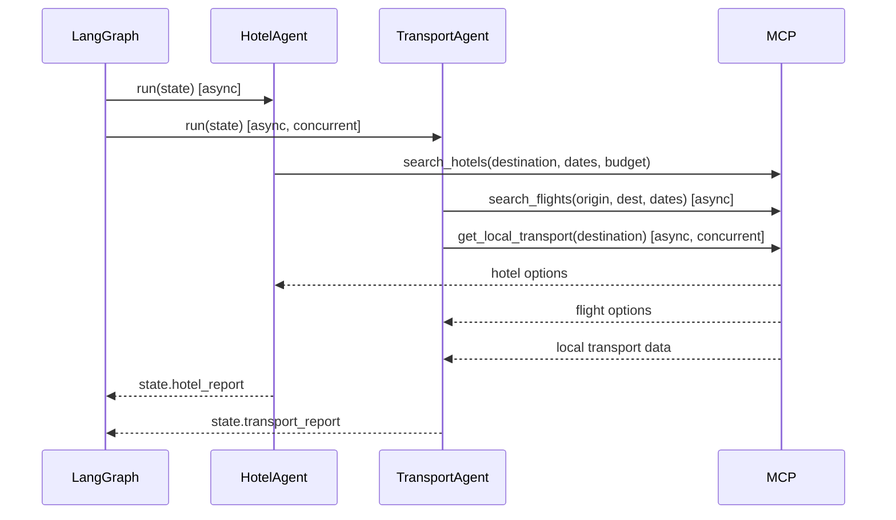

# M08 — Hotel & Transport Agents

**Milestone:** 8 of 20 | **Duration:** 1 Week | **Depends On:** M07

---

## 1. Objective

Implement `HotelAgent` and `TransportAgent`, the domain specialists for accommodation and travel logistics. Both receive outputs from the parallel research phase (M07) and run concurrently in the second parallel phase.

---

## 2. Scope

- `HotelAgent`: Find, rank, and present hotel recommendations across budget tiers.
- `TransportAgent`: Research flights, alternative transport, and local transport guide.
- Both read from the shared state (destination, dates, budget allocation).
- Transport cost estimates fed into BudgetAgent (M09).

---

## 3. Hotel Agent

### System Prompt
```
You are a luxury hotel consultant and travel accommodation expert with 20 years of experience.

TASK: Recommend {num_options} hotels for {destination} from {checkin} to {checkout} for {guests} guests.

REQUIREMENTS:
1. Always provide options across THREE tiers: budget-friendly, recommended-value, premium.
2. Calculate total stay cost (not just nightly rate).
3. Describe the hotel's neighborhood and walking distance to key attractions.
4. Be honest about cons — travelers appreciate candor over marketing speak.
5. Consider amenities relevant to this traveler's profile: {preferences}.
6. Budget constraint: max ${max_per_night} per night.

For each hotel provide:
- name, tier, star_rating, price_per_night_usd, total_price_usd
- neighborhood, distance_to_center_km
- amenities (list)
- pros (list of 3)
- cons (list of 2)
- ideal_for: who this hotel is best for (families, couples, business, etc.)
```

### Agent Implementation
```python
# backend/app/agents/hotel.py

class HotelAgent(BaseAgent):
    agent_name = "HotelAgent"
    
    async def run(self, state: TripPlanningState) -> TripPlanningState:
        params = state["trip_params"]
        destination = state.get("destination_report", {}).get("recommended_destination") \
                     or params.get("destination")
        
        # Calculate accommodation budget from total budget (40% default)
        total_budget = params.get("total_budget", 0)
        duration = params.get("duration_days", 7)
        max_per_night = (total_budget * 0.40) / duration if total_budget and duration else 200
        
        tool_result = await self.call_tool("search_hotels", {
            "destination": destination,
            "checkin_date": str(params.get("start_date")),
            "checkout_date": str(params.get("end_date")),
            "guests": params.get("num_travelers", 1),
            "max_price_per_night_usd": max_per_night,
            "preferences": self._get_hotel_preferences(state),
            "location_preference": "city_center"
        })
        
        if tool_result.success:
            raw_hotels = tool_result.data
        else:
            raw_hotels = await self._llm_hotel_fallback(destination, params, max_per_night)
        
        # Rank and format using LLM
        hotel_report = await self._rank_and_format_hotels(raw_hotels, params)
        state["hotel_report"] = hotel_report
        return state
    
    def _get_hotel_preferences(self, state: TripPlanningState) -> list:
        interests = state["trip_params"].get("interests", [])
        prefs = []
        if "family" in interests: prefs.append("family_rooms")
        if "business" in interests: prefs.append("business_center")
        if "beach" in interests: prefs.append("beachfront")
        return prefs or ["wifi", "breakfast", "central_location"]
```

### Output Schema
```json
{
  "destination": "Tokyo, Japan",
  "checkin": "2026-04-01",
  "checkout": "2026-04-08",
  "options": [
    {
      "name": "Shinjuku Granbell Hotel",
      "tier": "budget",
      "star_rating": 3,
      "price_per_night_usd": 90,
      "total_price_usd": 630,
      "neighborhood": "Shinjuku",
      "distance_to_center_km": 0.5,
      "amenities": ["wifi", "24hr_front_desk", "luggage_storage"],
      "pros": ["Central location", "Good transport links", "Clean rooms"],
      "cons": ["Small rooms", "No breakfast included"],
      "ideal_for": "Solo travelers and couples on a budget"
    },
    {
      "name": "The Prince Park Tower Tokyo",
      "tier": "luxury",
      "star_rating": 5,
      "price_per_night_usd": 350,
      "total_price_usd": 2450,
      "neighborhood": "Minato",
      "distance_to_center_km": 2.0,
      "amenities": ["pool", "spa", "restaurant", "wifi", "gym", "concierge"],
      "pros": ["Tokyo Tower views", "Exceptional service", "Full facilities"],
      "cons": ["Further from subway", "Expensive dining on-site"],
      "ideal_for": "Couples, honeymoons, and special occasions"
    }
  ],
  "recommended_option": "Shinjuku Granbell Hotel",
  "recommendation_reason": "Best value for your comfort budget with excellent location"
}
```

---

## 4. Transport Agent

### System Prompt
```
You are a transportation logistics expert specializing in efficient global travel planning.

TASK: Plan complete transportation for {num_travelers} travelers from {origin} to {destination}.

SECTION 1 - INTERNATIONAL TRANSPORT:
Provide 3 flight options:
- cheapest: minimize cost (accept longer journey)
- best_value: optimal balance of price and convenience
- premium: fastest, most comfortable (business if budget allows)

For each option: airline, estimated_price_per_person_usd, total_price_usd, 
estimated_duration_hours, num_stops, notes

SECTION 2 - LOCAL TRANSPORT AT DESTINATION:
- public_transport: describe metro/bus/tram system
- ride_hailing: available apps and typical costs
- transport_cards: tourist passes and their value
- taxi_estimates: typical cost for airport→center, within city
- rental_car: whether recommended and why/why not
- walking: walkability score and areas best explored on foot
```

### Agent Implementation
```python
# backend/app/agents/transport.py

class TransportAgent(BaseAgent):
    agent_name = "TransportAgent"
    
    async def run(self, state: TripPlanningState) -> TripPlanningState:
        params = state["trip_params"]
        destination = state.get("destination_report", {}).get("recommended_destination") \
                     or params.get("destination")
        
        # Run flight search and local transport in parallel
        flight_task = self.call_tool("search_flights", {
            "origin_iata": self._get_iata(params.get("origin")),
            "destination_iata": self._get_iata(destination),
            "departure_date": str(params.get("start_date")),
            "return_date": str(params.get("end_date")),
            "passengers": params.get("num_travelers", 1),
            "cabin_class": self._recommend_cabin_class(params),
            "max_price_usd": params.get("total_budget", 0) * 0.30
        })
        
        local_task = self.call_tool("get_local_transport", {
            "destination": destination,
            "mobility_needs": params.get("special_requirements", [])
        })
        
        flight_result, local_result = await asyncio.gather(
            flight_task, local_task, return_exceptions=True
        )
        
        transport_report = await self._build_transport_report(
            destination, params, flight_result, local_result
        )
        
        state["transport_report"] = transport_report
        return state
    
    def _recommend_cabin_class(self, params: dict) -> str:
        style = params.get("travel_style", "comfort")
        duration = params.get("duration_days", 7)
        return {
            "budget": "economy",
            "comfort": "premium_economy" if duration > 8 else "economy",
            "luxury": "business"
        }.get(style, "economy")
```

---

## 5. Sequence Diagram



---

## 6. Edge Cases

| Scenario | Behavior |
|---|---|
| No hotels within budget | Expand budget +20%, mark as "slightly over budget", add savings tip |
| Origin city not specified | Default to user profile location; if unknown, note assumption in report |
| No direct flights | Present best 1-stop options with total travel time |
| Destination unreachable by flight | Present train/ferry alternatives |
| Local transport not available (rural area) | Recommend car rental + driving guide |
| Budget too low for any accommodation | Present hostel alternatives + Airbnb note |

---

## 7. Testing Plan

| Test | Agent | Coverage |
|---|---|---|
| Hotel options across all 3 tiers | HA | Tier coverage |
| Total price calculation is correct | HA | Math validation |
| 3 flight options returned | TA | Option count |
| Local transport guide included | TA | Completeness |
| Flight + local transport run concurrently | TA | Parallelism |
| Hotel fallback on API failure | HA | Error handling |
| Budget-incompatible hotels show warning | HA | Budget validation |

---

## 8. Acceptance Criteria

**Hotel Agent:**
- [ ] Minimum 3 hotel options returned (one per tier).
- [ ] Each option includes pros, cons, total_price_usd.
- [ ] Recommended option identified with justification.
- [ ] Budget constraint respected (or exceeded with warning).

**Transport Agent:**
- [ ] 3 flight option types: cheapest, best_value, premium.
- [ ] Local transport guide covers: public, ride-hailing, taxi estimates.
- [ ] Transport costs available for BudgetAgent integration.
- [ ] Flight + local transport fetched concurrently.

---

## 9. Definition of Done

- Both agents unit-tested (mocked MCP and LLM).
- Integration test verifying parallel execution in LangGraph.
- Output schemas validated against Pydantic models.
- Coverage ≥ 80%.

---

*M08 — Hotel & Transport Agents | Duration: 1 Week*
