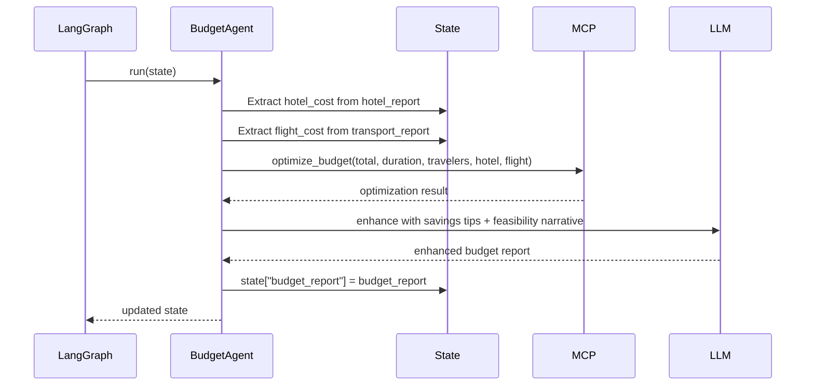

# M09 — Budget Agent

**Milestone:** 9 of 20 | **Duration:** 1 Week | **Depends On:** M08

---

## 1. Objective

Implement the `BudgetAgent` — the financial intelligence layer that integrates all cost estimates from previous agents, optimizes budget allocation, assesses feasibility, and identifies savings opportunities.

---

## 2. Scope

- `BudgetAgent` extending `BaseAgent`.
- Integrate hotel and flight costs from state.
- Call `optimize_budget` MCP tool.
- Produce three-tier budget scenarios (conservative, recommended, premium).
- Feasibility assessment with actionable advice.
- Savings tips generation.

---

## 3. System Prompt

```
You are a financial travel advisor specializing in budget optimization for maximum travel value.

TASK: Create a complete budget plan for this trip.

INPUTS:
- Total budget: ${total_budget} {currency}
- Duration: {duration_days} days
- Travelers: {num_travelers}
- Destination: {destination} (cost_of_living: {col_index})
- Hotel estimate: ${hotel_cost}
- Flight estimate: ${flight_cost}
- Travel style: {travel_style}

REQUIREMENTS:
1. Start by deducting 10% emergency reserve from total.
2. Incorporate actual hotel + flight estimates when provided.
3. Allocate remaining budget across food, activities, local transport, miscellaneous.
4. Present 3 scenarios:
   - Conservative: 10% under budget (safer)
   - Recommended: optimal allocation
   - Premium: 15% over budget (upgraded experiences)
5. Daily budget = remaining after fixed costs / duration / num_travelers.
6. Provide 5-7 specific, actionable savings tips for this destination.
7. Assess feasibility honestly: "comfortable", "tight", or "insufficient".

Output ONLY valid JSON.
```

---

## 4. Agent Implementation

```python
# backend/app/agents/budget.py

class BudgetAgent(BaseAgent):
    agent_name = "BudgetAgent"
    
    # Default allocation ratios by travel style
    DEFAULT_RATIOS = {
        "budget":  {"accommodation": 0.35, "transport": 0.30, "food": 0.25, "activities": 0.10},
        "comfort": {"accommodation": 0.40, "transport": 0.28, "food": 0.22, "activities": 0.10},
        "luxury":  {"accommodation": 0.45, "transport": 0.25, "food": 0.20, "activities": 0.10},
    }
    
    async def run(self, state: TripPlanningState) -> TripPlanningState:
        params = state["trip_params"]
        total_budget = params.get("total_budget", 0)
        duration = params.get("duration_days", 7)
        num_travelers = params.get("num_travelers", 1)
        style = params.get("travel_style", "comfort")
        
        # Extract actual cost estimates from previous agents
        hotel_cost = self._extract_hotel_cost(state.get("hotel_report"))
        flight_cost = self._extract_flight_cost(state.get("transport_report"))
        
        # Call optimization tool
        tool_result = await self.call_tool("optimize_budget", {
            "total_budget_usd": total_budget,
            "duration_days": duration,
            "num_travelers": num_travelers,
            "destination": params.get("destination"),
            "travel_style": style,
            "hotel_cost_estimate": hotel_cost,
            "flight_cost_estimate": flight_cost
        })
        
        if tool_result.success:
            optimization = tool_result.data
        else:
            optimization = self._rule_based_allocation(
                total_budget, duration, num_travelers, style, hotel_cost, flight_cost
            )
        
        # Enhance with LLM savings tips and feasibility narrative
        budget_report = await self._enhance_with_llm(optimization, params, hotel_cost, flight_cost)
        
        state["budget_report"] = budget_report
        return state
    
    def _extract_hotel_cost(self, hotel_report: dict | None) -> float:
        if not hotel_report:
            return 0
        options = hotel_report.get("options", [])
        # Use recommended option cost
        recommended_name = hotel_report.get("recommended_option")
        for opt in options:
            if opt["name"] == recommended_name:
                return opt.get("total_price_usd", 0)
        # Fallback: mid-range option
        mid = [o for o in options if o.get("tier") == "mid-range"]
        return mid[0].get("total_price_usd", 0) if mid else 0
    
    def _extract_flight_cost(self, transport_report: dict | None) -> float:
        if not transport_report:
            return 0
        flights = transport_report.get("flights", {})
        best_value = flights.get("best_value", {})
        return best_value.get("total_price_usd", 0)
    
    def _rule_based_allocation(
        self, total: float, days: int, travelers: int, style: str,
        hotel_cost: float, flight_cost: float
    ) -> dict:
        """Fallback rule-based allocation when tool fails."""
        emergency = total * 0.10
        available = total - emergency
        
        if hotel_cost and flight_cost:
            fixed = hotel_cost + flight_cost
            remaining = available - fixed
            return {
                "allocation": {
                    "accommodation_usd": hotel_cost,
                    "transport_usd": flight_cost,
                    "food_usd": round(remaining * 0.55, 2),
                    "activities_usd": round(remaining * 0.35, 2),
                    "misc_usd": round(remaining * 0.10, 2)
                },
                "emergency_reserve_usd": emergency,
                "daily_budget_per_person_usd": round(remaining / days / travelers, 2),
                "feasibility": "comfortable" if remaining > 0 else "insufficient",
                "savings_tips": [],
                "data_source": "rule_based_fallback"
            }
        
        ratios = self.DEFAULT_RATIOS[style]
        return {
            "allocation": {
                f"{k}_usd": round(available * v, 2) for k, v in ratios.items()
            },
            "emergency_reserve_usd": emergency,
            "daily_budget_per_person_usd": round(available / days / travelers, 2),
            "feasibility": "comfortable",
            "savings_tips": [],
            "data_source": "rule_based_fallback"
        }
```

---

## 5. Output Schema

```json
{
  "total_budget_usd": 4000,
  "emergency_reserve_usd": 400,
  "available_budget_usd": 3600,
  "scenarios": {
    "conservative": {
      "total": 3600,
      "accommodation_usd": 1200,
      "transport_usd": 900,
      "food_usd": 900,
      "activities_usd": 450,
      "misc_usd": 150,
      "daily_per_person_usd": 64
    },
    "recommended": {
      "total": 4000,
      "accommodation_usd": 1440,
      "transport_usd": 1080,
      "food_usd": 720,
      "activities_usd": 360,
      "misc_usd": 0,
      "daily_per_person_usd": 77
    },
    "premium": {
      "total": 4600,
      "accommodation_usd": 2000,
      "transport_usd": 1200,
      "food_usd": 900,
      "activities_usd": 500,
      "misc_usd": 0,
      "daily_per_person_usd": 93
    }
  },
  "actual_estimates": {
    "hotel_cost_usd": 630,
    "flight_cost_usd": 1400
  },
  "feasibility": "comfortable",
  "feasibility_note": "Your $4000 budget is well-suited for a 7-day Japan trip for 2 people.",
  "savings_tips": [
    "Use IC card for all metro travel — saves ~15% vs. single tickets",
    "Eat breakfast at convenience stores (7-Eleven, Lawson) — quality food for $3-5",
    "Visit Ueno Park and Shinjuku Gyoen instead of paid attractions on Day 2",
    "Book Shinkansen in advance for ~20% savings with a JR Pass",
    "Lunch menus at restaurants are typically 30-40% cheaper than dinner"
  ]
}
```

---

## 6. Sequence Diagram



---

## 7. Edge Cases

| Scenario | Behavior |
|---|---|
| `total_budget` is None | Use median estimates, mark as "budget not specified" |
| Hotel + flight costs > total budget | `feasibility: "insufficient"`, list minimum required budget |
| Hotel/transport data not available in state | Use percentage-based defaults |
| Total budget is 0 | `feasibility: "insufficient"`, request budget clarification |
| Budget currency not USD | Convert to USD using exchange rate estimate |
| Luxury style but budget-level funds | Downgrade to comfort recommendations automatically |

---

## 8. Testing Plan

| Test | Coverage |
|---|---|
| Allocation math: all amounts sum to total | Math correctness |
| Emergency reserve = 10% of total | Reserve calculation |
| Hotel cost extracted from hotel_report | State integration |
| Rule-based fallback when tool fails | Fallback behavior |
| Feasibility = "insufficient" when costs exceed budget | Feasibility logic |
| Three scenarios always present | Output completeness |
| Savings tips are destination-specific | Content quality |

---

## 9. Acceptance Criteria

- [ ] Budget allocation: `sum(allocation values) + emergency_reserve == total_budget` ± $1.
- [ ] Three budget scenarios always present in output.
- [ ] Feasibility correctly assessed when hotel + flight > total.
- [ ] Rule-based allocation fallback executes when tool fails.
- [ ] Daily per-person budget calculated correctly.
- [ ] Minimum 5 savings tips generated.
- [ ] Budget report integrated into downstream agents (ItineraryAgent reads daily budget).

---

## 10. Definition of Done

- BudgetAgent unit tests pass (mocked tool + LLM).
- Budget math validated by dedicated test suite.
- Integration test verifying budget is read by ItineraryAgent.
- Coverage ≥ 85%.

---

*M09 — Budget Agent | Duration: 1 Week*
