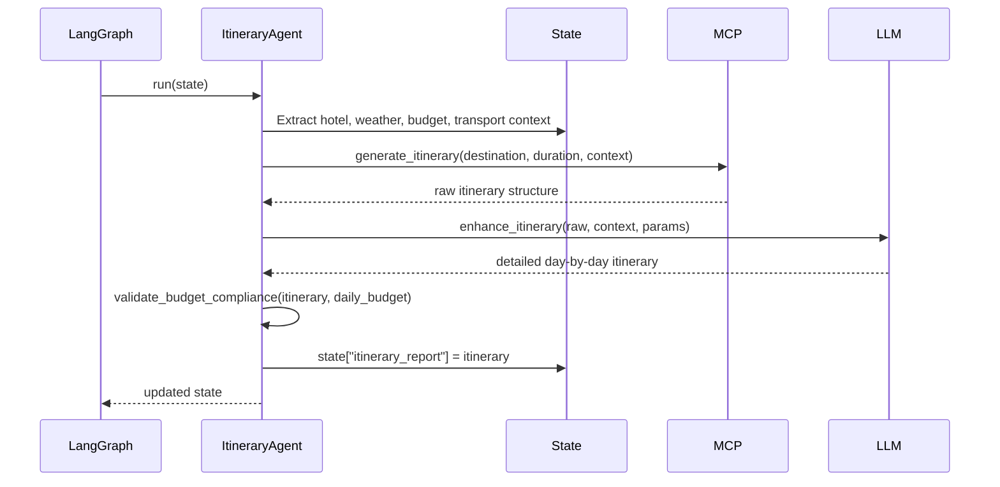

# M10 — Itinerary Agent

**Milestone:** 10 of 20 | **Duration:** 1 Week | **Depends On:** M07, M08, M09

---

## 1. Objective

Implement the `ItineraryAgent` — the synthesis agent that combines all domain reports into a geographically-optimized, weather-aware, budget-respecting day-by-day travel schedule.

---

## 2. Scope

- `ItineraryAgent` extending `BaseAgent`.
- Reads from: destination, weather, hotel, transport, and budget reports in state.
- Calls `generate_itinerary` MCP tool.
- Geographic grouping of activities to minimize transit.
- Weather-aware scheduling (outdoor activities on clear days).
- Daily budget tracking against budget report.
- Meal suggestions for each day.

---

## 3. System Prompt

```
You are a master itinerary planner with expertise in creating efficient, memorable travel experiences.

DESTINATION: {destination}
DURATION: {duration_days} days ({start_date} to {end_date})
TRAVELERS: {num_travelers} ({travel_style})
HOTEL LOCATION: {hotel_neighborhood}
DAILY BUDGET: ${daily_budget_per_person} per person
INTERESTS: {interests}

PLANNING PRINCIPLES:
1. Day 1: Arrival orientation — only light activities, jet lag consideration.
2. Last day: Departure logistics — morning activities only, checkout time respect.
3. Group activities by geographic area to minimize transit (max 30 min between venues).
4. Schedule outdoor activities on CLEAR weather days (check forecast per day).
5. Museums, galleries, indoor activities on rainy/cloudy days.
6. Balance: alternate intense sightseeing with relaxed exploration days.
7. Meal suggestions must match local cuisine and respect dietary restrictions: {dietary}.
8. Each day's total cost must not exceed ${daily_budget_total} for all travelers.

WEATHER CONTEXT (day by day):
{weather_summary}

HOTEL NEIGHBORHOOD: {hotel_neighborhood}
Available local transport: {transport_modes}

For each day, produce:
{
  "day": 1,
  "date": "YYYY-MM-DD",
  "weather": "sunny 22°C",
  "theme": "Arrival & First Impressions",
  "area_focus": "Shinjuku",
  "morning": {"activity": "...", "venue": "...", "duration_hours": 2, "cost_usd": 0, "notes": "..."},
  "afternoon": {"activity": "...", "venue": "...", "duration_hours": 3, "cost_usd": 15, "notes": "..."},
  "evening": {"activity": "...", "venue": "...", "duration_hours": 2, "cost_usd": 30, "notes": "..."},
  "meals": {
    "breakfast": {"suggestion": "...", "type": "...", "cost_usd": 10},
    "lunch": {"suggestion": "...", "type": "...", "cost_usd": 15},
    "dinner": {"suggestion": "...", "type": "...", "cost_usd": 40}
  },
  "logistics": "Take metro Chuo Line from Shinjuku to Shibuya (8 min, ¥170)",
  "estimated_cost_usd": 110,
  "tips": "Purchase 48-hour metro pass at Shinjuku station for unlimited rides"
}
```

---

## 4. Agent Implementation

```python
# backend/app/agents/itinerary.py

class ItineraryAgent(BaseAgent):
    agent_name = "ItineraryAgent"
    
    async def run(self, state: TripPlanningState) -> TripPlanningState:
        params = state["trip_params"]
        destination = state.get("destination_report", {}).get("recommended_destination") \
                     or params.get("destination")
        
        # Build context from all agent reports
        context = self._build_context(state)
        
        # Call itinerary generation tool
        tool_result = await self.call_tool("generate_itinerary", {
            "destination": destination,
            "duration_days": params.get("duration_days", 7),
            "hotel_neighborhood": context["hotel_neighborhood"],
            "interests": params.get("interests", []),
            "daily_budget_usd": context["daily_budget"],
            "weather_forecast": context["weather_by_day"],
            "num_travelers": params.get("num_travelers", 1)
        })
        
        if tool_result.success:
            raw_itinerary = tool_result.data
        else:
            raw_itinerary = await self._llm_itinerary_fallback(context, params)
        
        # Enhance and validate with LLM
        itinerary_report = await self._enhance_itinerary(raw_itinerary, context, params)
        
        # Validate budget compliance
        itinerary_report = self._validate_budget_compliance(
            itinerary_report, context["daily_budget"]
        )
        
        state["itinerary_report"] = itinerary_report
        return state
    
    def _build_context(self, state: TripPlanningState) -> dict:
        """Extract relevant data from all agent reports."""
        hotel_report = state.get("hotel_report", {})
        weather_report = state.get("weather_report", {})
        budget_report = state.get("budget_report", {})
        transport_report = state.get("transport_report", {})
        
        # Get recommended hotel neighborhood
        rec_name = hotel_report.get("recommended_option")
        hotel_neighborhood = "city center"
        for opt in hotel_report.get("options", []):
            if opt["name"] == rec_name:
                hotel_neighborhood = opt.get("neighborhood", "city center")
        
        # Extract daily budget
        daily_budget = budget_report.get("scenarios", {}).get("recommended", {}).get(
            "daily_per_person_usd", 100
        )
        num_travelers = state["trip_params"].get("num_travelers", 1)
        daily_budget_total = daily_budget * num_travelers
        
        # Format weather by day for prompt injection
        forecast = weather_report.get("forecast", [])
        weather_by_day = {
            f["date"]: {
                "condition": f["condition"],
                "high": f.get("high_temp_c"),
                "precipitation": f.get("precipitation_pct", 0),
                "outdoor_suitability": f.get("outdoor_activity_suitability", "good")
            }
            for f in forecast
        }
        
        # Extract transport modes
        local = transport_report.get("local_transport", {})
        transport_modes = list(local.keys()) if local else ["taxi", "metro"]
        
        return {
            "hotel_neighborhood": hotel_neighborhood,
            "daily_budget": daily_budget_total,
            "weather_by_day": weather_by_day,
            "transport_modes": transport_modes
        }
    
    def _validate_budget_compliance(self, itinerary: dict, daily_budget: float) -> dict:
        """Flag days that exceed daily budget."""
        for day in itinerary.get("days", []):
            cost = day.get("estimated_cost_usd", 0)
            if cost > daily_budget * 1.1:  # 10% tolerance
                day["budget_warning"] = f"This day exceeds daily budget by ${cost - daily_budget:.0f}"
        return itinerary
```

---

## 5. Output Schema

```json
{
  "destination": "Tokyo, Japan",
  "duration_days": 7,
  "total_estimated_cost_usd": 1850,
  "avg_daily_cost_usd": 264,
  "days": [
    {
      "day": 1,
      "date": "2026-04-01",
      "weather": "Partly cloudy, 18°C",
      "theme": "Arrival & Shinjuku Exploration",
      "area_focus": "Shinjuku",
      "morning": {
        "activity": "Arrive at Narita Airport, transfer to hotel",
        "venue": "Narita Airport → Shinjuku",
        "duration_hours": 3,
        "cost_usd": 30,
        "notes": "Take Narita Express (N'EX) directly to Shinjuku Station"
      },
      "afternoon": {
        "activity": "Check-in, rest and refresh",
        "venue": "Hotel",
        "duration_hours": 2,
        "cost_usd": 0,
        "notes": "Jet lag recovery — take it easy"
      },
      "evening": {
        "activity": "Stroll through Kabukicho and Omoide Yokocho (Memory Lane)",
        "venue": "Shinjuku",
        "duration_hours": 3,
        "cost_usd": 40,
        "notes": "Try yakitori and ramen at the small alley restaurants"
      },
      "meals": {
        "breakfast": {"suggestion": "On the flight", "type": "airline", "cost_usd": 0},
        "lunch": {"suggestion": "Airport ramen at Narita", "type": "japanese", "cost_usd": 15},
        "dinner": {"suggestion": "Omoide Yokocho yakitori stalls", "type": "street_food", "cost_usd": 35}
      },
      "logistics": "Purchase Suica IC card at Narita Airport for easy metro travel",
      "estimated_cost_usd": 120,
      "tips": "Get a pocket WiFi router at the airport — essential for navigation"
    }
  ],
  "geographic_flow": "Shinjuku → Akihabara → Asakusa → Harajuku → Shibuya → Day-trip Nikko → Ueno",
  "budget_summary": {
    "total_estimated": 1850,
    "daily_average": 264,
    "budget_compliance": "within_budget"
  }
}
```

---

## 6. Sequence Diagram



---

## 7. Edge Cases

| Scenario | Behavior |
|---|---|
| 1-day trip | Single day itinerary, remove arrival/departure padding |
| 30+ day trip | Chunk into weekly segments with flexibility notes |
| Rainy forecast for entire trip | Prioritize indoor attractions, note weather risk |
| No hotel neighborhood data | Default to "city center" |
| No weather data | Generic scheduling without weather optimization |
| Activities exceed daily budget | Flag with `budget_warning` and suggest alternatives |
| Dietary restrictions | Filter meal suggestions to comply |

---

## 8. Testing Plan

| Test | Coverage |
|---|---|
| 7-day itinerary has 7 days | Output completeness |
| Day 1 has lighter activities | Arrival day logic |
| Outdoor activities on clear days | Weather-aware scheduling |
| Daily cost ≤ daily_budget (±10%) | Budget compliance |
| Geographic flow is logical | Area grouping |
| Meal suggestions for each day | Meals completeness |
| Budget warning on over-budget days | Validation logic |

---

## 9. Acceptance Criteria

- [ ] Itinerary has exactly `duration_days` day objects.
- [ ] Day 1 and last day have appropriate logistics (arrival/departure).
- [ ] Each day includes morning, afternoon, evening activities + meals.
- [ ] Weather-aware scheduling: outdoor activities on clear/sunny days.
- [ ] Daily cost estimates within 10% of daily budget.
- [ ] Geographic flow groups nearby attractions.
- [ ] Over-budget days flagged with `budget_warning`.
- [ ] Meal suggestions respect dietary restrictions from params.

---

## 10. Definition of Done

- ItineraryAgent unit tests pass with mocked LLM and MCP.
- Day-count validation test passes for durations 1, 7, 14, 30.
- Budget compliance validated in test suite.
- Coverage ≥ 80%.

---

*M10 — Itinerary Agent | Duration: 1 Week*
