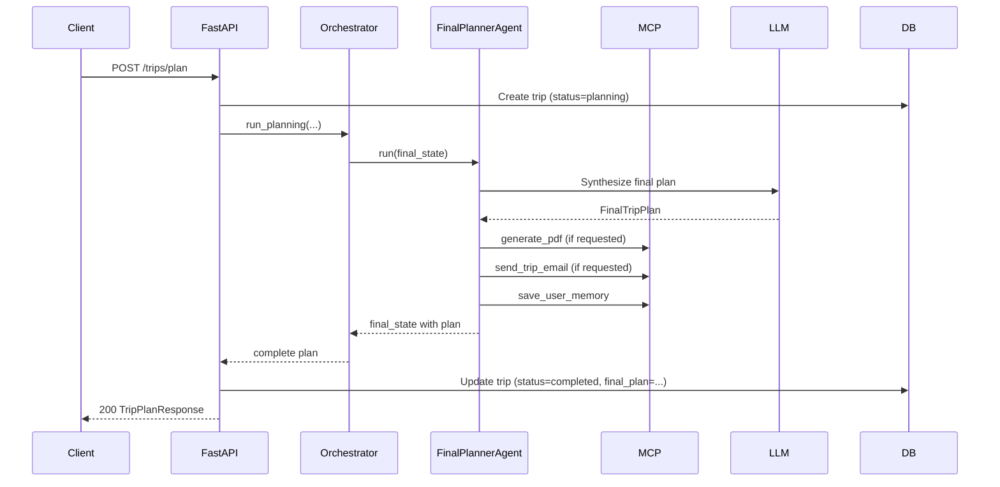

# M11 — Final Planner Agent

**Milestone:** 11 of 20 | **Duration:** 1 Week | **Depends On:** M10

---

## 1. Objective

Implement the `FinalPlannerAgent` — the synthesis and delivery agent that combines all reports into a polished, user-facing trip plan document, triggers PDF generation and email delivery when requested, and saves trip insights to the user's memory.

---

## 2. Scope

- `FinalPlannerAgent` extending `BaseAgent`.
- Synthesize all 6 agent reports into a single cohesive `FinalTripPlan`.
- Trigger `generate_pdf` and `send_trip_email` MCP tools when requested.
- Save user travel preferences and this trip's patterns to memory.
- Structure output for frontend rendering and database persistence.
- Wire the `POST /api/v1/trips/plan` endpoint to the full orchestration pipeline.

---

## 3. System Prompt

```
You are an executive travel consultant producing a final comprehensive travel document.

Your job is to synthesize all research outputs into a polished, complete travel plan.

SYNTHESIS RULES:
1. Write a compelling trip summary (5-7 sentences) that captures the essence of the trip.
2. Highlight 3 "signature experiences" — the must-do moments that will define this journey.
3. Ensure all recommendations are coherent — no conflicts between hotel location and itinerary.
4. Add practical travel tips specific to {destination} (cultural norms, safety, apps, tipping).
5. Include emergency contacts: nearest embassy, local emergency number, travel insurance reminder.
6. Closing note: one enthusiastic, personalized sentence about the trip.
7. Tone: like a brilliant, knowledgeable friend — warm, specific, never generic.

AVAILABLE DATA:
- Destination Report: {destination_summary}
- Weather Overview: {weather_summary}  
- Hotel Recommendations: {hotel_summary}
- Transport Plan: {transport_summary}
- Budget Breakdown: {budget_summary}
- Day-by-Day Itinerary: {itinerary_summary}

Output ONLY valid JSON matching the FinalTripPlan schema.
```

---

## 4. Agent Implementation

```python
# backend/app/agents/final_planner.py

class FinalPlannerAgent(BaseAgent):
    agent_name = "FinalPlannerAgent"
    
    async def run(self, state: TripPlanningState) -> TripPlanningState:
        params = state["trip_params"]
        
        # Build synthesis prompt with all agent summaries
        summaries = self._extract_summaries(state)
        
        # Call LLM to synthesize final plan
        final_plan = await self.llm.generate_structured(
            system=self.system_prompt.format(**summaries, destination=params.get("destination")),
            user=f"Create the final plan. Original request: {state['raw_request']}",
            output_schema=FINAL_PLAN_SCHEMA
        )
        
        # Merge all agent data into final plan
        final_plan = self._merge_all_data(final_plan, state)
        
        # Save to memory
        await self._save_trip_memory(state, final_plan)
        
        # Handle delivery requests
        delivery_results = await self._handle_delivery(state, final_plan)
        final_plan["delivery"] = delivery_results
        
        state["final_plan"] = final_plan
        state["current_phase"] = "completed"
        return state
    
    def _merge_all_data(self, synthesized: dict, state: TripPlanningState) -> dict:
        """Attach all agent reports to the final plan for frontend rendering."""
        return {
            **synthesized,
            "raw_params": state["trip_params"],
            "destination_report": state.get("destination_report"),
            "weather_report": state.get("weather_report"),
            "hotel_recommendations": state.get("hotel_report", {}).get("options", []),
            "transport_plan": state.get("transport_report"),
            "budget_breakdown": state.get("budget_report"),
            "itinerary": state.get("itinerary_report", {}).get("days", []),
            "agent_errors": state.get("errors", [])
        }
    
    async def _save_trip_memory(self, state: TripPlanningState, plan: dict) -> None:
        """Save trip patterns as user memories for future personalization."""
        params = state["trip_params"]
        
        # Save travel preferences discovered during planning
        await self.call_tool("save_user_memory", {
            "user_id": state["user_id"],
            "memory_type": "past_trip",
            "content": {
                "destination": params.get("destination"),
                "travel_style": params.get("travel_style"),
                "interests": params.get("interests"),
                "budget_per_day": plan.get("budget_breakdown", {}).get(
                    "scenarios", {}).get("recommended", {}).get("daily_per_person_usd")
            }
        })
    
    async def _handle_delivery(self, state: TripPlanningState, plan: dict) -> dict:
        results = {"pdf": None, "email": None}
        
        if state.get("deliver_pdf"):
            pdf_result = await self.call_tool("generate_pdf", {
                "trip_id": state["trip_id"],
                "trip_plan": plan,
                "user_profile": {}
            })
            results["pdf"] = pdf_result.data if pdf_result.success else {"error": "PDF generation failed"}
        
        if state.get("deliver_email") and state.get("email_recipients"):
            email_result = await self.call_tool("send_trip_email", {
                "recipients": state["email_recipients"],
                "trip_plan": plan,
                "template": "full_plan"
            })
            results["email"] = email_result.data if email_result.success else {"error": "Email delivery failed"}
        
        return results
```

---

## 5. Final Plan Output Schema (FinalTripPlan)

```json
{
  "trip_id": "uuid",
  "title": "7-Day Cherry Blossom Japan Adventure",
  "destination": "Japan (Tokyo, Kyoto)",
  "dates": "April 1–8, 2026",
  "num_travelers": 2,
  "total_budget_usd": 4000,
  "travel_style": "comfort",
  
  "summary": "A perfect spring journey through Japan's most iconic cities during cherry blossom season. You'll experience the electric energy of Tokyo, the timeless serenity of Kyoto's temples, and the unique blend of ancient and modern that makes Japan unlike anywhere else on earth. With cherry blossoms in full bloom, every park and temple becomes a pink-tinted dreamscape.",
  
  "signature_experiences": [
    "Cherry blossom picnic in Ueno Park (Day 2)",
    "Fushimi Inari shrine at sunrise before the crowds (Day 5)",
    "Evening ramen tour through Shinjuku's alleyways (Day 1)"
  ],
  
  "destination_overview": { "...": "..." },
  "hotel_recommendations": [{ "...": "..." }],
  "transport_plan": { "...": "..." },
  "budget_breakdown": { "...": "..." },
  "itinerary": [{ "day": 1, "...": "..." }],
  "weather_overview": { "...": "..." },
  
  "practical_tips": [
    "Download Google Translate with Japanese offline pack before you land",
    "IC cards (Suica/Pasmo) work on all public transport in Tokyo and Kyoto",
    "Tipping is not customary in Japan — leave no tip at restaurants",
    "Carry cash — many smaller restaurants and temples are cash-only",
    "Quiet in temples: speak softly and silence your phone"
  ],
  
  "emergency_contacts": {
    "local_emergency": "110 (police), 119 (fire/ambulance)",
    "us_embassy_tokyo": "+81-3-3224-5000",
    "tourist_hotline": "0570-783-800 (Japan Tourism Agency)"
  },
  
  "packing_list": ["Light layers", "Comfortable walking shoes", "Portable umbrella", "Power adapter (Type A/B)"],
  
  "closing_note": "This is going to be one of the most beautiful trips of your life — Japan in cherry blossom season is pure magic. Enjoy every moment!",
  
  "delivery": {
    "pdf": {"pdf_url": "https://...", "expires_at": "..."},
    "email": {"success": true, "delivered_to": ["..."]}
  }
}
```

---

## 6. FastAPI Integration

```python
# backend/app/api/v1/trips.py

@router.post("/plan", response_model=TripPlanResponse)
async def plan_trip(
    request: TripPlanRequest,
    current_user: User = Depends(get_current_user),
    db: AsyncSession = Depends(get_db)
):
    # Create trip record in DB
    trip = Trip(
        user_id=current_user.id,
        status="planning",
        raw_request=request.request
    )
    db.add(trip)
    await db.commit()
    
    try:
        orchestrator = PlanningOrchestrator()
        final_state = await orchestrator.run_planning(
            user_id=str(current_user.id),
            trip_id=str(trip.id),
            raw_request=request.request,
            options={
                "pdf": request.deliver_pdf,
                "email": request.deliver_email,
                "recipients": request.email_recipients
            }
        )
        
        # Persist final plan
        trip.status = "completed"
        trip.final_plan = final_state["final_plan"]
        trip.title = final_state["final_plan"].get("title")
        await db.commit()
        
        return TripPlanResponse(
            trip_id=str(trip.id),
            status="completed",
            **final_state["final_plan"]
        )
    
    except Exception as e:
        trip.status = "failed"
        await db.commit()
        raise HTTPException(500, f"Planning failed: {str(e)}")
```

---

## 7. Sequence Diagram



---

## 8. Edge Cases

| Scenario | Behavior |
|---|---|
| PDF generation fails | Plan returned without PDF; delivery.pdf.error set |
| Email delivery fails | Plan returned without email; delivery.email.error set |
| Memory save fails | Logged but does not block plan delivery |
| Some agents produced no data | Final plan includes partial data with "data unavailable" notes |
| Trip planning timeout (>90s) | Return partial plan with `status: "partial"` |

---

## 9. Acceptance Criteria

- [ ] `FinalTripPlan` includes all required fields: summary, signature_experiences, itinerary, budget, hotels, transport.
- [ ] PDF generated and URL returned when `deliver_pdf=true`.
- [ ] Email sent and delivery status returned when `deliver_email=true`.
- [ ] Trip memory saved after successful plan generation.
- [ ] `POST /api/v1/trips/plan` returns complete plan within 60 seconds (P95).
- [ ] Trip persisted to `trips` table with `status=completed`.
- [ ] Agent errors in state do not crash final plan synthesis.

---

## 10. Definition of Done

- End-to-end integration test: raw request → complete plan JSON.
- PDF tool mocked in tests (no real PDF generation in CI).
- `trips` table populated after test execution.
- Coverage ≥ 80%.

---

*M11 — Final Planner Agent | Duration: 1 Week*
