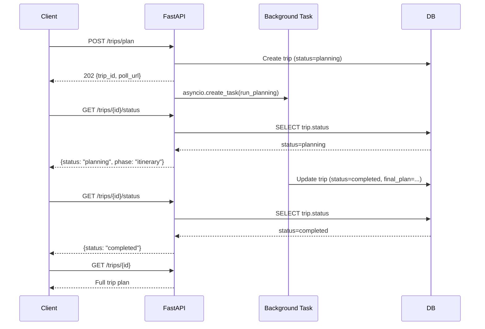

# M12 — Trip Persistence & History

**Milestone:** 12 of 20 | **Duration:** 1 Week | **Depends On:** M11

---

## 1. Objective

Implement complete trip data persistence including all database models for trips, itineraries, and hotels, plus the `GET /trips` history endpoint with filtering and pagination, and the `GET /trips/{id}` detail endpoint.

---

## 2. Scope

- SQLAlchemy ORM models: `Trip`, `Itinerary`, `Hotel`, `AgentLog`.
- Alembic migrations for all models.
- Repository classes for data access abstraction.
- `GET /api/v1/trips` — list trips with pagination and filtering.
- `GET /api/v1/trips/{id}` — get full trip details.
- `GET /api/v1/trips/{id}/status` — poll planning status.
- Async trip planning (return `trip_id` immediately, poll for completion).

---

## 3. ORM Models

```python
# backend/app/models/trip.py
from sqlalchemy import Column, String, Integer, Date, Numeric, ForeignKey, Text, Boolean
from sqlalchemy.dialects.postgresql import UUID, JSONB
from sqlalchemy.orm import relationship
from app.core.database import Base
from datetime import datetime
from uuid import uuid4

class Trip(Base):
    __tablename__ = "trips"
    
    id = Column(UUID(as_uuid=True), primary_key=True, default=uuid4)
    user_id = Column(UUID(as_uuid=True), ForeignKey("users.id", ondelete="CASCADE"), nullable=False, index=True)
    title = Column(String(255))
    status = Column(String(50), nullable=False, default="planning", index=True)
    origin = Column(String(255))
    destination = Column(String(255), index=True)
    destination_region = Column(String(255))
    start_date = Column(Date)
    end_date = Column(Date)
    num_travelers = Column(Integer, default=1)
    total_budget = Column(Numeric(12, 2))
    currency = Column(String(3), default="USD")
    travel_style = Column(String(50))
    raw_request = Column(Text)
    trip_params = Column(JSONB)
    destination_report = Column(JSONB)
    weather_report = Column(JSONB)
    hotel_report = Column(JSONB)
    transport_report = Column(JSONB)
    budget_report = Column(JSONB)
    itinerary_report = Column(JSONB)
    final_plan = Column(JSONB)
    pdf_url = Column(Text)
    created_at = Column(DateTime(timezone=True), default=datetime.utcnow, index=True)
    updated_at = Column(DateTime(timezone=True), default=datetime.utcnow, onupdate=datetime.utcnow)
    
    itineraries = relationship("Itinerary", back_populates="trip", cascade="all, delete-orphan")
    hotels = relationship("Hotel", back_populates="trip", cascade="all, delete-orphan")
    agent_logs = relationship("AgentLog", back_populates="trip", cascade="all, delete-orphan")
    user = relationship("User", back_populates="trips")


class Itinerary(Base):
    __tablename__ = "itineraries"
    
    id = Column(UUID(as_uuid=True), primary_key=True, default=uuid4)
    trip_id = Column(UUID(as_uuid=True), ForeignKey("trips.id", ondelete="CASCADE"), nullable=False)
    day_number = Column(Integer, nullable=False)
    date = Column(Date)
    theme = Column(String(255))
    morning_activities = Column(JSONB, default=[])
    afternoon_activities = Column(JSONB, default=[])
    evening_activities = Column(JSONB, default=[])
    meals = Column(JSONB, default={})
    logistics = Column(JSONB, default={})
    estimated_cost_usd = Column(Numeric(10, 2))
    weather_summary = Column(String(255))
    created_at = Column(DateTime(timezone=True), default=datetime.utcnow)
    
    trip = relationship("Trip", back_populates="itineraries")
    
    __table_args__ = (
        UniqueConstraint("trip_id", "day_number", name="uq_itinerary_trip_day"),
    )


class AgentLog(Base):
    __tablename__ = "agent_logs"
    
    id = Column(UUID(as_uuid=True), primary_key=True, default=uuid4)
    trip_id = Column(UUID(as_uuid=True), ForeignKey("trips.id", ondelete="CASCADE"), nullable=False)
    agent_name = Column(String(100), nullable=False)
    status = Column(String(50), nullable=False)
    input_payload = Column(JSONB)
    output_payload = Column(JSONB)
    tokens_used = Column(Integer, default=0)
    execution_time_ms = Column(Numeric(10, 2))
    retry_count = Column(Integer, default=0)
    error_message = Column(Text)
    error_code = Column(String(100))
    created_at = Column(DateTime(timezone=True), default=datetime.utcnow)
    
    trip = relationship("Trip", back_populates="agent_logs")
```

---

## 4. Repository Classes

```python
# backend/app/repositories/trip.py
from sqlalchemy.ext.asyncio import AsyncSession
from sqlalchemy import select, func
from app.models.trip import Trip

class TripRepository:
    def __init__(self, db: AsyncSession):
        self.db = db
    
    async def create(self, user_id: str, raw_request: str) -> Trip:
        trip = Trip(user_id=user_id, raw_request=raw_request, status="planning")
        self.db.add(trip)
        await self.db.commit()
        await self.db.refresh(trip)
        return trip
    
    async def get_by_id(self, trip_id: str, user_id: str) -> Trip | None:
        result = await self.db.execute(
            select(Trip).where(Trip.id == trip_id, Trip.user_id == user_id)
        )
        return result.scalar_one_or_none()
    
    async def list_by_user(
        self,
        user_id: str,
        page: int = 1,
        limit: int = 10,
        status: str | None = None
    ) -> tuple[list[Trip], int]:
        query = select(Trip).where(Trip.user_id == user_id)
        
        if status:
            query = query.where(Trip.status == status)
        
        count_result = await self.db.execute(
            select(func.count()).select_from(query.subquery())
        )
        total = count_result.scalar()
        
        query = query.order_by(Trip.created_at.desc())
        query = query.offset((page - 1) * limit).limit(limit)
        
        result = await self.db.execute(query)
        trips = result.scalars().all()
        return trips, total
    
    async def update_status(self, trip_id: str, status: str) -> None:
        await self.db.execute(
            update(Trip).where(Trip.id == trip_id).values(status=status, updated_at=datetime.utcnow())
        )
        await self.db.commit()
    
    async def update_plan(self, trip_id: str, final_plan: dict, title: str) -> None:
        await self.db.execute(
            update(Trip).where(Trip.id == trip_id).values(
                final_plan=final_plan,
                title=title,
                status="completed",
                updated_at=datetime.utcnow()
            )
        )
        await self.db.commit()
```

---

## 5. API Endpoints

```python
# backend/app/api/v1/trips.py

@router.get("", response_model=TripListResponse)
async def list_trips(
    page: int = Query(1, ge=1),
    limit: int = Query(10, ge=1, le=50),
    status: str | None = Query(None),
    current_user: User = Depends(get_current_user),
    db: AsyncSession = Depends(get_db)
):
    repo = TripRepository(db)
    trips, total = await repo.list_by_user(
        str(current_user.id), page=page, limit=limit, status=status
    )
    return TripListResponse(
        trips=[TripSummary.from_orm(t) for t in trips],
        total=total,
        page=page,
        limit=limit
    )


@router.get("/{trip_id}", response_model=TripDetailResponse)
async def get_trip(
    trip_id: str,
    current_user: User = Depends(get_current_user),
    db: AsyncSession = Depends(get_db)
):
    repo = TripRepository(db)
    trip = await repo.get_by_id(trip_id, str(current_user.id))
    
    if not trip:
        raise HTTPException(404, "Trip not found")
    
    return TripDetailResponse.from_orm(trip)


@router.get("/{trip_id}/status")
async def get_trip_status(
    trip_id: str,
    current_user: User = Depends(get_current_user),
    db: AsyncSession = Depends(get_db)
):
    repo = TripRepository(db)
    trip = await repo.get_by_id(trip_id, str(current_user.id))
    
    if not trip:
        raise HTTPException(404, "Trip not found")
    
    return {
        "trip_id": str(trip.id),
        "status": trip.status,
        "title": trip.title,
        "created_at": trip.created_at.isoformat()
    }
```

---

## 6. Async Planning with Status Polling



---

## 7. Pydantic Response Schemas

```python
# backend/app/schemas/trip.py

class TripSummary(BaseModel):
    trip_id: str
    title: str | None
    destination: str | None
    start_date: date | None
    end_date: date | None
    status: str
    created_at: datetime
    
    class Config:
        from_attributes = True

class TripListResponse(BaseModel):
    trips: list[TripSummary]
    total: int
    page: int
    limit: int

class TripDetailResponse(BaseModel):
    trip_id: str
    title: str | None
    status: str
    destination: str | None
    start_date: date | None
    end_date: date | None
    num_travelers: int
    total_budget: float | None
    final_plan: dict | None
    created_at: datetime
    updated_at: datetime
    
    class Config:
        from_attributes = True
```

---

## 8. Edge Cases

| Scenario | Behavior |
|---|---|
| User tries to access another user's trip | `403 FORBIDDEN` |
| Trip in `planning` status requested | Return trip with `final_plan: null`, `status: planning` |
| Trip failed | Return trip with `status: failed`, `final_plan: null` |
| Pagination beyond last page | Return empty list, not 404 |
| Status filter with invalid value | `422 VALIDATION_ERROR` |

---

## 9. Acceptance Criteria

- [ ] `GET /trips` returns paginated list of user's trips.
- [ ] `GET /trips/{id}` returns full plan for completed trips.
- [ ] `GET /trips/{id}` returns `403` for trips belonging to other users.
- [ ] `GET /trips/{id}/status` reflects real-time planning status.
- [ ] Trip `status` updates to `completed` after successful planning.
- [ ] All agent reports persisted in `trips.final_plan` JSONB column.
- [ ] Alembic migration runs cleanly from scratch.

---

## 10. Definition of Done

- All ORM models created and Alembic migration validated.
- Repository classes unit-tested with async mock DB.
- All 3 endpoints integration-tested.
- Coverage ≥ 80%.

---

*M12 — Trip Persistence & History | Duration: 1 Week*
