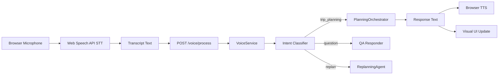

# M18 — Voice Assistant

**Milestone:** 18 of 20 | **Duration:** 1 Week | **Depends On:** M14

---

## 1. Objective

Implement the voice planning interface enabling hands-free trip planning through natural language voice commands, with speech-to-text input, multi-turn conversation, and text-to-speech responses.

---

## 2. Scope

- `VoicePlanner` frontend component using Web Speech API.
- `POST /api/v1/voice/process` backend endpoint.
- Voice session management (multi-turn conversation context).
- TTS (text-to-speech) audio response generation.
- Visual feedback synchronized with voice responses.
- Fallback to text input when microphone unavailable.

---

## 3. Architecture



---

## 4. Frontend Voice Component

```typescript
// src/components/dashboard/VoicePlanner.tsx
'use client';

import { useState, useRef, useCallback, useEffect } from 'react';

interface VoiceSession {
  session_id: string;
  context: string;
  history: { role: 'user' | 'assistant'; text: string }[];
}

export function VoicePlanner({ onPlanGenerated }: { onPlanGenerated: (plan: any) => void }) {
  const [isListening, setIsListening] = useState(false);
  const [isSpeaking, setIsSpeaking] = useState(false);
  const [transcript, setTranscript] = useState('');
  const [response, setResponse] = useState('');
  const [session, setSession] = useState<VoiceSession | null>(null);
  const [isSupported, setIsSupported] = useState(true);
  
  const recognitionRef = useRef<SpeechRecognition | null>(null);
  const synthRef = useRef<SpeechSynthesis | null>(null);

  useEffect(() => {
    if (typeof window !== 'undefined') {
      const SpeechRecognition = window.SpeechRecognition || window.webkitSpeechRecognition;
      if (!SpeechRecognition) {
        setIsSupported(false);
        return;
      }
      
      const recognition = new SpeechRecognition();
      recognition.continuous = false;
      recognition.interimResults = true;
      recognition.lang = 'en-US';
      
      recognition.onresult = (event) => {
        const currentTranscript = Array.from(event.results)
          .map(result => result[0].transcript)
          .join('');
        setTranscript(currentTranscript);
        
        if (event.results[event.results.length - 1].isFinal) {
          handleVoiceInput(currentTranscript);
        }
      };
      
      recognition.onend = () => setIsListening(false);
      recognition.onerror = (event) => {
        console.error('Speech recognition error:', event.error);
        setIsListening(false);
      };
      
      recognitionRef.current = recognition;
      synthRef.current = window.speechSynthesis;
    }
  }, []);
  
  const startListening = useCallback(() => {
    if (!recognitionRef.current) return;
    setTranscript('');
    setIsListening(true);
    recognitionRef.current.start();
  }, []);
  
  const stopListening = useCallback(() => {
    recognitionRef.current?.stop();
    setIsListening(false);
  }, []);
  
  const handleVoiceInput = async (text: string) => {
    if (!text.trim()) return;
    
    try {
      const payload = {
        transcript: text,
        session_id: session?.session_id || null,
        context: session?.context || 'initial'
      };
      
      const res = await apiClient.post('/voice/process', payload);
      const { response_text, trip_started, trip_id, new_session } = res.data;
      
      setResponse(response_text);
      if (new_session) setSession(new_session);
      if (trip_started && trip_id) {
        // Start polling for trip completion
        pollTripStatus(trip_id);
      }
      
      // Speak the response
      speakResponse(response_text);
      
    } catch (error) {
      speakResponse('Sorry, I had trouble processing that. Please try again.');
    }
  };
  
  const speakResponse = (text: string) => {
    if (!synthRef.current) return;
    synthRef.current.cancel();
    
    const utterance = new SpeechSynthesisUtterance(text);
    utterance.rate = 0.9;
    utterance.pitch = 1.0;
    utterance.voice = synthRef.current.getVoices().find(v => v.name.includes('Google') && v.lang === 'en-US') || null;
    
    utterance.onstart = () => setIsSpeaking(true);
    utterance.onend = () => setIsSpeaking(false);
    
    synthRef.current.speak(utterance);
  };
  
  if (!isSupported) {
    return <div className="voice-unsupported">Voice planning requires a modern browser with microphone access.</div>;
  }
  
  return (
    <div className="voice-planner">
      {/* Animated orb */}
      <div className={`voice-orb ${isListening ? 'listening' : ''} ${isSpeaking ? 'speaking' : ''}`}>
        <div className="orb-inner" />
        <div className="orb-ring" />
      </div>
      
      {/* Control buttons */}
      <div className="voice-controls">
        <button
          className={`mic-btn ${isListening ? 'active' : ''}`}
          onMouseDown={startListening}
          onMouseUp={stopListening}
          onTouchStart={startListening}
          onTouchEnd={stopListening}
        >
          {isListening ? '🎙️ Listening...' : '🎤 Hold to speak'}
        </button>
      </div>
      
      {/* Transcript and response */}
      {transcript && (
        <div className="voice-transcript">
          <strong>You:</strong> {transcript}
        </div>
      )}
      {response && (
        <div className="voice-response">
          <strong>Aegis:</strong> {response}
        </div>
      )}
      
      {/* Conversation history */}
      <div className="voice-history">
        {session?.history?.map((msg, i) => (
          <div key={i} className={`history-item ${msg.role}`}>
            <strong>{msg.role === 'user' ? 'You' : 'Aegis'}:</strong> {msg.text}
          </div>
        ))}
      </div>
    </div>
  );
}
```

---

## 5. Backend Voice Service

```python
# backend/app/api/v1/voice.py
from fastapi import APIRouter, Depends
from app.services.voice import VoiceService

router = APIRouter(prefix="/voice", tags=["Voice"])

@router.post("/process")
async def process_voice(
    request: VoiceProcessRequest,
    current_user: User = Depends(get_current_user),
    db: AsyncSession = Depends(get_db)
):
    voice_svc = VoiceService()
    return await voice_svc.process(
        transcript=request.transcript,
        user_id=str(current_user.id),
        session_id=request.session_id,
        context=request.context,
        db=db
    )
```

```python
# backend/app/services/voice.py
import re
from .orchestrator import PlanningOrchestrator
from uuid import uuid4

class VoiceService:
    
    INTENT_PATTERNS = {
        "trip_planning": [
            r"plan", r"trip", r"travel", r"vacation", r"holiday", r"visit", r"fly to", r"go to"
        ],
        "replan": [
            r"replan", r"change", r"update", r"cancel", r"different", r"instead"
        ],
        "question": [
            r"what", r"when", r"how", r"where", r"which", r"tell me", r"show me"
        ],
        "confirmation": [
            r"yes", r"confirm", r"ok", r"sounds good", r"perfect", r"let's do it"
        ]
    }
    
    VOICE_RESPONSES = {
        "planning_started": "Great! I'm starting to plan your {destination} trip. This will take about 30-45 seconds. I'll build your complete itinerary, find the best hotels, check the weather, and optimize your budget.",
        "planning_complete": "Your trip is ready! I've created a {duration}-day adventure to {destination} with a detailed itinerary, {hotel_count} hotel options, and a full budget breakdown.",
        "clarification_needed": "I'd love to help plan your trip! Could you tell me: {missing_fields}?",
        "error": "I'm sorry, I ran into a problem planning that trip. Could you try again or describe your trip differently?"
    }
    
    async def process(
        self,
        transcript: str,
        user_id: str,
        session_id: str | None,
        context: str,
        db
    ) -> dict:
        # Create or retrieve session
        if not session_id:
            session_id = str(uuid4())
            session = {"session_id": session_id, "context": "initial", "history": []}
        else:
            session = await self._get_session(session_id)
        
        # Detect intent
        intent = self._classify_intent(transcript)
        
        # Add to history
        session["history"].append({"role": "user", "text": transcript})
        
        if intent == "trip_planning" or context == "initial":
            response_text, trip_id = await self._handle_trip_planning(transcript, user_id, db)
        elif intent == "question":
            response_text = await self._handle_question(transcript, session)
            trip_id = None
        else:
            response_text = "I'm not sure what you'd like to do. You can say something like 'Plan a 7-day trip to Japan' to get started."
            trip_id = None
        
        # Add to history
        session["history"].append({"role": "assistant", "text": response_text})
        
        return {
            "transcript": transcript,
            "intent": intent,
            "response_text": response_text,
            "session_id": session_id,
            "new_session": session,
            "trip_started": trip_id is not None,
            "trip_id": trip_id
        }
    
    def _classify_intent(self, text: str) -> str:
        text_lower = text.lower()
        for intent, patterns in self.INTENT_PATTERNS.items():
            for pattern in patterns:
                if re.search(pattern, text_lower):
                    return intent
        return "unknown"
    
    async def _handle_trip_planning(self, transcript: str, user_id: str, db) -> tuple[str, str | None]:
        from app.models.trip import Trip
        
        # Create trip record
        trip = Trip(user_id=user_id, raw_request=transcript, status="planning")
        db.add(trip)
        await db.commit()
        
        # Start async planning
        import asyncio
        orchestrator = PlanningOrchestrator()
        asyncio.create_task(orchestrator.run_planning(user_id, str(trip.id), transcript))
        
        response = self.VOICE_RESPONSES["planning_started"].format(
            destination=self._extract_destination(transcript) or "your destination"
        )
        return response, str(trip.id)
    
    def _extract_destination(self, text: str) -> str | None:
        patterns = [r"to (\w+)", r"in (\w+)", r"visit (\w+)"]
        for pattern in patterns:
            match = re.search(pattern, text, re.IGNORECASE)
            if match:
                return match.group(1)
        return None
```

---

## 6. CSS Animation for Voice Orb

```css
/* src/app/globals.css additions */

.voice-orb {
  width: 120px;
  height: 120px;
  position: relative;
  margin: 0 auto 24px;
  display: flex;
  align-items: center;
  justify-content: center;
}

.orb-inner {
  width: 80px;
  height: 80px;
  background: radial-gradient(circle, hsl(230 100% 60%), hsl(280 80% 50%));
  border-radius: 50%;
  transition: all 0.3s ease;
}

.voice-orb.listening .orb-inner {
  animation: pulse 1s ease-in-out infinite;
  transform: scale(1.1);
  background: radial-gradient(circle, hsl(0 80% 60%), hsl(30 90% 55%));
}

.voice-orb.speaking .orb-inner {
  animation: breathe 2s ease-in-out infinite;
  background: radial-gradient(circle, hsl(142 76% 45%), hsl(160 70% 40%));
}

.orb-ring {
  position: absolute;
  width: 110px;
  height: 110px;
  border: 2px solid transparent;
  border-radius: 50%;
  border-top-color: hsl(230 100% 60%);
  animation: spin 2s linear infinite;
}

.voice-orb.listening .orb-ring {
  border-top-color: hsl(0 80% 60%);
  animation-duration: 0.8s;
}

@keyframes pulse {
  0%, 100% { transform: scale(1.0); }
  50% { transform: scale(1.2); }
}

@keyframes breathe {
  0%, 100% { transform: scale(1.0); }
  50% { transform: scale(1.08); }
}
```

---

## 7. Edge Cases

| Scenario | Behavior |
|---|---|
| Microphone permission denied | Show text input fallback with explanation |
| Background noise misinterprets | Confidence score check; ask for clarification |
| User speaks mid-TTS | Cancel TTS, start new recognition |
| Session timeout (>30 min inactive) | Clear session, start fresh |
| Network failure during processing | Voice response: "I couldn't connect. Please try again." |
| Browser doesn't support Web Speech API | Static message + text input fallback |

---

## 8. Acceptance Criteria

- [ ] Voice input captured via browser microphone on button hold.
- [ ] Transcript displayed in real-time as user speaks.
- [ ] Intent correctly classified for "trip planning" requests.
- [ ] Trip planning initiated and `trip_id` returned.
- [ ] TTS response played after planning starts.
- [ ] Orb animation changes state: idle → listening → speaking.
- [ ] Multi-turn conversation history maintained in session.
- [ ] Graceful fallback when microphone unavailable.
- [ ] Voice endpoint tested in backend integration tests.

---

## 9. Definition of Done

- VoicePlanner component renders without errors.
- Backend `/voice/process` endpoint tested with text transcript (no audio in CI).
- Intent classification tested with 10+ sample phrases.
- Browser microphone fallback verified.

---

*M18 — Voice Assistant | Duration: 1 Week*
