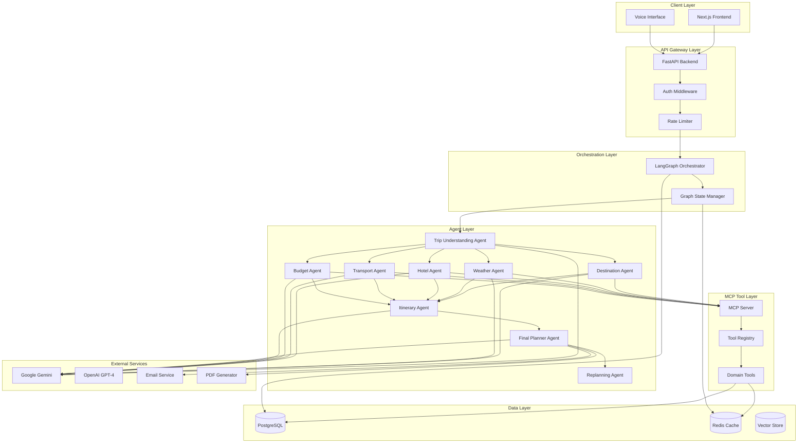
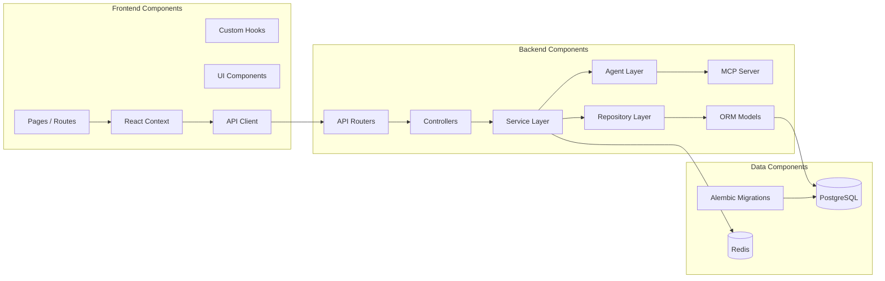
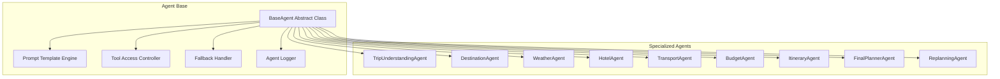
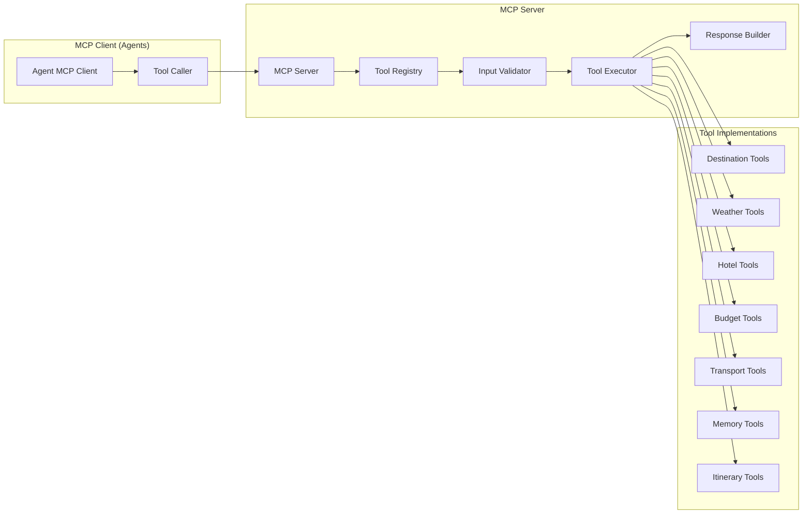
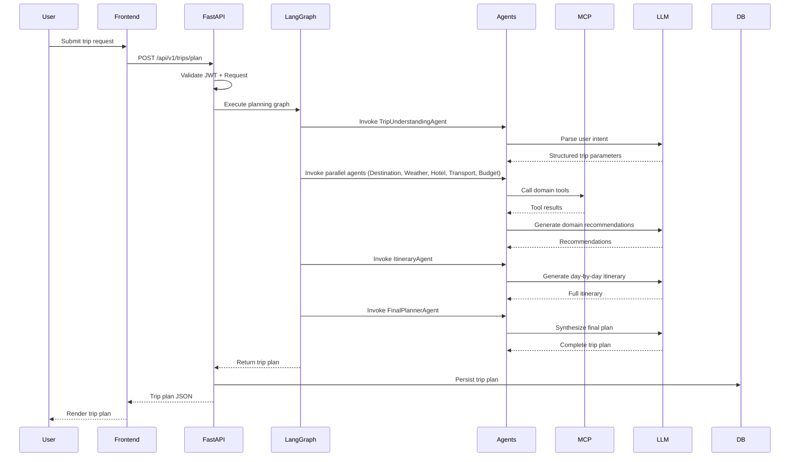
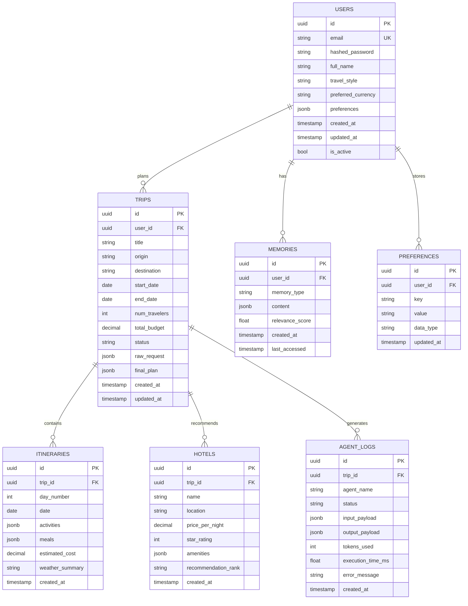
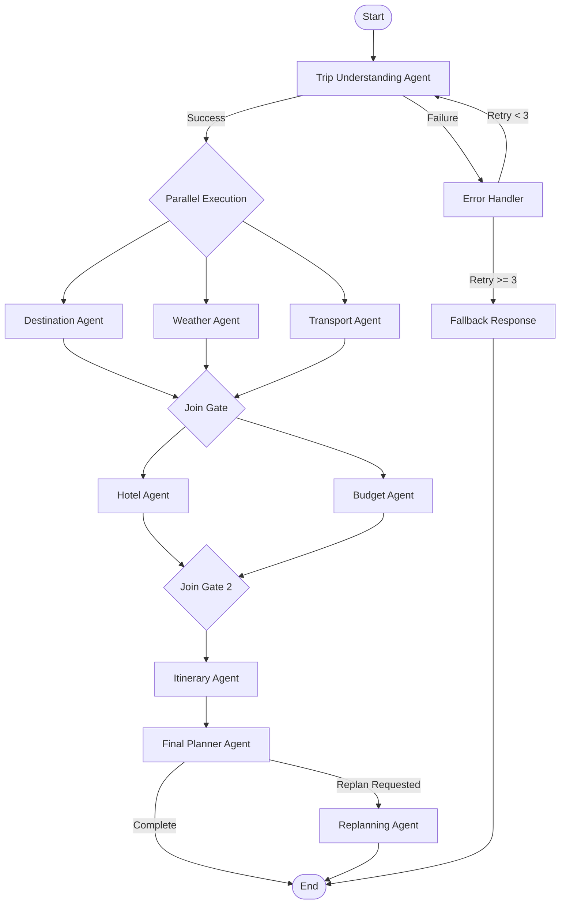
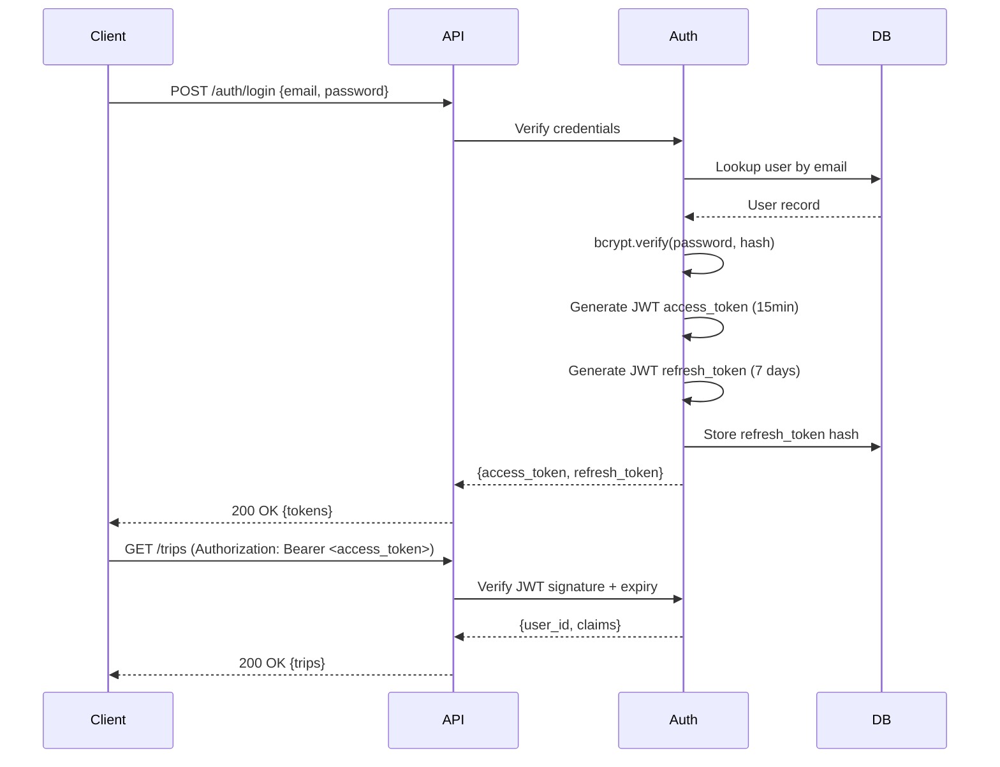
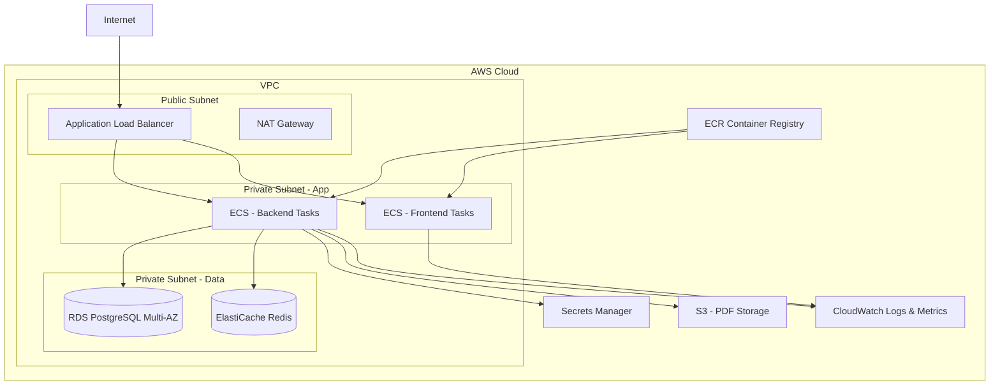
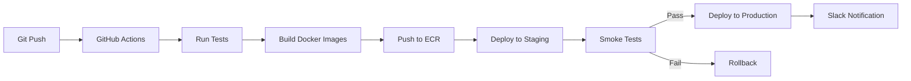

# Multi-Agent Trip Planner — Product Requirements Document (PRD)

**Project Codename:** Aegis  
**Version:** 1.0.0  
**Status:** Active Development  
**Owner:** Engineering Leadership  
**Last Updated:** 2026-06-20  

---

## Table of Contents

1. [Executive Summary](#1-executive-summary)
2. [Product Vision](#2-product-vision)
3. [Functional Requirements](#3-functional-requirements)
4. [Non-Functional Requirements](#4-non-functional-requirements)
5. [System Architecture](#5-system-architecture)
6. [Technology Stack](#6-technology-stack)
7. [Database Design](#7-database-design)
8. [MCP Server Design](#8-mcp-server-design)
9. [Multi-Agent Design](#9-multi-agent-design)
10. [LangGraph Workflow](#10-langgraph-workflow)
11. [API Documentation](#11-api-documentation)
12. [Frontend Documentation](#12-frontend-documentation)
13. [Security Design](#13-security-design)
14. [Testing Strategy](#14-testing-strategy)
15. [Deployment Architecture](#15-deployment-architecture)
16. [Milestone Breakdown](#16-milestone-breakdown)
17. [Folder Structure](#17-folder-structure)
18. [Risks and Mitigation](#18-risks-and-mitigation)
19. [Future Enhancements](#19-future-enhancements)
20. [Contributor Guide](#20-contributor-guide)

---

## 1. Executive Summary

### 1.1 Project Overview

The **Aegis Multi-Agent Trip Planner** is a next-generation AI-powered travel planning platform that orchestrates a collaborative network of specialized AI agents using the **Model Context Protocol (MCP)**. Each agent is a domain expert — handling destinations, weather, hotels, transportation, budgets, and itinerary generation — while the platform coordinates them to produce cohesive, personalized, and actionable travel plans.

### 1.2 Business Problem

Travel planning is fragmented, time-consuming, and overwhelming:
- Travelers juggle 6–12 separate platforms (flights, hotels, weather, maps, budgeting tools).
- 74% of travelers experience decision fatigue when planning international trips.
- Existing AI travel assistants are single-LLM chatbots with no domain specialization.
- No current solution integrates real-time weather, dynamic budget optimization, memory personalization, and voice interaction in one coherent experience.

### 1.3 Solution Overview

Aegis solves this with a **multi-agent MCP architecture** where:
- A **Trip Understanding Agent** parses natural language trip requests.
- Specialized agents (Weather, Hotel, Transport, Budget, Destination) gather domain-specific intelligence in parallel.
- An **Itinerary Agent** synthesizes all agent outputs into a day-by-day plan.
- A **Final Planner Agent** produces the complete travel document with PDF/email delivery.
- A **Replanning Agent** dynamically adjusts plans based on changes (weather disruptions, flight cancellations, budget changes).
- A **Memory System** stores user preferences and past trips for personalized recommendations.

### 1.4 Value Proposition

| Problem | Aegis Solution |
|---|---|
| Fragmented planning tools | Single unified AI platform |
| Generic recommendations | Personalized via memory system |
| Static plans | Dynamic replanning on disruptions |
| Text-only interaction | Voice-enabled planning |
| No budget intelligence | AI-optimized budget allocation |
| Manual coordination | Fully automated multi-agent orchestration |

### 1.5 Target Users

| Persona | Description |
|---|---|
| **Leisure Traveler** | Individuals and families planning vacations |
| **Business Traveler** | Professionals needing efficient, cost-controlled trips |
| **Adventure Traveler** | Users with specific activity and experience requirements |
| **Travel Agent** | Professionals managing client trips at scale |
| **Enterprise Travel Manager** | Coordinating group/corporate travel |

---

## 2. Product Vision

### 2.1 Long-Term Vision

> *"Aegis becomes the world's most intelligent travel co-pilot — an always-on AI that knows you, anticipates your needs, books your trips autonomously, and adapts in real time to disruptions, turning travel from a stressor into a delight."*

### 2.2 Future Roadmap

| Phase | Timeline | Focus |
|---|---|---|
| **v1.0 — Foundation** | Q3 2026 | Core multi-agent planning, authentication, basic UI |
| **v1.5 — Intelligence** | Q4 2026 | Memory system, voice assistant, PDF/email delivery |
| **v2.0 — Real-Time** | Q1 2027 | Live flight/hotel booking APIs, real-time price tracking |
| **v2.5 — Collaboration** | Q2 2027 | Multi-user trip collaboration, group planning |
| **v3.0 — Autonomy** | Q3 2027 | Fully autonomous booking, proactive disruption management |
| **v3.5 — Mobile** | Q4 2027 | Native iOS/Android apps with offline planning |
| **v4.0 — Enterprise** | Q1 2028 | Corporate travel management, policy compliance, analytics |

### 2.3 Competitive Advantages

1. **MCP-Native Architecture**: First travel platform built ground-up on Model Context Protocol, enabling tool composability and agent interoperability.
2. **True Multi-Agent Specialization**: Each agent is a domain expert with its own prompt engineering, tool access, and failure handling.
3. **Persistent Memory**: User preferences, past trips, and behavioral patterns inform every recommendation.
4. **Dynamic Replanning**: Real-time adaptation to disruptions without restarting the entire planning process.
5. **Voice-First Option**: Full trip planning through natural language voice commands.

### 2.4 Differentiators

- **vs. Google Travel**: Aegis orchestrates multiple AI agents; Google Travel is a search aggregator.
- **vs. ChatGPT Travel Planning**: Aegis has specialized agents, persistent memory, and structured outputs; ChatGPT is general-purpose.
- **vs. TripAdvisor**: Aegis generates personalized plans; TripAdvisor is a review/discovery platform.
- **vs. Kayak AI**: Aegis covers full end-to-end planning; Kayak AI focuses on flight/hotel search.

---

## 3. Functional Requirements

### 3.1 User Authentication

**Purpose:** Secure, stateless authentication enabling personalized experiences and data privacy.

**Inputs:** Email, password, optional OAuth token (Google/GitHub).

**Outputs:** JWT access token (15-minute expiry), JWT refresh token (7-day expiry), user profile object.

**User Stories:**
- As a new user, I can register with email and password so that I have a personal account.
- As a returning user, I can log in and receive a JWT so that I can access my trip history and preferences.
- As a user, I can refresh my access token without re-logging in so that my session persists.
- As a user, I can log out and invalidate my refresh token so that my account is secure.

**Acceptance Criteria:**
- [ ] Registration validates email format, password strength (min 8 chars, 1 uppercase, 1 number).
- [ ] Passwords are hashed using bcrypt with a work factor of 12.
- [ ] JWT is signed with HS256 and a 512-bit secret key.
- [ ] Refresh token rotation invalidates old tokens on use.
- [ ] Failed login attempts are rate-limited (5 attempts per 10 minutes).
- [ ] All auth endpoints return appropriate HTTP status codes (200, 201, 401, 422).

---

### 3.2 Trip Planning

**Purpose:** Accept natural language trip requests and orchestrate agents to produce a complete plan.

**Inputs:** Natural language prompt (e.g., "Plan a 7-day Europe trip for 2 people in August with a $3000 budget"), optional structured overrides (dates, budget, passengers).

**Outputs:** Structured trip plan JSON, day-by-day itinerary, budget breakdown, hotel recommendations, transport options.

**User Stories:**
- As a user, I can describe my trip in plain English so that Aegis generates a complete plan automatically.
- As a user, I can provide specific constraints (budget, dates, preferences) so that the plan respects my requirements.
- As a user, I can view my trip plan in a structured, readable format so that I can review and export it.

**Acceptance Criteria:**
- [ ] System accepts free-text inputs up to 2000 characters.
- [ ] Planning pipeline completes within 45 seconds for standard requests.
- [ ] Output includes: destination details, daily itinerary, hotel options (min 3), transport options, budget breakdown.
- [ ] All monetary values display in user's preferred currency.
- [ ] Trip plan is persisted to the database with a unique trip ID.

---

### 3.3 Destination Recommendation

**Purpose:** Intelligently recommend travel destinations based on user preferences, season, and travel patterns.

**Inputs:** Travel interests (e.g., beach, culture, adventure), budget range, travel dates, duration, departure city, past trip history.

**Outputs:** Ranked list of 3–5 destination recommendations with justification, best-visit season, key attractions, estimated costs.

**User Stories:**
- As a user who is unsure where to go, I can describe my interests so that Aegis recommends ideal destinations.
- As a user, I can see why each destination was recommended so that I can make an informed choice.

**Acceptance Criteria:**
- [ ] Returns minimum 3 destination recommendations.
- [ ] Each recommendation includes: name, country, description, top 5 attractions, best season, estimated cost per day.
- [ ] Recommendations factor in user's travel history from memory system.
- [ ] Recommendations avoid recently visited destinations unless explicitly requested.

---

### 3.4 Weather Intelligence

**Purpose:** Provide weather analysis for planned travel dates to enable informed packing and activity planning.

**Inputs:** Destination, travel dates, trip duration.

**Outputs:** Day-by-day weather forecast, temperature range, precipitation probability, weather-appropriate activity suggestions, packing recommendations.

**User Stories:**
- As a user, I can see the expected weather during my trip so that I can pack appropriately.
- As a user, I receive weather-aware activity suggestions so that outdoor plans align with good weather days.

**Acceptance Criteria:**
- [ ] Weather data provided for the full trip duration.
- [ ] Forecast includes temperature (high/low), precipitation chance, humidity, UV index.
- [ ] Weather-based alerts generated for extreme conditions (storms, heatwaves).
- [ ] Packing list generated based on weather profile.

---

### 3.5 Budget Optimization

**Purpose:** Intelligently allocate a user's travel budget across accommodations, transport, food, and activities.

**Inputs:** Total budget, travel duration, number of travelers, destination, travel style (budget/comfort/luxury).

**Outputs:** Budget breakdown by category, daily allowance, cost-saving recommendations, value-for-money alternatives.

**User Stories:**
- As a user with a fixed budget, I want Aegis to allocate it optimally so that I maximize my travel experience.
- As a user, I want to see cost-saving alternatives so that I can choose to upgrade specific experiences.

**Acceptance Criteria:**
- [ ] Budget allocated across: accommodation (%), transport (%), food (%), activities (%), emergency reserve (10%).
- [ ] Three budget tiers presented: conservative, recommended, premium.
- [ ] Daily cost estimate provided per person.
- [ ] Savings opportunities highlighted with expected savings amounts.

---

### 3.6 Hotel Recommendation

**Purpose:** Recommend hotels that match user preferences, location requirements, and budget constraints.

**Inputs:** Destination, check-in/check-out dates, number of guests, budget per night, amenity preferences, location preference (city center/near attractions/beach).

**Outputs:** List of 3–5 hotel recommendations with ratings, prices, amenities, pros/cons, and location map reference.

**User Stories:**
- As a user, I receive hotel recommendations that match my budget and preferences so that I don't need to search manually.
- As a user, I can compare hotels side-by-side so that I can make the best choice.

**Acceptance Criteria:**
- [ ] Minimum 3 hotel options per recommendation set.
- [ ] Each hotel includes: name, star rating, price per night, amenities list, pros/cons, neighborhood description.
- [ ] Options span budget, mid-range, and premium tiers.
- [ ] Location context provided relative to key attractions.

---

### 3.7 Transport Recommendation

**Purpose:** Identify optimal transportation options between origin and destination, and for local travel.

**Inputs:** Origin city, destination city, travel dates, budget range, travel style, number of travelers.

**Outputs:** Flight options, train/bus alternatives, local transport guide (metro/taxi/car rental), inter-city route recommendations.

**User Stories:**
- As a user, I want the best flight options for my trip so that I can choose based on price and convenience.
- As a user, I want to understand local transport options so that I can navigate efficiently at the destination.

**Acceptance Criteria:**
- [ ] International options: 3+ flight recommendations with estimated prices.
- [ ] Alternative transport modes included when relevant (train for <4hr journeys).
- [ ] Local transport guide included for all destinations.
- [ ] Transport costs integrated into budget breakdown.

---

### 3.8 Itinerary Generation

**Purpose:** Create a detailed, day-by-day itinerary combining all agent outputs into an actionable travel schedule.

**Inputs:** Destination, duration, hotel location, transport plan, weather forecast, activities list, budget allocation, user preferences.

**Outputs:** Hour-by-hour daily schedule, activity descriptions, meal suggestions, logistics (travel time between venues), cost per day.

**User Stories:**
- As a user, I receive a complete day-by-day itinerary so that I have a clear travel plan to follow.
- As a user, the itinerary accounts for weather and logical geographic routing so that my days are efficient.

**Acceptance Criteria:**
- [ ] Day-by-day schedule generated for full trip duration.
- [ ] Each day includes: morning/afternoon/evening activities, meal suggestions, estimated costs.
- [ ] Activities grouped geographically to minimize travel time.
- [ ] Weather-aware scheduling (outdoor activities on clear days).
- [ ] Logistics included (approximate travel times between venues).

---

### 3.9 Multi-Agent Collaboration

**Purpose:** Orchestrate multiple specialized AI agents to work in concert via MCP, sharing context and coordinating outputs.

**Inputs:** User trip request, agent graph definition, MCP tool registry.

**Outputs:** Coordinated, non-conflicting outputs across all agents synthesized into a unified plan.

**User Stories:**
- As a developer, agents share context through a unified state object so that outputs are coherent.
- As a user, I see one cohesive plan (not separate agent outputs) so that the experience is seamless.

**Acceptance Criteria:**
- [ ] All agents share a unified LangGraph state object.
- [ ] Agent outputs are validated before being passed to downstream agents.
- [ ] Agent failures trigger fallback behavior without halting the pipeline.
- [ ] Total orchestration overhead <5 seconds above individual agent execution times.

---

### 3.10 Memory System

**Purpose:** Store and retrieve user travel preferences, behavioral patterns, and past trips to personalize recommendations.

**Inputs:** User profile, past trip data, explicit preferences, implicit behavioral signals.

**Outputs:** Personalized recommendations incorporating memory context.

**User Stories:**
- As a returning user, Aegis remembers my hotel preferences so that I don't have to re-specify them each time.
- As a user, I can view and edit my stored preferences so that I remain in control of my data.

**Acceptance Criteria:**
- [ ] User preferences stored: travel style, budget tier, dietary restrictions, accommodation type, airline preferences.
- [ ] Past trips stored with full plan details for reference.
- [ ] Memory integrated into all agent prompts when available.
- [ ] Users can view, edit, and delete their stored memories via the UI.

---

### 3.11 PDF Export

**Purpose:** Allow users to download their complete trip plan as a formatted PDF document.

**Inputs:** Completed trip plan, user profile, export format preferences.

**Outputs:** Formatted PDF with cover page, itinerary, hotel details, budget breakdown, maps, and packing list.

**User Stories:**
- As a user, I can download my trip plan as a PDF so that I have it available offline.
- As a user, the PDF is professionally formatted so that I can share it with travel companions.

**Acceptance Criteria:**
- [ ] PDF generated within 10 seconds of request.
- [ ] PDF includes: cover page, table of contents, day-by-day itinerary, hotel/transport summary, budget breakdown, packing list.
- [ ] PDF is downloadable via a signed URL valid for 24 hours.
- [ ] PDF is mobile-readable (responsive text, no cutting off).

---

### 3.12 Email Delivery

**Purpose:** Send trip plans and notifications to users via email.

**Inputs:** User email, trip plan, email template type (full plan / summary / reminder).

**Outputs:** Formatted email delivered to user's inbox.

**User Stories:**
- As a user, I can email my trip plan to myself and companions so that everyone has a copy.
- As a user, I receive trip reminder emails 48 hours before departure so that I'm prepared.

**Acceptance Criteria:**
- [ ] Email delivery within 60 seconds of request.
- [ ] Email includes: trip summary, key dates, hotel confirmation details, links to full plan.
- [ ] HTML email is responsive and renders correctly in Gmail, Outlook, Apple Mail.
- [ ] User can add multiple recipient emails.
- [ ] Unsubscribe link included in all marketing emails.

---

### 3.13 Voice Assistant

**Purpose:** Enable full trip planning through natural language voice interaction.

**Inputs:** Voice audio input (microphone), optional text fallback.

**Outputs:** Voice response (TTS), visual plan updates in the UI.

**User Stories:**
- As a user, I can speak my trip requirements so that planning is hands-free and natural.
- As a user, I hear the trip plan read back to me so that I can review it without reading.

**Acceptance Criteria:**
- [ ] Voice input captured via browser microphone API.
- [ ] Speech-to-text processing latency <3 seconds.
- [ ] Voice responses natural and conversational, not robotic.
- [ ] Visual UI updates in sync with voice responses.
- [ ] Voice session supports multi-turn conversation.

---

### 3.14 Dynamic Replanning

**Purpose:** Automatically adjust trip plans in response to disruptions (weather changes, flight cancellations, budget changes).

**Inputs:** Original trip plan, disruption event (type, severity, affected dates), user constraints.

**Outputs:** Updated itinerary with modifications highlighted, explanation of changes, alternative options presented.

**User Stories:**
- As a user whose flight was cancelled, Aegis replans my trip with alternative options so that I can adapt quickly.
- As a user who wants to change my budget, the plan is re-optimized automatically so that it still makes sense.

**Acceptance Criteria:**
- [ ] Replanning triggered by: weather alerts, user-reported disruptions, budget changes, date changes.
- [ ] Replanning completes within 30 seconds.
- [ ] Changed elements visually highlighted in the UI.
- [ ] Original plan preserved and accessible for comparison.
- [ ] User can accept or reject specific changes.

---

## 4. Non-Functional Requirements

### 4.1 Scalability

- Backend horizontally scalable via stateless FastAPI pods behind a load balancer.
- LangGraph workflow executions isolated per user request with no shared state.
- Database connection pooling (SQLAlchemy) with min 5 / max 20 connections per pod.
- Redis caching for agent tool results with 1-hour TTL.
- Target: Support 1,000 concurrent trip planning sessions.

### 4.2 Security

- All data encrypted in transit (TLS 1.3) and at rest (AES-256).
- JWT tokens with short expiry and secure rotation.
- API secrets stored in environment variables / AWS Secrets Manager (production).
- Rate limiting on all public endpoints (100 req/min per IP, 20 req/min per user).
- SQL injection prevention via SQLAlchemy parameterized queries.
- CORS configured to whitelist only known frontends.
- PII data (email, preferences) encrypted at column level in production.

### 4.3 Performance

| Metric | Target |
|---|---|
| Trip plan generation | < 45 seconds P95 |
| API response (non-AI) | < 300ms P99 |
| Frontend page load | < 2 seconds (LCP) |
| Voice STT latency | < 3 seconds |
| PDF generation | < 10 seconds |
| Agent orchestration overhead | < 5 seconds |

### 4.4 Reliability

- Backend target uptime: 99.9% (SLA).
- LangGraph retries: 3 attempts with exponential backoff per agent.
- Circuit breaker on all external API calls (weather, hotel data).
- Database write operations wrapped in transactions with rollback on failure.
- Health check endpoints for all services.

### 4.5 Maintainability

- Codebase follows clean architecture principles (separation of concerns).
- All functions documented with docstrings.
- Type annotations required on all Python functions.
- ESLint + Prettier enforced on frontend code.
- Test coverage minimum: 80% for core business logic.

### 4.6 Extensibility

- New agents added by implementing the `BaseAgent` abstract class.
- New MCP tools added by registering in the `ToolRegistry`.
- New LLM providers plugged in via an `LLMProvider` interface.
- Agent graph nodes added without modifying existing nodes.

### 4.7 Observability

- Structured JSON logging on all services.
- Distributed tracing via OpenTelemetry (production).
- Agent execution logs persisted in the `agent_logs` database table.
- Metrics: request rate, error rate, agent latency, LLM token usage.
- Alerts on: error rate >1%, P95 latency >60s, LLM quota near-limit.

### 4.8 Cost Optimization

- LLM token usage tracked per request and per user.
- Result caching for repeated tool calls (weather, destination info).
- Model tiering: fast/cheap models for extraction, powerful models for synthesis.
- Token budgets enforced per agent (configurable).
- Monthly cost dashboards for LLM spend by agent.

---

## 5. System Architecture

### 5.1 High-Level Architecture



### 5.2 Component Architecture



### 5.3 Agent Architecture



### 5.4 MCP Architecture



### 5.5 Request Data Flow



---

## 6. Technology Stack

### 6.1 Frontend

| Technology | Version | Reason |
|---|---|---|
| **Next.js** | 15+ | App Router, RSC, file-based routing, SSR/SSG capabilities |
| **TypeScript** | 5+ | Type safety, better DX, fewer runtime errors |
| **Tailwind CSS** | 3+ | Utility-first CSS, rapid prototyping, consistent design system |
| **shadcn/ui** | Latest | High-quality accessible components built on Radix UI |
| **React Context** | Built-in | Lightweight state management for auth and preferences |
| **React Query** | 5+ | Server state management, caching, background refetching |
| **Web Speech API** | Browser native | Voice input/output without additional dependencies |

**Why Next.js?** App Router enables server-side rendering for SEO and performance, with React Server Components reducing client-side JavaScript.

### 6.2 Backend

| Technology | Version | Reason |
|---|---|---|
| **FastAPI** | 0.110+ | Async-native, automatic OpenAPI docs, Pydantic validation |
| **Python** | 3.12+ | Strong AI/ML ecosystem, asyncio support |
| **Pydantic v2** | 2.x | Request/response validation, settings management |
| **SQLAlchemy** | 2.x | Async ORM, connection pooling, migration support |
| **Alembic** | 1.13+ | Database migration management |
| **Uvicorn** | 0.28+ | ASGI server with production performance |

**Why FastAPI?** Built-in OpenAPI documentation, async support for concurrent agent calls, and Pydantic integration for type-safe schemas make it ideal for AI orchestration backends.

### 6.3 Database

| Technology | Reason |
|---|---|
| **PostgreSQL 16** | ACID compliance, JSONB for flexible agent outputs, full-text search, mature ecosystem |
| **Redis 7** | In-memory caching for agent results, session storage, rate limiting |

### 6.4 AI Frameworks

| Technology | Reason |
|---|---|
| **LangGraph** | Stateful, graph-based agent orchestration with retry and conditional routing |
| **LangChain** | Tool abstractions, prompt templates, LLM provider interfaces |
| **MCP (Model Context Protocol)** | Standardized tool discovery and execution across agents |

**Why LangGraph?** Unlike simple chains, LangGraph supports cycles, conditional edges, and shared state — essential for complex multi-agent workflows with replanning.

### 6.5 LLM Providers

| Provider | Use Case |
|---|---|
| **Google Gemini 2.0 Flash** | Primary: fast, cost-efficient for agent tasks |
| **Google Gemini 1.5 Pro** | Complex synthesis: final plan generation |
| **OpenAI GPT-4o** | Fallback provider for resilience |

### 6.6 DevOps Tools

| Tool | Reason |
|---|---|
| **Docker + Docker Compose** | Consistent local development environment |
| **GitHub Actions** | CI/CD pipeline automation |
| **AWS ECR/ECS** | Container registry and orchestration in production |
| **AWS RDS (PostgreSQL)** | Managed database in production |
| **AWS ElastiCache (Redis)** | Managed Redis in production |
| **Terraform** | Infrastructure as code for AWS resources |

---

## 7. Database Design

### 7.1 Entity Relationship Diagram



### 7.2 Indexing Strategy

| Table | Index | Type | Reason |
|---|---|---|---|
| `users` | `email` | UNIQUE | Login lookup |
| `trips` | `user_id` | BTREE | User's trips query |
| `trips` | `status` | BTREE | Status filtering |
| `trips` | `created_at` | BTREE DESC | Recent trips ordering |
| `itineraries` | `trip_id, day_number` | COMPOSITE | Daily itinerary lookup |
| `agent_logs` | `trip_id, agent_name` | COMPOSITE | Agent debugging |
| `memories` | `user_id, memory_type` | COMPOSITE | Memory retrieval |
| `preferences` | `user_id, key` | UNIQUE COMPOSITE | Preference lookup |

---

## 8. MCP Server Design

### 8.1 Tool Architecture

The MCP Server exposes all domain tools through a standardized interface. Tools are self-describing — each tool declares its name, description, input schema, and output schema.

### 8.2 Tool Registry

The `ToolRegistry` is a singleton that maintains the mapping from tool names to their implementations. Agents discover available tools at startup through the registry.

```python
class ToolRegistry:
    def register(self, tool: BaseMCPTool) -> None: ...
    def get_tool(self, name: str) -> BaseMCPTool: ...
    def list_tools(self) -> list[ToolDefinition]: ...
    def execute(self, name: str, inputs: dict) -> ToolResult: ...
```

### 8.3 MCP Tool Catalog

#### Tool: `search_destinations`
- **Description:** Search and rank travel destinations based on user criteria.
- **Input:** `{ interests: string[], budget_range: string, duration_days: int, departure_city: string, travel_month: string }`
- **Output:** `{ destinations: [{ name, country, description, top_attractions, cost_estimate, best_for }] }`
- **Error Handling:** Returns empty list with error message if no destinations match.

#### Tool: `get_weather_forecast`
- **Description:** Retrieve weather forecast for a destination and date range.
- **Input:** `{ destination: string, start_date: string, end_date: string }`
- **Output:** `{ forecast: [{ date, high_temp, low_temp, precipitation_pct, condition, uv_index }], summary: string }`
- **Error Handling:** Returns historical averages with caveat if forecast unavailable.

#### Tool: `search_hotels`
- **Description:** Find hotels matching location, dates, and budget.
- **Input:** `{ destination: string, checkin: string, checkout: string, guests: int, budget_per_night: float, preferences: string[] }`
- **Output:** `{ hotels: [{ name, stars, price_per_night, amenities, pros, cons, neighborhood }] }`
- **Error Handling:** Expands budget range by 20% and retries if no results.

#### Tool: `search_flights`
- **Description:** Find flight options between origin and destination.
- **Input:** `{ origin: string, destination: string, departure_date: string, return_date: string, passengers: int, cabin_class: string }`
- **Output:** `{ flights: [{ airline, departure_time, arrival_time, duration, price, stops }] }`
- **Error Handling:** Returns alternative dates within ±3 days if exact date unavailable.

#### Tool: `optimize_budget`
- **Description:** Allocate budget optimally across trip categories.
- **Input:** `{ total_budget: float, duration_days: int, num_travelers: int, destination: string, travel_style: string }`
- **Output:** `{ allocation: { accommodation: float, transport: float, food: float, activities: float, emergency: float }, daily_budget: float, tips: string[] }`
- **Error Handling:** Falls back to default allocation percentages if optimization fails.

#### Tool: `generate_itinerary`
- **Description:** Generate a detailed day-by-day itinerary.
- **Input:** `{ destination: string, duration_days: int, hotel_location: string, activities: string[], budget_per_day: float, weather_forecast: object }`
- **Output:** `{ itinerary: [{ day, date, morning, afternoon, evening, meals, logistics, cost }] }`
- **Error Handling:** Generates generic itinerary if specific activity data unavailable.

#### Tool: `get_local_transport`
- **Description:** Retrieve local transportation options at the destination.
- **Input:** `{ destination: string, mobility_needs: string[] }`
- **Output:** `{ options: [{ mode, description, avg_cost, coverage, tips }] }`
- **Error Handling:** Returns generic destination-type transport guide on API failure.

#### Tool: `get_user_memories`
- **Description:** Retrieve relevant user memories for personalization.
- **Input:** `{ user_id: string, query_context: string, limit: int }`
- **Output:** `{ memories: [{ type, content, relevance_score }] }`
- **Error Handling:** Returns empty memories gracefully; agents proceed without personalization.

#### Tool: `save_user_memory`
- **Description:** Persist a new memory or preference for the user.
- **Input:** `{ user_id: string, memory_type: string, content: object }`
- **Output:** `{ memory_id: string, success: bool }`
- **Error Handling:** Logs failure but does not block trip generation.

#### Tool: `generate_pdf`
- **Description:** Generate a formatted PDF document for a trip plan.
- **Input:** `{ trip_id: string, trip_plan: object, user_profile: object }`
- **Output:** `{ pdf_url: string, file_size_bytes: int, expires_at: string }`
- **Error Handling:** Returns plain-text fallback if PDF generation fails.

#### Tool: `send_trip_email`
- **Description:** Send the trip plan to specified email addresses.
- **Input:** `{ recipients: string[], trip_plan: object, template: string }`
- **Output:** `{ success: bool, message_id: string, delivered_to: string[] }`
- **Error Handling:** Queues for retry on SMTP failure; notifies user of delay.

---

## 9. Multi-Agent Design

### 9.1 Trip Understanding Agent

**Responsibilities:** Parse free-text trip requests into structured parameters; identify ambiguities and fill gaps with reasonable defaults.

**Inputs:** Raw user text input (string), user memory context (optional).

**Outputs:** Structured `TripParameters` object:
```json
{
  "destination": "Paris, France",
  "origin": "New York, USA",
  "start_date": "2026-08-15",
  "end_date": "2026-08-22",
  "num_travelers": 2,
  "total_budget": 3000,
  "currency": "USD",
  "travel_style": "comfort",
  "interests": ["culture", "food", "art"],
  "special_requirements": ["wheelchair accessible"]
}
```

**Prompt Strategy:** System prompt establishes the agent as a "travel intake specialist". Uses structured output prompting with JSON schema enforcement. Includes few-shot examples of ambiguous requests and their resolutions.

**Tool Usage:** `get_user_memories` to personalize defaults.

**Failure Handling:** If LLM extraction fails 3 times, returns a structured error requesting user clarification on specific fields.

---

### 9.2 Destination Agent

**Responsibilities:** Research and recommend travel destinations; gather destination-specific information (attractions, culture, safety, visa requirements).

**Inputs:** `TripParameters`, user interests, travel_style, budget.

**Outputs:** `DestinationReport` with ranked destination recommendations.

**Prompt Strategy:** Detailed system prompt with destination research expertise. Instructs the agent to consider seasonality, budget alignment, and user interest match. Requires justification for each recommendation.

**Tool Usage:** `search_destinations`, `get_user_memories` (past visited destinations).

**Failure Handling:** If `search_destinations` fails, uses LLM world knowledge to generate recommendations with appropriate caveats.

---

### 9.3 Weather Agent

**Responsibilities:** Gather weather forecasts; identify weather-related risks; provide packing and activity timing recommendations.

**Inputs:** Confirmed destination, travel dates.

**Outputs:** `WeatherReport` with day-by-day forecast and recommendations.

**Prompt Strategy:** Meteorological expert persona. Instructed to flag extreme weather events and suggest optimal timing for outdoor activities. Output must include actionable packing recommendations.

**Tool Usage:** `get_weather_forecast`.

**Failure Handling:** Falls back to historical climate averages for the destination/month with explicit "forecast unavailable" notice.

---

### 9.4 Hotel Agent

**Responsibilities:** Research and recommend hotels; evaluate location, price-to-value ratio, and amenity fit.

**Inputs:** Destination, dates, num_travelers, budget_allocation.accommodation, preferences.

**Outputs:** `HotelReport` with 3–5 ranked hotel recommendations.

**Prompt Strategy:** Travel accommodation specialist persona. Instructed to provide balanced options across budget tiers. Must include pros/cons and neighborhood context for each option.

**Tool Usage:** `search_hotels`.

**Failure Handling:** Expands search radius and budget range by 20% on failure before escalating.

---

### 9.5 Transport Agent

**Responsibilities:** Identify optimal international travel options (flights, trains); research local transportation at destination.

**Inputs:** Origin, destination, dates, num_travelers, budget_allocation.transport.

**Outputs:** `TransportReport` with flight options and local transport guide.

**Prompt Strategy:** Transportation logistics expert persona. Prioritizes value-for-money while considering convenience factors (layover duration, airport transfers).

**Tool Usage:** `search_flights`, `get_local_transport`.

**Failure Handling:** Provides manual research instructions if flight search API fails.

---

### 9.6 Budget Agent

**Responsibilities:** Analyze all cost estimates from other agents; optimize budget allocation; identify saving opportunities.

**Inputs:** Total budget, all agent cost estimates (hotels, flights, activities), destination cost-of-living data.

**Outputs:** `BudgetReport` with allocation breakdown, daily budget, and savings tips.

**Prompt Strategy:** Financial travel advisor persona. Instructed to ensure emergency reserve (10%) and present three budget tiers (conservative, recommended, premium).

**Tool Usage:** `optimize_budget`.

**Failure Handling:** Falls back to rule-based allocation (40% accommodation, 30% transport, 20% food, 10% activities) if optimization tool fails.

---

### 9.7 Itinerary Agent

**Responsibilities:** Synthesize all agent outputs into a coherent, geographically-optimized day-by-day itinerary.

**Inputs:** All agent reports (Destination, Weather, Hotel, Transport, Budget), destination, duration.

**Outputs:** `ItineraryReport` with detailed day-by-day schedule.

**Prompt Strategy:** Expert itinerary planner persona. Instructed to group activities geographically, respect weather forecasts (outdoor activities on clear days), and balance activity types (cultural, leisure, adventure). Must respect daily budget limits.

**Tool Usage:** `generate_itinerary`.

**Failure Handling:** Generates simplified itinerary without time-specific scheduling if detailed tool fails.

---

### 9.8 Final Planner Agent

**Responsibilities:** Synthesize all outputs into the final, user-facing trip plan; trigger PDF generation and email delivery if requested.

**Inputs:** All agent reports, user profile, delivery preferences.

**Outputs:** Complete `FinalTripPlan` object, PDF URL, email delivery status.

**Prompt Strategy:** Executive travel consultant persona. Instructed to produce a polished, comprehensive document. Must highlight unique experiences, practical tips, and key logistics.

**Tool Usage:** `generate_pdf`, `send_trip_email`, `save_user_memory`.

**Failure Handling:** Returns completed plan even if PDF/email delivery fails; reports delivery failures separately.

---

### 9.9 Replanning Agent

**Responsibilities:** Modify an existing trip plan in response to disruptions without regenerating the entire plan.

**Inputs:** Original trip plan, disruption type (weather / cancellation / budget_change / preference_change), disruption details, user constraints.

**Outputs:** Updated trip plan with changes highlighted, explanation of each modification.

**Prompt Strategy:** Crisis travel advisor persona. Instructed to make minimal changes to preserve the spirit of the original plan while addressing the disruption. Must clearly communicate what changed and why.

**Tool Usage:** All domain tools (selectively based on what needs replanning), `save_user_memory`.

**Failure Handling:** Presents original plan with manual guidance notes if automated replanning fails.

---

## 10. LangGraph Workflow

### 10.1 Graph State

```python
class TripPlanningState(TypedDict):
    # Input
    user_id: str
    trip_id: str
    raw_request: str
    
    # Parsed Parameters
    trip_params: Optional[TripParameters]
    
    # Agent Outputs
    destination_report: Optional[DestinationReport]
    weather_report: Optional[WeatherReport]
    hotel_report: Optional[HotelReport]
    transport_report: Optional[TransportReport]
    budget_report: Optional[BudgetReport]
    itinerary_report: Optional[ItineraryReport]
    
    # Final Output
    final_plan: Optional[FinalTripPlan]
    
    # Control Flow
    errors: list[AgentError]
    retry_count: dict[str, int]
    current_node: str
    is_replanning: bool
    disruption_context: Optional[DisruptionContext]
```

### 10.2 Workflow Diagram



### 10.3 Conditional Routing

| Condition | Route |
|---|---|
| `trip_params.is_valid` is False | Return to TUA with clarification request |
| `destination_report` is None after 3 retries | Use LLM-based fallback |
| `is_replanning` is True | Skip to Replanning Agent with original plan |
| Any critical agent fails | Route to Error Handler, attempt retry |
| All retries exhausted | Partial plan with manual guidance |

### 10.4 Retry Strategy

- **Per-agent retry limit:** 3 attempts
- **Backoff:** Exponential (1s, 2s, 4s)
- **On LLM rate limit:** 30-second wait then retry
- **On tool failure:** Attempt with alternative tool or LLM fallback
- **Graph-level timeout:** 120 seconds before returning partial results

---

## 11. API Documentation

See [`API/API_Specification.md`](../API/API_Specification.md) for full REST API documentation.

### Endpoint Summary

| Method | Endpoint | Description | Auth |
|---|---|---|---|
| POST | `/api/v1/auth/register` | Register new user | None |
| POST | `/api/v1/auth/login` | Login and get tokens | None |
| POST | `/api/v1/auth/refresh` | Refresh access token | Refresh Token |
| POST | `/api/v1/auth/logout` | Logout and invalidate tokens | Bearer Token |
| POST | `/api/v1/trips/plan` | Plan a new trip | Bearer Token |
| GET | `/api/v1/trips` | List user's trips | Bearer Token |
| GET | `/api/v1/trips/{trip_id}` | Get trip details | Bearer Token |
| POST | `/api/v1/trips/{trip_id}/replan` | Replan existing trip | Bearer Token |
| GET | `/api/v1/trips/{trip_id}/export/pdf` | Export trip as PDF | Bearer Token |
| POST | `/api/v1/trips/{trip_id}/email` | Email trip plan | Bearer Token |
| GET | `/api/v1/users/me` | Get current user profile | Bearer Token |
| PUT | `/api/v1/users/me/preferences` | Update preferences | Bearer Token |
| GET | `/api/v1/users/me/memories` | Get user memories | Bearer Token |
| DELETE | `/api/v1/users/me/memories/{id}` | Delete a memory | Bearer Token |
| POST | `/api/v1/voice/process` | Process voice input | Bearer Token |
| GET | `/api/v1/health` | Service health check | None |

---

## 12. Frontend Documentation

See [`Frontend/`](../Frontend/) for detailed component documentation.

### 12.1 Pages

| Route | Page | Description |
|---|---|---|
| `/` | Landing Page | Marketing page with CTA |
| `/auth/login` | Login Page | Email/password login |
| `/auth/register` | Register Page | New user registration |
| `/dashboard` | Dashboard | Trip history, quick actions |
| `/plan` | Trip Planner | Main planning interface |
| `/trips/{id}` | Trip Detail | Full trip plan view |
| `/trips/{id}/edit` | Trip Editor | Modify/replan existing trip |
| `/profile` | User Profile | Preferences and memory management |

### 12.2 Key Components

- **VoicePlanner** — Voice recording, STT, TTS interface
- **TripPlanResults** — Renders complete trip plan with tabs
- **TripHistory** — Lists past trips with search/filter
- **MemoryManager** — CRUD interface for user memories
- **BudgetChart** — Visual budget allocation chart
- **ItineraryTimeline** — Day-by-day visual timeline
- **HotelCard** — Hotel recommendation card with comparison
- **WeatherWidget** — Day-by-day weather visualization
- **ReplanPanel** — Disruption reporting and replan trigger

### 12.3 State Management

- **AuthContext** — JWT tokens, user profile, login/logout
- **TripContext** — Active trip state, planning progress
- **React Query** — Server state caching for trip data

---

## 13. Security Design

### 13.1 Authentication Flow



### 13.2 Security Controls

| Control | Implementation |
|---|---|
| Password hashing | bcrypt, work factor 12 |
| JWT signing | HS256, 512-bit secret |
| Token expiry | Access: 15min, Refresh: 7 days |
| Token rotation | New refresh token on each refresh |
| Rate limiting | 100/min per IP, 20/min per user |
| CORS | Whitelist-only (no wildcard) |
| SQL injection | SQLAlchemy parameterized queries |
| Secrets | Environment variables + AWS Secrets Manager |
| API keys | Never logged, never in responses |
| HTTPS | TLS 1.3 enforced in production |

---

## 14. Testing Strategy

### 14.1 Testing Pyramid

```
          /E2E Tests\
         /  (Playwright) \
        /_______________\
       /  Integration Tests \
      /   (pytest + httpx)   \
     /________________________\
    /       Unit Tests          \
   /    (pytest, jest/vitest)    \
  /______________________________\
```

### 14.2 Coverage Targets

| Layer | Target Coverage | Tool |
|---|---|---|
| Backend Unit Tests | 80% | pytest |
| Backend Integration Tests | 70% | pytest + httpx |
| Frontend Unit Tests | 75% | Jest / Vitest |
| Agent Tests | 60% | pytest (mocked LLM) |
| MCP Tool Tests | 85% | pytest |
| E2E Tests | Critical paths | Playwright |

### 14.3 Agent Testing Strategy

- **Mock LLM responses** for deterministic agent testing.
- **Tool response mocking** for all MCP tool calls.
- **State validation** — verify graph state transitions are correct.
- **Failure injection** — test retry and fallback behaviors.

---

## 15. Deployment Architecture

### 15.1 Local Development

```
docker compose up --build
├── PostgreSQL:5432
├── Redis:6379
├── Backend FastAPI:8000
└── Frontend Next.js:3000
```

### 15.2 AWS Production Architecture



### 15.3 CI/CD Pipeline



---

## 16. Milestone Breakdown

| # | Milestone | Duration | Key Deliverable |
|---|---|---|---|
| M01 | Project Setup & Infrastructure | 1 week | Monorepo, Docker, CI scaffold |
| M02 | Authentication System | 1 week | JWT auth, user CRUD |
| M03 | MCP Server Foundation | 1 week | MCP server, tool registry |
| M04 | Tool Registry & Core Tools | 1 week | All MCP tools implemented |
| M05 | LangGraph Foundation | 1 week | Graph state, basic workflow |
| M06 | Trip Understanding Agent | 1 week | Intent parsing agent |
| M07 | Destination & Weather Agents | 1 week | Domain research agents |
| M08 | Hotel & Transport Agents | 1 week | Accommodation & transport agents |
| M09 | Budget Agent | 1 week | Budget optimization agent |
| M10 | Itinerary Agent | 1 week | Day-by-day itinerary generation |
| M11 | Final Planner Agent | 1 week | Plan synthesis agent |
| M12 | Trip Persistence & History | 1 week | Database persistence, trip history |
| M13 | Memory System | 1 week | User memory CRUD + agent integration |
| M14 | Frontend Core | 2 weeks | Next.js app, auth UI, planning UI |
| M15 | PDF Export | 1 week | PDF generation and download |
| M16 | Email Delivery | 1 week | Email service integration |
| M17 | Dynamic Replanning | 1 week | Replanning agent + UI |
| M18 | Voice Assistant | 1 week | Voice input/output |
| M19 | Testing & QA | 2 weeks | Full test suite, bug fixes |
| M20 | Production Deployment | 1 week | AWS deployment, monitoring |

---

## 17. Folder Structure

```
Trip_Planner/
├── frontend/                          # Next.js Application
│   ├── src/
│   │   ├── app/                       # Next.js App Router
│   │   │   ├── (auth)/
│   │   │   │   ├── login/page.tsx
│   │   │   │   └── register/page.tsx
│   │   │   ├── dashboard/page.tsx
│   │   │   ├── plan/page.tsx
│   │   │   ├── trips/[id]/page.tsx
│   │   │   ├── profile/page.tsx
│   │   │   └── layout.tsx
│   │   ├── components/
│   │   │   ├── ui/                    # shadcn/ui base components
│   │   │   ├── auth/                  # Auth components
│   │   │   ├── dashboard/             # Dashboard components
│   │   │   ├── planning/              # Trip planning components
│   │   │   └── shared/                # Shared layout components
│   │   ├── context/
│   │   │   ├── AuthContext.tsx
│   │   │   └── TripContext.tsx
│   │   ├── hooks/
│   │   │   ├── useTrip.ts
│   │   │   ├── useVoice.ts
│   │   │   └── useMemory.ts
│   │   ├── lib/
│   │   │   ├── api.ts                 # API client
│   │   │   └── utils.ts
│   │   └── types/
│   │       ├── trip.ts
│   │       └── user.ts
│   ├── public/
│   ├── package.json
│   └── next.config.ts
│
├── backend/                           # FastAPI Application
│   ├── app/
│   │   ├── main.py                    # FastAPI app entry
│   │   ├── api/
│   │   │   ├── v1/
│   │   │   │   ├── auth.py
│   │   │   │   ├── trips.py
│   │   │   │   ├── users.py
│   │   │   │   └── voice.py
│   │   ├── agents/
│   │   │   ├── base.py                # BaseAgent abstract class
│   │   │   ├── trip_understanding.py
│   │   │   ├── destination.py
│   │   │   ├── weather.py
│   │   │   ├── hotel.py
│   │   │   ├── transport.py
│   │   │   ├── budget.py
│   │   │   ├── itinerary.py
│   │   │   ├── final_planner.py
│   │   │   └── replanning.py
│   │   ├── core/
│   │   │   ├── config.py
│   │   │   ├── database.py
│   │   │   ├── security.py
│   │   │   └── registry.py
│   │   ├── graph/
│   │   │   ├── state.py               # LangGraph state definition
│   │   │   ├── workflow.py            # Graph definition
│   │   │   └── nodes.py               # Graph node functions
│   │   ├── middleware/
│   │   │   ├── auth.py
│   │   │   └── logging.py
│   │   ├── models/                    # SQLAlchemy ORM models
│   │   │   ├── user.py
│   │   │   ├── trip.py
│   │   │   ├── memory.py
│   │   │   └── agent_log.py
│   │   └── schemas/                   # Pydantic schemas
│   │       ├── auth.py
│   │       ├── trip.py
│   │       └── user.py
│   ├── alembic/
│   ├── requirements.txt
│   └── .env
│
├── mcp_server/                        # MCP Server
│   ├── server.py                      # MCP server entry
│   ├── registry.py                    # Tool registry
│   ├── tools/
│   │   ├── base.py                    # BaseMCPTool
│   │   ├── destination.py
│   │   ├── weather.py
│   │   ├── hotel.py
│   │   ├── transport.py
│   │   ├── budget.py
│   │   ├── itinerary.py
│   │   ├── memory.py
│   │   └── delivery.py                # PDF + Email tools
│   └── tests/
│
├── docs/                              # This documentation
│   ├── PRD/
│   ├── Architecture/
│   ├── Milestones/
│   ├── API/
│   ├── Database/
│   └── Deployment/
│
├── docker-compose.yml
├── .gitignore
└── README.md
```

---

## 18. Risks and Mitigation

| Risk | Category | Severity | Probability | Mitigation |
|---|---|---|---|---|
| LLM API rate limits | Technical | High | Medium | Token caching, fallback providers, exponential backoff |
| LLM hallucination in plans | AI | High | Medium | Output validation schemas, fact-checking tools, confidence scores |
| High LLM costs at scale | Cost | High | High | Model tiering, result caching, token budgets per agent |
| Agent deadlock in LangGraph | Technical | Medium | Low | Timeout guards, circuit breakers, fallback routes |
| External API unavailability | Technical | Medium | Medium | Cached fallbacks, multiple data providers, graceful degradation |
| Data privacy violation | Security | Critical | Low | Encryption at rest, GDPR compliance, data retention policies |
| Vector store performance | Scalability | Medium | Medium | Pagination, relevance score cutoffs, periodic cleanup |
| User adoption failure | Product | High | Medium | UX research, beta testing, iterative feature releases |

---

## 19. Future Enhancements

### v2.0 — Real-Time Booking Integration
- Live flight booking via Amadeus / Skyscanner API.
- Hotel booking via Booking.com / Expedia API.
- Real-time price tracking with alerts.

### v2.5 — Collaborative Planning
- Multi-user trip collaboration with real-time sync (WebSockets).
- Shared trip plans with permission levels (viewer/editor/admin).
- Comment and voting system for group decisions.

### v3.0 — Autonomous Travel Agent
- Proactive disruption monitoring (flight delays, weather alerts).
- Automatic itinerary adjustments when disruptions detected.
- Push notifications for real-time travel updates.

### v3.5 — Mobile Applications
- Native iOS app (Swift / SwiftUI).
- Native Android app (Kotlin / Jetpack Compose).
- Offline plan access with local storage sync.

### v4.0 — Enterprise Platform
- Corporate travel policy enforcement.
- Approval workflows for travel spend.
- Organization-level analytics dashboards.
- SSO integration (SAML, OIDC).

---

## 20. Contributor Guide

### 20.1 Development Workflow

1. **Clone** the repository.
2. **Create** a feature branch from `develop` (not `main`).
3. **Develop** your feature with tests.
4. **Submit** a pull request to `develop`.
5. **Pass** all CI checks (lint, tests, build).
6. **Request** review from a team member.
7. **Merge** after approval.

### 20.2 Branching Strategy (Git Flow)

```
main          ← Production releases only
develop       ← Integration branch
feature/*     ← Feature development
bugfix/*      ← Bug fixes
hotfix/*      ← Production emergency fixes
release/*     ← Release preparation
```

### 20.3 Pull Request Standards

- PR title: `[feat|fix|docs|refactor|test]: Short description`
- PR description: Problem, solution, testing steps, screenshots (for UI).
- All PR checks must pass: lint, type-check, unit tests, integration tests.
- Minimum 1 reviewer approval required.
- PRs must not decrease test coverage below baseline.

### 20.4 Coding Standards

**Python (Backend):**
- PEP 8 compliance (enforced via `ruff`).
- Type annotations on all functions.
- Docstrings for all public classes and functions (Google style).
- Max function length: 50 lines (extract to helpers if longer).

**TypeScript (Frontend):**
- ESLint + Prettier enforced.
- No `any` types without explicit justification comment.
- Components must have PropTypes / interface definitions.
- Custom hooks must be unit tested.

### 20.5 Documentation Standards

- All new features require documentation updates in `docs/`.
- API changes require `API_Specification.md` updates.
- Database changes require ER diagram updates and Alembic migration.
- New agents require entry in `Agent_Architecture.md`.
- All docs must include last-updated date.

---

*End of Product Requirements Document*

*Document Version: 1.0.0 | Project: Aegis Multi-Agent Trip Planner | Status: Active*
